# Proposal | After Trigger | Match Fin. Prof. Role to Advisor Contact

## Flow Diagram [(_View History_)](Proposal_After_Trigger_Match_Fin_Prof_Role_to_Advisor_Contact-history.md)

```mermaid
%% If you read this, your Markdown visualizer does not handle MermaidJS syntax.
%% - If you are in VS Code, install extension `Markdown Preview Mermaid Support` at https://marketplace.visualstudio.com/items?itemName=bierner.markdown-mermaid
%% - If you are using sfdx-hardis, try to define env variable `MERMAID_MODES=cli,docker` ,then run again the command to regenerate markdown with SVG images.
%% - If you are within mkdocs-material, define mermaid plugin in `mkdocs.yml` as described in https://squidfunk.github.io/mkdocs-material/extensions/mermaid/
%% - As a last resort, you can copy-paste this MermaidJS code into https://mermaid.live/ to see the flow diagram

flowchart TB
START(["START<br/><b>AutoLaunched Flow</b></br>Type: <b> Record After Save</b>"]):::startClass
click START "#general-information" "3418376249"

Update_Fin_Prof_Role[\"🟰 <em></em><br/>Update Fin Prof Role"/]:::assignments
click Update_Fin_Prof_Role "#update_fin_prof_role" "3430639354"

Contact_Found{"🔀 <em></em><br/>Contact Found?"}:::decisions
click Contact_Found "#contact_found" "2312432923"

Get_Advisor_Contact[("🔍 <em></em><br/>Get Advisor Contact")]:::recordLookups
click Get_Advisor_Contact "#get_advisor_contact" "3489125210"

Update_Advisor_Contact[("🛠️ <em></em><br/>Update Advisor Contact")]:::recordUpdates
click Update_Advisor_Contact "#update_advisor_contact" "3667760539"

Update_Fin_Prof_Role --> Update_Advisor_Contact
Contact_Found --> |"Yes"| Update_Fin_Prof_Role
Contact_Found --> |"No"| END_Contact_Found
Get_Advisor_Contact --> Contact_Found
Update_Advisor_Contact --> END_Update_Advisor_Contact
START -->  Get_Advisor_Contact
END_Contact_Found(( END )):::endClass
END_Update_Advisor_Contact(( END )):::endClass


classDef actionCalls fill:#D4E4FC,color:black,text-decoration:none,max-height:100px
classDef assignments fill:#FBEED7,color:black,text-decoration:none,max-height:100px
classDef collectionProcessors fill:#F0E3FA,color:black,text-decoration:none,max-height:100px
classDef customErrors fill:#FFE9E9,color:black,text-decoration:none,max-height:100px
classDef decisions fill:#FDEAF6,color:black,text-decoration:none,max-height:100px
classDef loops fill:#FDEAF6,color:black,text-decoration:none,max-height:100px
classDef recordCreates fill:#FFF8C9,color:black,text-decoration:none,max-height:100px
classDef recordDeletes fill:#FFF8C9,color:black,text-decoration:none,max-height:100px
classDef recordLookups fill:#EDEAFF,color:black,text-decoration:none,max-height:100px
classDef recordUpdates fill:#FFF8C9,color:black,text-decoration:none,max-height:100px
classDef screens fill:#DFF6FF,color:black,text-decoration:none,max-height:100px
classDef subflows fill:#D4E4FC,color:black,text-decoration:none,max-height:100px
classDef startClass fill:#D9F2E6,color:black,text-decoration:none,max-height:100px
classDef endClass fill:#F9BABA,color:black,text-decoration:none,max-height:100px
classDef transforms fill:#FDEAF6,color:black,text-decoration:none,max-height:100px


```

<!-- Flow description -->

## General Information

|<!-- -->|<!-- -->|
|:---|:---|
|Object|Proposal__c|
|Process Type| Auto Launched Flow|
|Trigger Type| Record After Save|
|Record Trigger Type| Create And Update|
|Label|Proposal | After Trigger | Match Fin. Prof. Role to Advisor Contact|
|Status|Obsolete|
|Filter Formula|ISNEW() || ISCHANGED({!$Record.Financial_Professional_Role__c})|
|Description|When a proposal is created or edited, update the advisor contact record with the financial professional role from the proposal.|
|Environments|Default|
|Interview Label|Proposal | After Trigger | Match Fin. Prof. Role to Advisor Contact {!$Flow.CurrentDateTime}|
| Builder Type (PM)|LightningFlowBuilder|
| Canvas Mode (PM)|AUTO_LAYOUT_CANVAS|
| Origin Builder Type (PM)|LightningFlowBuilder|
|Connector|[Get_Advisor_Contact](#get_advisor_contact)|
|Next Node|[Get_Advisor_Contact](#get_advisor_contact)|

## Variables

|Name|Data Type|Is Collection|Is Input|Is Output|Object Type|Description|
|:-- |:--:|:--:|:--:|:--:|:--:|:--  |
|Advisor_Contact|SObject|⬜|✅|⬜|Contact|<!-- -->|

## Flow Nodes Details

### Update_Fin_Prof_Role

|<!-- -->|<!-- -->|
|:---|:---|
|Type|Assignment|
|Label|Update Fin Prof Role|
|Connector|[Update_Advisor_Contact](#update_advisor_contact)|

#### Assignments

|Assign To Reference|Operator|Value|
|:-- |:--:|:--: |
|Advisor_Contact.Financial_Professional_Role__c| Assign|$Record.Financial_Professional_Role__c|

### Contact_Found

|<!-- -->|<!-- -->|
|:---|:---|
|Type|Decision|
|Label|Contact Found?|
|Default Connector Label|No|

#### Rule Yes (Yes)

|<!-- -->|<!-- -->|
|:---|:---|
|Connector|[Update_Fin_Prof_Role](#update_fin_prof_role)|
|Condition Logic|and|

|Condition Id|Left Value Reference|Operator|Right Value|
|:-- |:-- |:--:|:--: |
|1|Advisor_Contact.Id| Is Null|⬜|
|2|Advisor_Contact.Financial_Professional_Role__c| Not Equal To|$Record.Financial_Professional_Role__c|

### Get_Advisor_Contact

|<!-- -->|<!-- -->|
|:---|:---|
|Type|Record Lookup|
|Object|Contact|
|Label|Get Advisor Contact|
|Assign Null Values If No Records Found|✅|
|Output Reference|Advisor_Contact|
|Queried Fields|- Id - Financial_Professional_Role__c |
|Connector|[Contact_Found](#contact_found)|

#### Filters (logic: **and**)

|Filter Id|Field|Operator|Value|
|:-- |:-- |:--:|:--: |
|1|Id| Equal To|$Record.Advisor_Contact__r.Id|

### Update_Advisor_Contact

|<!-- -->|<!-- -->|
|:---|:---|
|Type|Record Update|
|Label|Update Advisor Contact|
|Input Reference|Advisor_Contact|

___

_Documentation generated from branch monitoring_myubiquity by [sfdx-hardis](https://sfdx-hardis.cloudity.com), featuring [salesforce-flow-visualiser](https://github.com/toddhalfpenny/salesforce-flow-visualiser)_