# Proposal | After Update | Add/Update Purchase Contacts

## Flow Diagram [(_View History_)](Proposal_After_Update_Add_Update_Purchase_Contacts-history.md)

```mermaid
%% If you read this, your Markdown visualizer does not handle MermaidJS syntax.
%% - If you are in VS Code, install extension `Markdown Preview Mermaid Support` at https://marketplace.visualstudio.com/items?itemName=bierner.markdown-mermaid
%% - If you are using sfdx-hardis, try to define env variable `MERMAID_MODES=cli,docker` ,then run again the command to regenerate markdown with SVG images.
%% - If you are within mkdocs-material, define mermaid plugin in `mkdocs.yml` as described in https://squidfunk.github.io/mkdocs-material/extensions/mermaid/
%% - As a last resort, you can copy-paste this MermaidJS code into https://mermaid.live/ to see the flow diagram

flowchart TB
START(["START<br/><b>AutoLaunched Flow</b></br>Type: <b> Record After Save</b>"]):::startClass
click START "#general-information" "3346138824"

Set_Advisor_Account_Fields[\"🟰 <em></em><br/>Set Advisor Account Fields"/]:::assignments
click Set_Advisor_Account_Fields "#set_advisor_account_fields" "2064938182"

Set_Advisor_Contact_Fields[\"🟰 <em></em><br/>Set Advisor Contact Fields"/]:::assignments
click Set_Advisor_Contact_Fields "#set_advisor_contact_fields" "1728054448"

Set_Advisor_Lead_Fields[\"🟰 <em></em><br/>Set Advisor Lead Fields"/]:::assignments
click Set_Advisor_Lead_Fields "#set_advisor_lead_fields" "610938904"

Set_TPA_Sales_Account_Fields[\"🟰 <em></em><br/>Set TPA Sales Account Fields"/]:::assignments
click Set_TPA_Sales_Account_Fields "#set_tpa_sales_account_fields" "1512745270"

Set_TPA_Sales_Account_Fields_0[\"🟰 <em></em><br/>Set TPA Sales Account Fields"/]:::assignments
click Set_TPA_Sales_Account_Fields_0 "#set_tpa_sales_account_fields_0" "276108073"

Set_TPA_Sales_Contact_Fields[\"🟰 <em></em><br/>Set TPA Sales Contact Fields"/]:::assignments
click Set_TPA_Sales_Contact_Fields "#set_tpa_sales_contact_fields" "3328887750"

Set_TPA_Sales_Lead_Fields[\"🟰 <em></em><br/>Set TPA Sales Lead Fields"/]:::assignments
click Set_TPA_Sales_Lead_Fields "#set_tpa_sales_lead_fields" "3120355727"

Set_TPA_Sales_Lead_Fields_0[\"🟰 <em></em><br/>Set TPA Ops Contact Fields"/]:::assignments
click Set_TPA_Sales_Lead_Fields_0 "#set_tpa_sales_lead_fields_0" "1187181368"

Advisor_Account_Flow{"🔀 <em></em><br/>Advisor Account Flow"}:::decisions
click Advisor_Account_Flow "#advisor_account_flow" "159858833"

Advisor_Contact_Flow{"🔀 <em></em><br/>Advisor Contact Flow"}:::decisions
click Advisor_Contact_Flow "#advisor_contact_flow" "1940239486"

TPA_Account_Flow{"🔀 <em></em><br/>TPA Account Flow"}:::decisions
click TPA_Account_Flow "#tpa_account_flow" "1998615426"

TPA_Contact_Flow{"🔀 <em></em><br/>TPA Contact Flow"}:::decisions
click TPA_Contact_Flow "#tpa_contact_flow" "2551673825"

TPA_Ops_Contact_Flow{"🔀 <em></em><br/>TPA Ops Contact Flow"}:::decisions
click TPA_Ops_Contact_Flow "#tpa_ops_contact_flow" "470537210"

Create_Advisor_Lead[("➕ <em></em><br/>Create Advisor Lead")]:::recordCreates
click Create_Advisor_Lead "#create_advisor_lead" "4022236546"

Create_Ops_Contact[("➕ <em></em><br/>Create Ops Contact")]:::recordCreates
click Create_Ops_Contact "#create_ops_contact" "1064616786"

Create_TPA_Lead[("➕ <em></em><br/>Create TPA Lead")]:::recordCreates
click Create_TPA_Lead "#create_tpa_lead" "2994349209"

Update_Advisor_Account[("🛠️ <em></em><br/>Update Advisor Account")]:::recordUpdates
click Update_Advisor_Account "#update_advisor_account" "2772536164"

Update_Advisor_Contact[("🛠️ <em></em><br/>Update Advisor Contact")]:::recordUpdates
click Update_Advisor_Contact "#update_advisor_contact" "3340865591"

Update_Ops_Contact[("🛠️ <em></em><br/>Update Ops Contact")]:::recordUpdates
click Update_Ops_Contact "#update_ops_contact" "4265383752"

Update_TPA_Account[("🛠️ <em></em><br/>Update TPA Account")]:::recordUpdates
click Update_TPA_Account "#update_tpa_account" "2068971412"

Update_TPA_Contact[("🛠️ <em></em><br/>Update TPA Contact")]:::recordUpdates
click Update_TPA_Contact "#update_tpa_contact" "523671533"

Set_Advisor_Account_Fields --> Update_Advisor_Account
Set_Advisor_Contact_Fields --> Update_Advisor_Contact
Set_Advisor_Lead_Fields --> Create_Advisor_Lead
Set_TPA_Sales_Account_Fields --> Update_TPA_Account
Set_TPA_Sales_Account_Fields_0 --> Update_Ops_Contact
Set_TPA_Sales_Contact_Fields --> Update_TPA_Contact
Set_TPA_Sales_Lead_Fields --> Create_TPA_Lead
Set_TPA_Sales_Lead_Fields_0 --> Create_Ops_Contact
Advisor_Account_Flow --> |"Advisor Account Linked"| Set_Advisor_Account_Fields
Advisor_Account_Flow --> |"Default Outcome"| TPA_Contact_Flow
Advisor_Contact_Flow --> |"Advisor Contact Linked"| Set_Advisor_Contact_Fields
Advisor_Contact_Flow --> |"Advisor Not Linked"| Set_Advisor_Lead_Fields
Advisor_Contact_Flow --> |"Default Outcome"| Advisor_Account_Flow
TPA_Account_Flow --> |"TPA Account Linked"| Set_TPA_Sales_Account_Fields
TPA_Account_Flow --> |"Default Outcome"| TPA_Ops_Contact_Flow
TPA_Contact_Flow --> |"TPA Contact Linked"| Set_TPA_Sales_Contact_Fields
TPA_Contact_Flow --> |"TPA Not Linked"| Set_TPA_Sales_Lead_Fields
TPA_Contact_Flow --> |"Default Outcome"| TPA_Account_Flow
TPA_Ops_Contact_Flow --> |"Ops Contact Linked"| Set_TPA_Sales_Account_Fields_0
TPA_Ops_Contact_Flow --> |"Ops Not Linked"| Set_TPA_Sales_Lead_Fields_0
TPA_Ops_Contact_Flow --> |"Default Outcome"| END_TPA_Ops_Contact_Flow
Create_Advisor_Lead --> Advisor_Account_Flow
Create_Ops_Contact --> END_Create_Ops_Contact
Create_TPA_Lead --> TPA_Account_Flow
Update_Advisor_Account --> TPA_Contact_Flow
Update_Advisor_Contact --> Advisor_Account_Flow
Update_Ops_Contact --> END_Update_Ops_Contact
Update_TPA_Account --> TPA_Ops_Contact_Flow
Update_TPA_Contact --> TPA_Account_Flow
START -->  Advisor_Contact_Flow
END_TPA_Ops_Contact_Flow(( END )):::endClass
END_Create_Ops_Contact(( END )):::endClass
END_Update_Ops_Contact(( END )):::endClass


classDef actionCalls fill:#D4E4FC,color:black,text-decoration:none,max-height:100px
classDef assignments fill:#FBEED7,color:black,text-decoration:none,max-height:100px
classDef collectionProcessors fill:#F0E3FA,color:black,text-decoration:none,max-height:100px
classDef customErrors fill:#FFE9E9,color:black,text-decoration:none,max-height:100px
classDef decisions fill:#FDEAF6,color:black,text-decoration:none,max-height:100px
classDef loops fill:#FDEAF6,color:black,text-decoration:none,max-height:100px
classDef recordCreates fill:#FFF8C9,color:black,text-decoration:none,max-height:100px
classDef recordDeletes fill:#FFF8C9,color:black,text-decoration:none,max-height:100px
classDef recordLookups fill:#EDEAFF,color:black,text-decoration:none,max-height:100px
classDef recordUpdates fill:#FFF8C9,color:black,text-decoration:none,max-height:100px
classDef screens fill:#DFF6FF,color:black,text-decoration:none,max-height:100px
classDef subflows fill:#D4E4FC,color:black,text-decoration:none,max-height:100px
classDef startClass fill:#D9F2E6,color:black,text-decoration:none,max-height:100px
classDef endClass fill:#F9BABA,color:black,text-decoration:none,max-height:100px
classDef transforms fill:#FDEAF6,color:black,text-decoration:none,max-height:100px


```

<!-- Flow description -->

## General Information

|<!-- -->|<!-- -->|
|:---|:---|
|Object|Proposal__c|
|Process Type| Auto Launched Flow|
|Trigger Type| Record After Save|
|Record Trigger Type| Create And Update|
|Label|Proposal | After Update | Add/Update Purchase Contacts|
|Status|Obsolete|
|Interview Label|Proposal | After Update | Add/Update Purchase Contacts {!$Flow.CurrentDateTime}|
| Builder Type (PM)|LightningFlowBuilder|
| Canvas Mode (PM)|FREE_FORM_CANVAS|
| Origin Builder Type (PM)|LightningFlowBuilder|
|Connector|[Advisor_Contact_Flow](#advisor_contact_flow)|
|Next Node|[Advisor_Contact_Flow](#advisor_contact_flow)|

#### Filters (logic: **and**)

|Filter Id|Field|Operator|Value|
|:-- |:-- |:--:|:--: |
|1|Principal_Id__c| Is Null|<!-- -->|
|2|Plan_ID__c| Contains|devface|

## Variables

|Name|Data Type|Is Collection|Is Input|Is Output|Object Type|Description|
|:-- |:--:|:--:|:--:|:--:|:--:|:--  |
|advisorAccount|SObject|⬜|✅|⬜|Account|<!-- -->|
|advisorContact|SObject|⬜|✅|⬜|Contact|<!-- -->|
|advisorLead|SObject|⬜|✅|⬜|Lead|<!-- -->|
|opsContact|SObject|⬜|✅|⬜|Contact|<!-- -->|
|tpaAccount|SObject|⬜|✅|⬜|Account|<!-- -->|
|tpaContact|SObject|⬜|✅|⬜|Contact|<!-- -->|
|tpaLead|SObject|⬜|✅|⬜|Lead|<!-- -->|

## Flow Nodes Details

### Set_Advisor_Account_Fields

|<!-- -->|<!-- -->|
|:---|:---|
|Type|Assignment|
|Label|Set Advisor Account Fields|
|Connector|[Update_Advisor_Account](#update_advisor_account)|

#### Assignments

|Assign To Reference|Operator|Value|
|:-- |:--:|:--: |
|advisorAccount.Id| Assign|$Record.Advisor_Account__c|
|advisorAccount.Business_Unit__c| Assign|Simply Retirement|
|advisorAccount.Name| Assign|$Record.Firm_Name__c|
|advisorAccount.BillingPostalCode| Assign|$Record.Financial_Professional_Zip_Code__c|
|advisorAccount.BillingStateCode| Assign|$Record.Financial_Professional_State__c|

### Set_Advisor_Contact_Fields

|<!-- -->|<!-- -->|
|:---|:---|
|Type|Assignment|
|Label|Set Advisor Contact Fields|
|Connector|[Update_Advisor_Contact](#update_advisor_contact)|

#### Assignments

|Assign To Reference|Operator|Value|
|:-- |:--:|:--: |
|advisorContact.Id| Assign|$Record.Advisor_Contact__c|
|advisorContact.Business_Unit__c| Assign|Simply Retirement|
|advisorContact.Advisor_Broker_Dealer__c| Assign|$Record.Advisor_Broker_Dealer__c|
|advisorContact.NPN_Number__c| Assign|$Record.Advisor_NPN__c|
|advisorContact.Email| Assign|$Record.Advisor_Email__c|
|advisorContact.FirstName| Assign|$Record.Financial_Professional_First_Name__c|
|advisorContact.LastName| Assign|$Record.Financial_Professional_Last_Name__c|
|advisorContact.Phone| Assign|$Record.Financial_Professional_Phone__c|
|advisorContact.MailingStateCode| Assign|$Record.Financial_Professional_State__c|
|advisorContact.MailingCountry| Assign|United States|
|advisorContact.MailingPostalCode| Assign|$Record.Financial_Professional_Zip_Code__c|
|advisorContact.RecordTypeId| Assign|0121G000000bptX|

### Set_Advisor_Lead_Fields

|<!-- -->|<!-- -->|
|:---|:---|
|Type|Assignment|
|Label|Set Advisor Lead Fields|
|Connector|[Create_Advisor_Lead](#create_advisor_lead)|

#### Assignments

|Assign To Reference|Operator|Value|
|:-- |:--:|:--: |
|advisorLead.Business_Unit__c| Assign|Simply Retirement|
|advisorLead.Lead_Type__c| Assign|Advisor|
|advisorLead.Connected_Partner__c| Assign|Simply Retirement|
|advisorLead.Advisor_Broker_Dealer__c| Assign|$Record.Advisor_Broker_Dealer__c|
|advisorLead.Advisor_NPN__c| Assign|$Record.Advisor_NPN__c|
|advisorLead.Email| Assign|$Record.Financial_Professional_Email__c|
|advisorLead.FirstName| Assign|$Record.Financial_Professional_First_Name__c|
|advisorLead.LastName| Assign|$Record.Financial_Professional_Last_Name__c|
|advisorLead.Phone| Assign|$Record.Financial_Professional_Phone__c|
|advisorLead.StateCode| Assign|$Record.Financial_Professional_State__c|
|advisorLead.PostalCode| Assign|$Record.Financial_Professional_Zip_Code__c|
|advisorLead.Company| Assign|$Record.Firm_Name__c|
|advisorLead.Role__c| Assign|Advisor|
|advisorLead.OwnerId| Assign|0051G0000069ZB1|
|advisorLead.Status| Assign|Assigned|

### Set_TPA_Sales_Account_Fields

|<!-- -->|<!-- -->|
|:---|:---|
|Type|Assignment|
|Label|Set TPA Sales Account Fields|
|Connector|[Update_TPA_Account](#update_tpa_account)|

#### Assignments

|Assign To Reference|Operator|Value|
|:-- |:--:|:--: |
|tpaAccount.Id| Assign|$Record.TPA_Account__c|
|tpaAccount.Business_Unit__c| Assign|Simply Retirement|
|tpaAccount.Name| Assign|$Record.TPA_Firm_Name__c|
|tpaAccount.Employer_Identification_Number_EIN__c| Assign|$Record.TPA_EIN__c|

### Set_TPA_Sales_Account_Fields_0

|<!-- -->|<!-- -->|
|:---|:---|
|Type|Assignment|
|Label|Set TPA Sales Account Fields|
|Connector|[Update_Ops_Contact](#update_ops_contact)|

#### Assignments

|Assign To Reference|Operator|Value|
|:-- |:--:|:--: |
|opsContact.Id| Assign|$Record.TPA_Ops_Contact__c|
|opsContact.Business_Unit__c| Assign|Simply Retirement|
|opsContact.Email| Assign|$Record.TPA_Ops_Email__c|
|opsContact.FirstName| Assign|$Record.TPA_Ops_First_Name__c|
|opsContact.LastName| Assign|$Record.TPA_Ops_Last_Name__c|
|opsContact.Phone| Assign|$Record.TPA_Ops_Phone__c|
|opsContact.RecordTypeId| Assign|0121G000000RlhK|

### Set_TPA_Sales_Contact_Fields

|<!-- -->|<!-- -->|
|:---|:---|
|Type|Assignment|
|Label|Set TPA Sales Contact Fields|
|Connector|[Update_TPA_Contact](#update_tpa_contact)|

#### Assignments

|Assign To Reference|Operator|Value|
|:-- |:--:|:--: |
|tpaContact.Id| Assign|$Record.TPA_Contact__c|
|tpaContact.Business_Unit__c| Assign|Simply Retirement|
|tpaContact.FirstName| Assign|$Record.TPA_Sales_First_Name__c|
|tpaContact.LastName| Assign|$Record.TPA_Sales_Last_Name__c|
|tpaContact.Email| Assign|$Record.TPA_Sales_Email__c|
|tpaContact.RecordTypeId| Assign|0121G000000RlhK|

### Set_TPA_Sales_Lead_Fields

|<!-- -->|<!-- -->|
|:---|:---|
|Type|Assignment|
|Label|Set TPA Sales Lead Fields|
|Connector|[Create_TPA_Lead](#create_tpa_lead)|

#### Assignments

|Assign To Reference|Operator|Value|
|:-- |:--:|:--: |
|tpaLead.Business_Unit__c| Assign|Simply Retirement|
|tpaLead.FirstName| Assign|$Record.TPA_Sales_First_Name__c|
|tpaLead.LastName| Assign|$Record.TPA_Sales_Last_Name__c|
|tpaLead.Email| Assign|$Record.TPA_Sales_Email__c|
|tpaLead.Company| Assign|$Record.TPA_Firm_Name__c|
|tpaLead.Lead_Type__c| Assign|TPA|
|tpaLead.Role__c| Assign|TPA - Sales|
|tpaLead.OwnerId| Assign|0051G0000069ZB1|
|tpaLead.Status| Assign|Assigned|

### Set_TPA_Sales_Lead_Fields_0

|<!-- -->|<!-- -->|
|:---|:---|
|Type|Assignment|
|Label|Set TPA Ops Contact Fields|
|Connector|[Create_Ops_Contact](#create_ops_contact)|

#### Assignments

|Assign To Reference|Operator|Value|
|:-- |:--:|:--: |
|opsContact.Business_Unit__c| Assign|Simply Retirement|
|opsContact.AccountId| Assign|$Record.TPA_Account__c|
|opsContact.RecordTypeId| Assign|0121G000000RlhK|
|opsContact.FirstName| Assign|$Record.TPA_Ops_First_Name__c|
|opsContact.LastName| Assign|$Record.TPA_Ops_Last_Name__c|
|opsContact.Phone| Assign|$Record.TPA_Ops_Phone__c|
|opsContact.Role__c| Assign|TPA - Operational Support|
|opsContact.OwnerId| Assign|0051G0000069ZB1|

### Advisor_Account_Flow

|<!-- -->|<!-- -->|
|:---|:---|
|Type|Decision|
|Label|Advisor Account Flow|
|Default Connector|[TPA_Contact_Flow](#tpa_contact_flow)|
|Default Connector Label|Default Outcome|

#### Rule Advisor_Account_Linked (Advisor Account Linked)

|<!-- -->|<!-- -->|
|:---|:---|
|Connector|[Set_Advisor_Account_Fields](#set_advisor_account_fields)|
|Condition Logic|1 AND (2 OR 3 OR 4)|

|Condition Id|Left Value Reference|Operator|Right Value|
|:-- |:-- |:--:|:--: |
|1|$Record.Advisor_Account__c| Is Null|⬜|
|2|$Record.Firm_Name__c| Is Changed|✅|
|3|$Record.Financial_Professional_Zip_Code__c| Is Changed|✅|
|4|$Record.Financial_Professional_State__c| Is Changed|✅|

### Advisor_Contact_Flow

|<!-- -->|<!-- -->|
|:---|:---|
|Type|Decision|
|Label|Advisor Contact Flow|
|Default Connector|[Advisor_Account_Flow](#advisor_account_flow)|
|Default Connector Label|Default Outcome|

#### Rule Advisor_Contact_Linked (Advisor Contact Linked)

|<!-- -->|<!-- -->|
|:---|:---|
|Connector|[Set_Advisor_Contact_Fields](#set_advisor_contact_fields)|
|Condition Logic|1 AND (2 OR 3 OR 4 OR 5 OR 6 OR 7 OR 8 OR 9)|

|Condition Id|Left Value Reference|Operator|Right Value|
|:-- |:-- |:--:|:--: |
|1|$Record.Advisor_Contact__c| Is Null|⬜|
|2|$Record.Advisor_Broker_Dealer__c| Is Changed|✅|
|3|$Record.Advisor_NPN__c| Is Changed|✅|
|4|$Record.Financial_Professional_Email__c| Is Changed|✅|
|5|$Record.Financial_Professional_First_Name__c| Is Changed|✅|
|6|$Record.Financial_Professional_Last_Name__c| Is Changed|✅|
|7|$Record.Financial_Professional_Phone__c| Is Changed|✅|
|8|$Record.Financial_Professional_State__c| Is Changed|✅|
|9|$Record.Financial_Professional_Zip_Code__c| Is Changed|✅|

#### Rule Advisor_Not_Linked (Advisor Not Linked)

|<!-- -->|<!-- -->|
|:---|:---|
|Connector|[Set_Advisor_Lead_Fields](#set_advisor_lead_fields)|
|Condition Logic|and|

|Condition Id|Left Value Reference|Operator|Right Value|
|:-- |:-- |:--:|:--: |
|1|$Record.Advisor_Contact__c| Is Null|✅|
|2|$Record.Financial_Professional_Email__c| Is Null|⬜|
|3|$Record.Advisor_NPN__c| Is Null|⬜|
|4|$Record.Firm_Name__c| Is Null|⬜|
|5|$Record.Financial_Professional_First_Name__c| Is Null|⬜|
|6|$Record.Financial_Professional_Last_Name__c| Is Null|⬜|
|7|$Record.Financial_Professional_State__c| Is Null|⬜|

### TPA_Account_Flow

|<!-- -->|<!-- -->|
|:---|:---|
|Type|Decision|
|Label|TPA Account Flow|
|Default Connector|[TPA_Ops_Contact_Flow](#tpa_ops_contact_flow)|
|Default Connector Label|Default Outcome|

#### Rule TPA_Account_Linked (TPA Account Linked)

|<!-- -->|<!-- -->|
|:---|:---|
|Connector|[Set_TPA_Sales_Account_Fields](#set_tpa_sales_account_fields)|
|Condition Logic|and|

|Condition Id|Left Value Reference|Operator|Right Value|
|:-- |:-- |:--:|:--: |
|1|$Record.TPA_Account__c| Is Null|⬜|
|2|$Record.TPA_Firm_Name__c| Is Null|⬜|

### TPA_Contact_Flow

|<!-- -->|<!-- -->|
|:---|:---|
|Type|Decision|
|Label|TPA Contact Flow|
|Default Connector|[TPA_Account_Flow](#tpa_account_flow)|
|Default Connector Label|Default Outcome|

#### Rule TPA_Contact_Linked (TPA Contact Linked)

|<!-- -->|<!-- -->|
|:---|:---|
|Connector|[Set_TPA_Sales_Contact_Fields](#set_tpa_sales_contact_fields)|
|Condition Logic|1 AND (2 OR 3 OR 4)|

|Condition Id|Left Value Reference|Operator|Right Value|
|:-- |:-- |:--:|:--: |
|1|$Record.TPA_Contact__c| Is Null|⬜|
|2|$Record.TPA_Sales_First_Name__c| Is Changed|✅|
|3|$Record.TPA_Sales_Last_Name__c| Is Changed|✅|
|4|$Record.TPA_Sales_Email__c| Is Changed|✅|

#### Rule TPA_Not_Linked (TPA Not Linked)

|<!-- -->|<!-- -->|
|:---|:---|
|Connector|[Set_TPA_Sales_Lead_Fields](#set_tpa_sales_lead_fields)|
|Condition Logic|and|

|Condition Id|Left Value Reference|Operator|Right Value|
|:-- |:-- |:--:|:--: |
|1|$Record.TPA_Contact__c| Is Null|✅|
|2|$Record.TPA_Sales_First_Name__c| Is Null|⬜|
|3|$Record.TPA_Sales_Last_Name__c| Is Null|⬜|
|4|$Record.TPA_Sales_Email__c| Is Null|⬜|
|5|$Record.TPA_Firm_Name__c| Is Null|⬜|

### TPA_Ops_Contact_Flow

|<!-- -->|<!-- -->|
|:---|:---|
|Type|Decision|
|Label|TPA Ops Contact Flow|
|Default Connector Label|Default Outcome|

#### Rule Ops_Contact_Linked (Ops Contact Linked)

|<!-- -->|<!-- -->|
|:---|:---|
|Connector|[Set_TPA_Sales_Account_Fields_0](#set_tpa_sales_account_fields_0)|
|Condition Logic|1 AND (2 OR 3 OR 4 OR 5)|

|Condition Id|Left Value Reference|Operator|Right Value|
|:-- |:-- |:--:|:--: |
|1|$Record.TPA_Ops_Contact__c| Is Null|⬜|
|2|$Record.TPA_Ops_Email__c| Is Changed|✅|
|3|$Record.TPA_Ops_First_Name__c| Is Changed|✅|
|4|$Record.TPA_Ops_Last_Name__c| Is Changed|✅|
|5|$Record.TPA_Ops_Phone__c| Is Changed|✅|

#### Rule Ops_Not_Linked (Ops Not Linked)

|<!-- -->|<!-- -->|
|:---|:---|
|Connector|[Set_TPA_Sales_Lead_Fields_0](#set_tpa_sales_lead_fields_0)|
|Condition Logic|and|

|Condition Id|Left Value Reference|Operator|Right Value|
|:-- |:-- |:--:|:--: |
|1|$Record.TPA_Ops_Contact__c| Is Null|✅|
|2|$Record.TPA_Ops_Email__c| Is Null|⬜|
|3|$Record.TPA_Ops_First_Name__c| Is Null|⬜|
|4|$Record.TPA_Ops_Last_Name__c| Is Null|⬜|

### Create_Advisor_Lead

|<!-- -->|<!-- -->|
|:---|:---|
|Type|Record Create|
|Label|Create Advisor Lead|
|Input Reference|advisorLead|
|Connector|[Advisor_Account_Flow](#advisor_account_flow)|

### Create_Ops_Contact

|<!-- -->|<!-- -->|
|:---|:---|
|Type|Record Create|
|Label|Create Ops Contact|
|Input Reference|opsContact|

### Create_TPA_Lead

|<!-- -->|<!-- -->|
|:---|:---|
|Type|Record Create|
|Label|Create TPA Lead|
|Input Reference|tpaLead|
|Connector|[TPA_Account_Flow](#tpa_account_flow)|

### Update_Advisor_Account

|<!-- -->|<!-- -->|
|:---|:---|
|Type|Record Update|
|Label|Update Advisor Account|
|Input Reference|advisorAccount|
|Connector|[TPA_Contact_Flow](#tpa_contact_flow)|

### Update_Advisor_Contact

|<!-- -->|<!-- -->|
|:---|:---|
|Type|Record Update|
|Label|Update Advisor Contact|
|Input Reference|advisorContact|
|Connector|[Advisor_Account_Flow](#advisor_account_flow)|

### Update_Ops_Contact

|<!-- -->|<!-- -->|
|:---|:---|
|Type|Record Update|
|Label|Update Ops Contact|
|Input Reference|opsContact|

### Update_TPA_Account

|<!-- -->|<!-- -->|
|:---|:---|
|Type|Record Update|
|Label|Update TPA Account|
|Input Reference|tpaAccount|
|Connector|[TPA_Ops_Contact_Flow](#tpa_ops_contact_flow)|

### Update_TPA_Contact

|<!-- -->|<!-- -->|
|:---|:---|
|Type|Record Update|
|Label|Update TPA Contact|
|Input Reference|tpaContact|
|Connector|[TPA_Account_Flow](#tpa_account_flow)|

___

_Documentation generated from branch monitoring_myubiquity by [sfdx-hardis](https://sfdx-hardis.cloudity.com), featuring [salesforce-flow-visualiser](https://github.com/toddhalfpenny/salesforce-flow-visualiser)_