# Proposal | Autolaunched | Create leads from proposal

## Flow Diagram [(_View History_)](Proposal_Autolaunched_Create_leads_from_proposal-history.md)

```mermaid
%% If you read this, your Markdown visualizer does not handle MermaidJS syntax.
%% - If you are in VS Code, install extension `Markdown Preview Mermaid Support` at https://marketplace.visualstudio.com/items?itemName=bierner.markdown-mermaid
%% - If you are using sfdx-hardis, try to define env variable `MERMAID_MODES=cli,docker` ,then run again the command to regenerate markdown with SVG images.
%% - If you are within mkdocs-material, define mermaid plugin in `mkdocs.yml` as described in https://squidfunk.github.io/mkdocs-material/extensions/mermaid/
%% - As a last resort, you can copy-paste this MermaidJS code into https://mermaid.live/ to see the flow diagram

flowchart TB
START(["START<br/><b>AutoLaunched Flow</b></br>"]):::startClass
click START "#general-information" "425209145"

Add_to_lead_create_collection[\"🟰 <em></em><br/>Add to lead create collection"/]:::assignments
click Add_to_lead_create_collection "#add_to_lead_create_collection" "3115808958"

Assign_employer_values_from_proposal[\"🟰 <em></em><br/>Assign employer values from proposal"/]:::assignments
click Assign_employer_values_from_proposal "#assign_employer_values_from_proposal" "690711917"

Define_association_values[\"🟰 <em></em><br/>Define association values"/]:::assignments
click Define_association_values "#define_association_values" "2296429186"

Define_Partner_Account_using_Proposal_Advisor[\"🟰 <em></em><br/>Define Partner Account using Proposal Advisor"/]:::assignments
click Define_Partner_Account_using_Proposal_Advisor "#define_partner_account_using_proposal_advisor" "3067357178"

Are_there_leads_to_create{"🔀 <em></em><br/>Are there leads to create?"}:::decisions
click Are_there_leads_to_create "#are_there_leads_to_create" "3352634941"

Check_context{"🔀 <em></em><br/>Check context"}:::decisions
click Check_context "#check_context" "3471474174"

Partner_firm_on_proposal{"🔀 <em></em><br/>Partner firm on proposal?"}:::decisions
click Partner_firm_on_proposal "#partner_firm_on_proposal" "732664433"

Referrer_Email_Check{"🔀 <em></em><br/>Referrer Email Check"}:::decisions
click Referrer_Email_Check "#referrer_email_check" "3281267936"

Referrer_found_check{"🔀 <em></em><br/>Referrer found check"}:::decisions
click Referrer_found_check "#referrer_found_check" "3184952760"

Who_this{"🔀 <em></em><br/>Who this?"}:::decisions
click Who_this "#who_this" "3035372787"

Lead_Loop{{"🔁 <em></em><br/>Lead Loop"}}:::loops
click Lead_Loop "#lead_loop" "1084011311"

Create_Lead_Records[("➕ <em></em><br/>Create Lead Records")]:::recordCreates
click Create_Lead_Records "#create_lead_records" "1617434732"

Find_Referrer[("🔍 <em></em><br/>Find Referrer")]:::recordLookups
click Find_Referrer "#find_referrer" "1716682536"

Get_partner_account_via_firm_name[("🔍 <em></em><br/>Get partner account via firm name")]:::recordLookups
click Get_partner_account_via_firm_name "#get_partner_account_via_firm_name" "2121494282"

Add_to_lead_create_collection --> Lead_Loop
Assign_employer_values_from_proposal --> Add_to_lead_create_collection
Define_association_values --> Lead_Loop
Define_Partner_Account_using_Proposal_Advisor --> Lead_Loop
Are_there_leads_to_create --> |"Pending leads"| Create_Lead_Records
Are_there_leads_to_create --> |"Default Outcome"| END_Are_there_leads_to_create
Check_context --> |"Purchase linked mini partner proposal"| Referrer_Email_Check
Check_context --> |"Default Outcome"| END_Check_context
Partner_firm_on_proposal --> |"Firm name no direct link"| Get_partner_account_via_firm_name
Partner_firm_on_proposal --> |"Advisor Account Present and Advisor Referred"| Define_Partner_Account_using_Proposal_Advisor
Partner_firm_on_proposal --> |"Default Outcome"| Lead_Loop
Referrer_Email_Check --> |"Referrer email present"| Find_Referrer
Referrer_Email_Check --> |"Default Outcome"| Partner_firm_on_proposal
Referrer_found_check --> |"Referrer found"| Define_association_values
Referrer_found_check --> |"Default Outcome"| Partner_firm_on_proposal
Who_this --> |"Job creator"| Assign_employer_values_from_proposal
Who_this --> |"Default Outcome"| Lead_Loop
Lead_Loop --> |"For Each"|Who_this
Lead_Loop ---> |"After Last"|Are_there_leads_to_create
Create_Lead_Records --> END_Create_Lead_Records
Find_Referrer --> Referrer_found_check
Get_partner_account_via_firm_name --> Lead_Loop
START -->  Check_context
END_Are_there_leads_to_create(( END )):::endClass
END_Check_context(( END )):::endClass
END_Create_Lead_Records(( END )):::endClass


classDef actionCalls fill:#D4E4FC,color:black,text-decoration:none,max-height:100px
classDef assignments fill:#FBEED7,color:black,text-decoration:none,max-height:100px
classDef collectionProcessors fill:#F0E3FA,color:black,text-decoration:none,max-height:100px
classDef customErrors fill:#FFE9E9,color:black,text-decoration:none,max-height:100px
classDef decisions fill:#FDEAF6,color:black,text-decoration:none,max-height:100px
classDef loops fill:#FDEAF6,color:black,text-decoration:none,max-height:100px
classDef recordCreates fill:#FFF8C9,color:black,text-decoration:none,max-height:100px
classDef recordDeletes fill:#FFF8C9,color:black,text-decoration:none,max-height:100px
classDef recordLookups fill:#EDEAFF,color:black,text-decoration:none,max-height:100px
classDef recordUpdates fill:#FFF8C9,color:black,text-decoration:none,max-height:100px
classDef screens fill:#DFF6FF,color:black,text-decoration:none,max-height:100px
classDef subflows fill:#D4E4FC,color:black,text-decoration:none,max-height:100px
classDef startClass fill:#D9F2E6,color:black,text-decoration:none,max-height:100px
classDef endClass fill:#F9BABA,color:black,text-decoration:none,max-height:100px
classDef transforms fill:#FDEAF6,color:black,text-decoration:none,max-height:100px


```

<!-- Flow description -->

## General Information

|<!-- -->|<!-- -->|
|:---|:---|
|Process Type| Auto Launched Flow|
|Label|Proposal | Autolaunched | Create leads from proposal|
|Status|Active|
|Description|Adding AC and AP roles|
|Environments|Default|
|Interview Label|Proposal | Autolaunched | Create leads from proposal {!$Flow.CurrentDateTime}|
| Builder Type (PM)|LightningFlowBuilder|
| Canvas Mode (PM)|AUTO_LAYOUT_CANVAS|
| Origin Builder Type (PM)|LightningFlowBuilder|
|Connector|[Check_context](#check_context)|
|Next Node|[Check_context](#check_context)|

## Variables

|Name|Data Type|Is Collection|Is Input|Is Output|Object Type|Description|
|:-- |:--:|:--:|:--:|:--:|:--:|:--  |
|associatedContact|SObject|⬜|⬜|⬜|Contact|<!-- -->|
|associatedPartnerAccount|SObject|⬜|⬜|⬜|Account|<!-- -->|
|inputLeads|SObject|✅|✅|⬜|Lead|<!-- -->|
|inputProposal|SObject|⬜|✅|⬜|Proposal__c|<!-- -->|
|leadLoopCounter|Number|⬜|⬜|⬜|<!-- -->|<!-- -->|
|leads2Create|SObject|✅|⬜|⬜|Lead|<!-- -->|

## Flow Nodes Details

### Add_to_lead_create_collection

|<!-- -->|<!-- -->|
|:---|:---|
|Type|Assignment|
|Label|Add to lead create collection|
|Connector|[Lead_Loop](#lead_loop)|

#### Assignments

|Assign To Reference|Operator|Value|
|:-- |:--:|:--: |
|leads2Create| Add|[Lead_Loop](#lead_loop)|

### Assign_employer_values_from_proposal

|<!-- -->|<!-- -->|
|:---|:---|
|Type|Assignment|
|Label|Assign employer values from proposal|
|Connector|[Add_to_lead_create_collection](#add_to_lead_create_collection)|

#### Assignments

|Assign To Reference|Operator|Value|
|:-- |:--:|:--: |
|Lead_Loop.FirstName| Assign|inputProposal.Company_Contact_First_Name__c|
|Lead_Loop.LastName| Assign|inputProposal.Company_Contact_Last_Name__c|
|Lead_Loop.Email| Assign|inputProposal.Company_Email__c|
|Lead_Loop.NumberOfEmployees| Assign|inputProposal.Number_of_Employees__c|
|Lead_Loop.LeadSource| Assign|inputProposal.Lead_Source__c|
|Lead_Loop.LeadSourceDetail__c| Assign|inputProposal.Lead_Source_Detail__c|
|Lead_Loop.Company| Assign|inputProposal.Client_Company_Name__c|
|Lead_Loop.Method_of_First_Contact__c| Assign|Partner Referral|
|Lead_Loop.Service_Option__c| Assign|inputProposal.Service_Option__c|
|Lead_Loop.Product_Type__c| Assign|inputProposal.Product_Type__c|
|Lead_Loop.State| Assign|inputProposal.Company_State__c|
|Lead_Loop.Business_Unit__c| Assign|Ubiquity|
|Lead_Loop.Associated_Partner__c| Assign|associatedPartnerAccount.Id|
|Lead_Loop.OwnerId| Assign|inputProposal.OwnerId|
|Lead_Loop.Status| Assign|Assigned|
|Lead_Loop.Plan_Type__c| Assign|inputProposal.Plan_Type__c|
|Lead_Loop.Associated_Contact__c| Assign|associatedContact.Id|
|Lead_Loop.Associated_Contact_Role__c| Assign|Financial Advisor|
|Lead_Loop.Associated_Partner_Role__c| Assign|Financial Advisory Firm|

### Define_association_values

|<!-- -->|<!-- -->|
|:---|:---|
|Type|Assignment|
|Label|Define association values|
|Connector|[Lead_Loop](#lead_loop)|

#### Assignments

|Assign To Reference|Operator|Value|
|:-- |:--:|:--: |
|associatedPartnerAccount.Id| Assign|associatedContact.AccountId|

### Define_Partner_Account_using_Proposal_Advisor

|<!-- -->|<!-- -->|
|:---|:---|
|Type|Assignment|
|Label|Define Partner Account using Proposal Advisor|
|Connector|isGoTo: true targetReference: Lead_Loop |

#### Assignments

|Assign To Reference|Operator|Value|
|:-- |:--:|:--: |
|associatedPartnerAccount.Id| Assign|inputProposal.Advisor_Account__r.Id|

### Are_there_leads_to_create

|<!-- -->|<!-- -->|
|:---|:---|
|Type|Decision|
|Label|Are there leads to create?|
|Default Connector Label|Default Outcome|

#### Rule Pending_leads (Pending leads)

|<!-- -->|<!-- -->|
|:---|:---|
|Connector|[Create_Lead_Records](#create_lead_records)|
|Condition Logic|and|

|Condition Id|Left Value Reference|Operator|Right Value|
|:-- |:-- |:--:|:--: |
|1|inputLeads| Is Null|⬜|

### Check_context

|<!-- -->|<!-- -->|
|:---|:---|
|Type|Decision|
|Label|Check context|
|Default Connector Label|Default Outcome|

#### Rule Purchase_linked_mini_partner_proposal (Purchase linked mini partner proposal)

|<!-- -->|<!-- -->|
|:---|:---|
|Connector|[Referrer_Email_Check](#referrer_email_check)|
|Condition Logic|1 AND (2 OR 3)|

|Condition Id|Left Value Reference|Operator|Right Value|
|:-- |:-- |:--:|:--: |
|1|inputProposal.RecordTypeId| Equal To|0121G000000AjeLQAS|
|2|inputProposal.Paradigm_Purchase_Link__c| Is Null|⬜|
|3|inputProposal.isCalloutTriggered__c| Equal To|✅|

### Partner_firm_on_proposal

|<!-- -->|<!-- -->|
|:---|:---|
|Type|Decision|
|Label|Partner firm on proposal?|
|Default Connector|isGoTo: true targetReference: Lead_Loop |
|Default Connector Label|Default Outcome|

#### Rule Firm_name_no_direct_link (Firm name no direct link)

|<!-- -->|<!-- -->|
|:---|:---|
|Connector|[Get_partner_account_via_firm_name](#get_partner_account_via_firm_name)|
|Condition Logic|and|

|Condition Id|Left Value Reference|Operator|Right Value|
|:-- |:-- |:--:|:--: |
|1|inputProposal.Firm_Name__c| Is Null|⬜|

#### Rule Advisor_Account_Present_and_Advisor_Referred (Advisor Account Present and Advisor Referred)

|<!-- -->|<!-- -->|
|:---|:---|
|Connector|[Define_Partner_Account_using_Proposal_Advisor](#define_partner_account_using_proposal_advisor)|
|Condition Logic|and|

|Condition Id|Left Value Reference|Operator|Right Value|
|:-- |:-- |:--:|:--: |
|1|inputProposal.Advisor_Account__c| Is Null|⬜|
|2|inputProposal.Referrer_Type__c| Equal To|Advisor|

### Referrer_Email_Check

|<!-- -->|<!-- -->|
|:---|:---|
|Type|Decision|
|Label|Referrer Email Check|
|Default Connector|isGoTo: true targetReference: Partner_firm_on_proposal |
|Default Connector Label|Default Outcome|

#### Rule Referrer_email_present (Referrer email present)

|<!-- -->|<!-- -->|
|:---|:---|
|Connector|[Find_Referrer](#find_referrer)|
|Condition Logic|and|

|Condition Id|Left Value Reference|Operator|Right Value|
|:-- |:-- |:--:|:--: |
|1|inputProposal.Referrer_Email__c| Is Null|⬜|
|2|inputProposal.Referrer_Email__c| Not Equal To|inputProposal.Company_Email__c|
|3|inputProposal.Company_Email__c| Is Null|⬜|

### Referrer_found_check

|<!-- -->|<!-- -->|
|:---|:---|
|Type|Decision|
|Label|Referrer found check|
|Default Connector|[Partner_firm_on_proposal](#partner_firm_on_proposal)|
|Default Connector Label|Default Outcome|

#### Rule Referrer_found (Referrer found)

|<!-- -->|<!-- -->|
|:---|:---|
|Connector|[Define_association_values](#define_association_values)|
|Condition Logic|and|

|Condition Id|Left Value Reference|Operator|Right Value|
|:-- |:-- |:--:|:--: |
|1|associatedContact| Is Null|⬜|
|2|associatedContact.AccountId| Is Null|⬜|

### Who_this

|<!-- -->|<!-- -->|
|:---|:---|
|Type|Decision|
|Label|Who this?|
|Default Connector|[Lead_Loop](#lead_loop)|
|Default Connector Label|Default Outcome|

#### Rule Job_creator (Job creator)

|<!-- -->|<!-- -->|
|:---|:---|
|Connector|[Assign_employer_values_from_proposal](#assign_employer_values_from_proposal)|
|Condition Logic|and|

|Condition Id|Left Value Reference|Operator|Right Value|
|:-- |:-- |:--:|:--: |
|1|Lead_Loop.Lead_Type__c| Equal To|Employer|

### Lead_Loop

|<!-- -->|<!-- -->|
|:---|:---|
|Type|Loop|
|Label|Lead Loop|
|Collection Reference|inputLeads|
|Iteration Order|Asc|
|Next Value Connector|[Who_this](#who_this)|
|No More Values Connector|[Are_there_leads_to_create](#are_there_leads_to_create)|

### Create_Lead_Records

|<!-- -->|<!-- -->|
|:---|:---|
|Type|Record Create|
|Label|Create Lead Records|
|Input Reference|leads2Create|

### Find_Referrer

|<!-- -->|<!-- -->|
|:---|:---|
|Type|Record Lookup|
|Object|Contact|
|Label|Find Referrer|
|Assign Null Values If No Records Found|✅|
|Output Reference|associatedContact|
|Queried Fields|- Id - AccountId |
|Connector|[Referrer_found_check](#referrer_found_check)|

#### Filters (logic: **and**)

|Filter Id|Field|Operator|Value|
|:-- |:-- |:--:|:--: |
|1|Email| Equal To|inputProposal.Referrer_Email__c|

### Get_partner_account_via_firm_name

|<!-- -->|<!-- -->|
|:---|:---|
|Type|Record Lookup|
|Object|Account|
|Label|Get partner account via firm name|
|Assign Null Values If No Records Found|✅|
|Output Reference|associatedPartnerAccount|
|Queried Fields|Id|
|Connector|isGoTo: true targetReference: Lead_Loop |

#### Filters (logic: **and**)

|Filter Id|Field|Operator|Value|
|:-- |:-- |:--:|:--: |
|1|Name| Equal To|inputProposal.Firm_Name__c|

___

_Documentation generated from branch monitoring_myubiquity by [sfdx-hardis](https://sfdx-hardis.cloudity.com), featuring [salesforce-flow-visualiser](https://github.com/toddhalfpenny/salesforce-flow-visualiser)_