# Proposal | Before Save | Find Advisor

## Flow Diagram [(_View History_)](Proposal_Before_Save_Find_Advisor-history.md)

```mermaid
%% If you read this, your Markdown visualizer does not handle MermaidJS syntax.
%% - If you are in VS Code, install extension `Markdown Preview Mermaid Support` at https://marketplace.visualstudio.com/items?itemName=bierner.markdown-mermaid
%% - If you are using sfdx-hardis, try to define env variable `MERMAID_MODES=cli,docker` ,then run again the command to regenerate markdown with SVG images.
%% - If you are within mkdocs-material, define mermaid plugin in `mkdocs.yml` as described in https://squidfunk.github.io/mkdocs-material/extensions/mermaid/
%% - As a last resort, you can copy-paste this MermaidJS code into https://mermaid.live/ to see the flow diagram

flowchart TB
START(["START<br/><b>AutoLaunched Flow</b></br>Type: <b> Record Before Save</b>"]):::startClass
click START "#general-information" "2079691471"

Set_Advisor_Email_Sallus[\"🟰 <em></em><br/>Set Advisor Email Sallus"/]:::assignments
click Set_Advisor_Email_Sallus "#set_advisor_email_sallus" "1432719980"

Set_Advisor_Email_Standard[\"🟰 <em></em><br/>Set Advisor Email Standard"/]:::assignments
click Set_Advisor_Email_Standard "#set_advisor_email_standard" "1850833181"

Wipe_Advisor[\"🟰 <em></em><br/>Wipe Advisor"/]:::assignments
click Wipe_Advisor "#wipe_advisor" "341007119"

Wipe_TPA[\"🟰 <em></em><br/>Wipe TPA"/]:::assignments
click Wipe_TPA "#wipe_tpa" "1409852781"

Is_Advisor_Needed_Check{"🔀 <em></em><br/>Is Advisor Needed Check"}:::decisions
click Is_Advisor_Needed_Check "#is_advisor_needed_check" "1032028038"

Is_TPA_Needed_Check{"🔀 <em></em><br/>Is TPA Needed Check"}:::decisions
click Is_TPA_Needed_Check "#is_tpa_needed_check" "840022511"

Proposal_Type_Split{"🔀 <em></em><br/>Proposal Type Split"}:::decisions
click Proposal_Type_Split "#proposal_type_split" "2266516273"

Find_Advisor[("🔍 <em></em><br/>Find Advisor")]:::recordLookups
click Find_Advisor "#find_advisor" "3747512591"

Find_TPA[("🔍 <em></em><br/>Find TPA")]:::recordLookups
click Find_TPA "#find_tpa" "888807878"

Set_Advisor_Email_Sallus --> Is_Advisor_Needed_Check
Set_Advisor_Email_Standard --> Is_Advisor_Needed_Check
Wipe_Advisor --> Is_TPA_Needed_Check
Wipe_TPA --> END_Wipe_TPA
Is_Advisor_Needed_Check --> |"Need Advisor"| Find_Advisor
Is_Advisor_Needed_Check --> |"Need Advisor Removal"| Wipe_Advisor
Is_Advisor_Needed_Check --> |"Default Outcome"| Is_TPA_Needed_Check
Is_TPA_Needed_Check --> |"Need TPA"| Find_TPA
Is_TPA_Needed_Check --> |"Need TPA Removal"| Wipe_TPA
Is_TPA_Needed_Check --> |"Default Outcome"| END_Is_TPA_Needed_Check
Proposal_Type_Split --> |"Sallus"| Set_Advisor_Email_Sallus
Proposal_Type_Split --> |"All Others"| Set_Advisor_Email_Standard
Find_Advisor --> Is_TPA_Needed_Check
Find_TPA --> END_Find_TPA
START -->  Proposal_Type_Split
END_Wipe_TPA(( END )):::endClass
END_Is_TPA_Needed_Check(( END )):::endClass
END_Find_TPA(( END )):::endClass


classDef actionCalls fill:#D4E4FC,color:black,text-decoration:none,max-height:100px
classDef assignments fill:#FBEED7,color:black,text-decoration:none,max-height:100px
classDef collectionProcessors fill:#F0E3FA,color:black,text-decoration:none,max-height:100px
classDef customErrors fill:#FFE9E9,color:black,text-decoration:none,max-height:100px
classDef decisions fill:#FDEAF6,color:black,text-decoration:none,max-height:100px
classDef loops fill:#FDEAF6,color:black,text-decoration:none,max-height:100px
classDef recordCreates fill:#FFF8C9,color:black,text-decoration:none,max-height:100px
classDef recordDeletes fill:#FFF8C9,color:black,text-decoration:none,max-height:100px
classDef recordLookups fill:#EDEAFF,color:black,text-decoration:none,max-height:100px
classDef recordUpdates fill:#FFF8C9,color:black,text-decoration:none,max-height:100px
classDef screens fill:#DFF6FF,color:black,text-decoration:none,max-height:100px
classDef subflows fill:#D4E4FC,color:black,text-decoration:none,max-height:100px
classDef startClass fill:#D9F2E6,color:black,text-decoration:none,max-height:100px
classDef endClass fill:#F9BABA,color:black,text-decoration:none,max-height:100px
classDef transforms fill:#FDEAF6,color:black,text-decoration:none,max-height:100px


```

<!-- Flow description -->

## General Information

|<!-- -->|<!-- -->|
|:---|:---|
|Object|Proposal__c|
|Process Type| Auto Launched Flow|
|Trigger Type| Record Before Save|
|Record Trigger Type| Create And Update|
|Label|Proposal | Before Save | Find Advisor|
|Status|Active|
|Description|Fixed whoopsie doopsie removal of internal form support|
|Environments|Default|
|Interview Label|Proposal | Before Save | Find Advisor {!$Flow.CurrentDateTime}|
| Builder Type (PM)|LightningFlowBuilder|
| Canvas Mode (PM)|AUTO_LAYOUT_CANVAS|
| Origin Builder Type (PM)|LightningFlowBuilder|
|Connector|[Proposal_Type_Split](#proposal_type_split)|
|Next Node|[Proposal_Type_Split](#proposal_type_split)|

#### Filters (logic: **((1 OR 10) AND ((4 AND 3) OR 6)) OR (2 AND 3 AND 5) OR (7 AND 9) OR 8**)

|Filter Id|Field|Operator|Value|
|:-- |:-- |:--:|:--: |
|1|Principal_Id__c| Is Null|<!-- -->|
|2|Sallus_ID__c| Is Null|<!-- -->|
|3|Advisor_Contact__c| Is Null|<!-- -->|
|4|Financial_Professional_Email__c| Is Null|<!-- -->|
|5|Referrer_Email__c| Is Null|<!-- -->|
|6|Financial_Professional_Email__c| Is Changed|✅|
|7|TPA_Sales_Email__c| Is Null|<!-- -->|
|8|TPA_Sales_Email__c| Is Changed|✅|
|9|TPA_Contact__c| Is Null|<!-- -->|
|10|MML_Form_Values__c| Is Null|<!-- -->|

## Variables

|Name|Data Type|Is Collection|Is Input|Is Output|Object Type|Description|
|:-- |:--:|:--:|:--:|:--:|:--:|:--  |
|advisorEmail|String|⬜|⬜|⬜|<!-- -->|<!-- -->|

## Flow Nodes Details

### Set_Advisor_Email_Sallus

|<!-- -->|<!-- -->|
|:---|:---|
|Type|Assignment|
|Label|Set Advisor Email Sallus|
|Connector|[Is_Advisor_Needed_Check](#is_advisor_needed_check)|

#### Assignments

|Assign To Reference|Operator|Value|
|:-- |:--:|:--: |
|advisorEmail| Assign|$Record.Referrer_Email__c|

### Set_Advisor_Email_Standard

|<!-- -->|<!-- -->|
|:---|:---|
|Type|Assignment|
|Label|Set Advisor Email Standard|
|Connector|[Is_Advisor_Needed_Check](#is_advisor_needed_check)|

#### Assignments

|Assign To Reference|Operator|Value|
|:-- |:--:|:--: |
|advisorEmail| Assign|$Record.Financial_Professional_Email__c|

### Wipe_Advisor

|<!-- -->|<!-- -->|
|:---|:---|
|Type|Assignment|
|Label|Wipe Advisor|
|Connector|[Is_TPA_Needed_Check](#is_tpa_needed_check)|

#### Assignments

|Assign To Reference|Operator|Value|
|:-- |:--:|:--: |
|$Record.Advisor_Contact__c| Assign|stringValue: '' |
|$Record.Advisor_Account__c| Assign|stringValue: '' |

### Wipe_TPA

|<!-- -->|<!-- -->|
|:---|:---|
|Type|Assignment|
|Label|Wipe TPA|

#### Assignments

|Assign To Reference|Operator|Value|
|:-- |:--:|:--: |
|$Record.TPA_Contact__c| Assign|stringValue: '' |
|$Record.TPA_Account__c| Assign|stringValue: '' |

### Is_Advisor_Needed_Check

|<!-- -->|<!-- -->|
|:---|:---|
|Type|Decision|
|Label|Is Advisor Needed Check|
|Default Connector|[Is_TPA_Needed_Check](#is_tpa_needed_check)|
|Default Connector Label|Default Outcome|

#### Rule Need_Advisor (Need Advisor)

|<!-- -->|<!-- -->|
|:---|:---|
|Connector|[Find_Advisor](#find_advisor)|
|Condition Logic|2 AND (1 OR 3 OR 4)|

|Condition Id|Left Value Reference|Operator|Right Value|
|:-- |:-- |:--:|:--: |
|1|$Record.Advisor_Contact__c| Is Blank|✅|
|2|advisorEmail| Is Blank|⬜|
|3|$Record.Financial_Professional_Email__c| Is Changed|✅|
|4|$Record.Referrer_Email__c| Is Changed|✅|

#### Rule Need_Advisor_Removal (Need Advisor Removal)

|<!-- -->|<!-- -->|
|:---|:---|
|Connector|[Wipe_Advisor](#wipe_advisor)|
|Condition Logic|and|

|Condition Id|Left Value Reference|Operator|Right Value|
|:-- |:-- |:--:|:--: |
|1|advisorEmail| Is Blank|✅|
|2|$Record.Advisor_Contact__c| Is Blank|⬜|

### Is_TPA_Needed_Check

|<!-- -->|<!-- -->|
|:---|:---|
|Type|Decision|
|Label|Is TPA Needed Check|
|Default Connector Label|Default Outcome|

#### Rule Need_TPA (Need TPA)

|<!-- -->|<!-- -->|
|:---|:---|
|Connector|[Find_TPA](#find_tpa)|
|Condition Logic|2 AND (1 OR 3)|

|Condition Id|Left Value Reference|Operator|Right Value|
|:-- |:-- |:--:|:--: |
|1|$Record.TPA_Contact__c| Is Blank|✅|
|2|$Record.TPA_Sales_Email__c| Is Blank|⬜|
|3|$Record.TPA_Sales_Email__c| Is Changed|✅|

#### Rule Need_TPA_Removal (Need TPA Removal)

|<!-- -->|<!-- -->|
|:---|:---|
|Connector|[Wipe_TPA](#wipe_tpa)|
|Condition Logic|and|

|Condition Id|Left Value Reference|Operator|Right Value|
|:-- |:-- |:--:|:--: |
|1|$Record.TPA_Sales_Email__c| Is Blank|✅|
|2|$Record.TPA_Contact__c| Is Blank|⬜|

### Proposal_Type_Split

|<!-- -->|<!-- -->|
|:---|:---|
|Type|Decision|
|Label|Proposal Type Split|
|Default Connector|[Set_Advisor_Email_Standard](#set_advisor_email_standard)|
|Default Connector Label|All Others|

#### Rule Sallus (Sallus)

|<!-- -->|<!-- -->|
|:---|:---|
|Connector|[Set_Advisor_Email_Sallus](#set_advisor_email_sallus)|
|Condition Logic|and|

|Condition Id|Left Value Reference|Operator|Right Value|
|:-- |:-- |:--:|:--: |
|1|$Record.Sallus_ID__c| Is Blank|⬜|

### Find_Advisor

|<!-- -->|<!-- -->|
|:---|:---|
|Type|Record Lookup|
|Object|Contact|
|Label|Find Advisor|
|Assign Null Values If No Records Found|⬜|
|Output Assignments|- assignToReference: $Record.Advisor_Account__c &nbsp;&nbsp;field: AccountId - assignToReference: $Record.Advisor_Contact__c &nbsp;&nbsp;field: Id |
|Connector|[Is_TPA_Needed_Check](#is_tpa_needed_check)|

#### Filters (logic: **and**)

|Filter Id|Field|Operator|Value|
|:-- |:-- |:--:|:--: |
|1|Email| Equal To|advisorEmail|

### Find_TPA

|<!-- -->|<!-- -->|
|:---|:---|
|Type|Record Lookup|
|Object|Contact|
|Label|Find TPA|
|Assign Null Values If No Records Found|⬜|
|Output Assignments|- assignToReference: $Record.TPA_Account__c &nbsp;&nbsp;field: AccountId - assignToReference: $Record.TPA_Contact__c &nbsp;&nbsp;field: Id |

#### Filters (logic: **and**)

|Filter Id|Field|Operator|Value|
|:-- |:-- |:--:|:--: |
|1|Email| Equal To|$Record.TPA_Sales_Email__c|

___

_Documentation generated from branch monitoring_myubiquity by [sfdx-hardis](https://sfdx-hardis.cloudity.com), featuring [salesforce-flow-visualiser](https://github.com/toddhalfpenny/salesforce-flow-visualiser)_