# Proposal | Before Update | Principal Stage and Status

## Flow Diagram [(_View History_)](Proposal_Before_Update_Principal_Stage_and_Status-history.md)

```mermaid
%% If you read this, your Markdown visualizer does not handle MermaidJS syntax.
%% - If you are in VS Code, install extension `Markdown Preview Mermaid Support` at https://marketplace.visualstudio.com/items?itemName=bierner.markdown-mermaid
%% - If you are using sfdx-hardis, try to define env variable `MERMAID_MODES=cli,docker` ,then run again the command to regenerate markdown with SVG images.
%% - If you are within mkdocs-material, define mermaid plugin in `mkdocs.yml` as described in https://squidfunk.github.io/mkdocs-material/extensions/mermaid/
%% - As a last resort, you can copy-paste this MermaidJS code into https://mermaid.live/ to see the flow diagram

flowchart TB
START(["START<br/><b>AutoLaunched Flow</b></br>Type: <b> Record Before Save</b>"]):::startClass
click START "#general-information" "3166810755"

New_Purchase[\"🟰 <em></em><br/>New Purchase"/]:::assignments
click New_Purchase "#new_purchase" "2221205426"

Pending_Purchase[\"🟰 <em></em><br/>Pending Purchase"/]:::assignments
click Pending_Purchase "#pending_purchase" "1659864309"

Set_Initial_Values[\"🟰 <em></em><br/>Set Initial Values"/]:::assignments
click Set_Initial_Values "#set_initial_values" "190610030"

Set_loser_values[\"🟰 <em></em><br/>Set loser values"/]:::assignments
click Set_loser_values "#set_loser_values" "1678233356"

Set_SaveShare_Values[\"🟰 <em></em><br/>Set SaveShare Values"/]:::assignments
click Set_SaveShare_Values "#set_saveshare_values" "777580464"

Principal_Stage_Update{"🔀 <em></em><br/>Principal Stage Update"}:::decisions
click Principal_Stage_Update "#principal_stage_update" "592886478"

Submitted_or_Purchased{"🔀 <em></em><br/>Submitted or Purchased"}:::decisions
click Submitted_or_Purchased "#submitted_or_purchased" "4108971198"

New_Purchase --> END_New_Purchase
Pending_Purchase --> END_Pending_Purchase
Set_Initial_Values --> END_Set_Initial_Values
Set_loser_values --> END_Set_loser_values
Set_SaveShare_Values --> END_Set_SaveShare_Values
Principal_Stage_Update --> |"Expired"| Set_loser_values
Principal_Stage_Update --> |"Purchase"| Submitted_or_Purchased
Principal_Stage_Update --> |"SaveShare"| Set_SaveShare_Values
Principal_Stage_Update --> |"ReviewNewInfo"| Set_Initial_Values
Principal_Stage_Update --> |"Default Outcome"| END_Principal_Stage_Update
Submitted_or_Purchased --> |"Purchased and Committed"| New_Purchase
Submitted_or_Purchased --> |"Submitted"| Pending_Purchase
Submitted_or_Purchased --> |"Purchased and Closed Won"| END_Submitted_or_Purchased
START -->  Principal_Stage_Update
END_New_Purchase(( END )):::endClass
END_Pending_Purchase(( END )):::endClass
END_Set_Initial_Values(( END )):::endClass
END_Set_loser_values(( END )):::endClass
END_Set_SaveShare_Values(( END )):::endClass
END_Principal_Stage_Update(( END )):::endClass
END_Submitted_or_Purchased(( END )):::endClass


classDef actionCalls fill:#D4E4FC,color:black,text-decoration:none,max-height:100px
classDef assignments fill:#FBEED7,color:black,text-decoration:none,max-height:100px
classDef collectionProcessors fill:#F0E3FA,color:black,text-decoration:none,max-height:100px
classDef customErrors fill:#FFE9E9,color:black,text-decoration:none,max-height:100px
classDef decisions fill:#FDEAF6,color:black,text-decoration:none,max-height:100px
classDef loops fill:#FDEAF6,color:black,text-decoration:none,max-height:100px
classDef recordCreates fill:#FFF8C9,color:black,text-decoration:none,max-height:100px
classDef recordDeletes fill:#FFF8C9,color:black,text-decoration:none,max-height:100px
classDef recordLookups fill:#EDEAFF,color:black,text-decoration:none,max-height:100px
classDef recordUpdates fill:#FFF8C9,color:black,text-decoration:none,max-height:100px
classDef screens fill:#DFF6FF,color:black,text-decoration:none,max-height:100px
classDef subflows fill:#D4E4FC,color:black,text-decoration:none,max-height:100px
classDef startClass fill:#D9F2E6,color:black,text-decoration:none,max-height:100px
classDef endClass fill:#F9BABA,color:black,text-decoration:none,max-height:100px
classDef transforms fill:#FDEAF6,color:black,text-decoration:none,max-height:100px


```

<!-- Flow description -->

## General Information

|<!-- -->|<!-- -->|
|:---|:---|
|Object|Proposal__c|
|Process Type| Auto Launched Flow|
|Trigger Type| Record Before Save|
|Record Trigger Type| Create And Update|
|Label|Proposal | Before Update | Principal Stage and Status|
|Status|Active|
|Filter Formula|NOT(ISBLANK({!$Record.Principal_Id__c})) && {!$Record.Provisions__c} && (TEXT({!$Record.Stage_Flag__c}) != TEXT({!$Record__Prior.Stage_Flag__c}) || (ISPICKVAL({!$Record.Status__c},'Purchased') && NOT(ISPICKVAL({!$Record__Prior.Status__c},'Purchased'))) || ISCHANGED({!$Record.Provisions__c}))|
|Environments|Default|
|Interview Label|Proposal | Before Update | Stage Flag Translation {!$Flow.CurrentDateTime}|
| Builder Type (PM)|LightningFlowBuilder|
| Canvas Mode (PM)|AUTO_LAYOUT_CANVAS|
| Origin Builder Type (PM)|LightningFlowBuilder|
|Connector|[Principal_Stage_Update](#principal_stage_update)|
|Next Node|[Principal_Stage_Update](#principal_stage_update)|

## Variables

|Name|Data Type|Is Collection|Is Input|Is Output|Object Type|Description|
|:-- |:--:|:--:|:--:|:--:|:--:|:--  |
|simplyProposalStatuses|String|✅|⬜|⬜|<!-- -->|<!-- -->|

## Flow Nodes Details

### New_Purchase

|<!-- -->|<!-- -->|
|:---|:---|
|Type|Assignment|
|Label|New Purchase|

#### Assignments

|Assign To Reference|Operator|Value|
|:-- |:--:|:--: |
|$Record.Principal_Opportunity_Stage__c| Assign|Committed|

### Pending_Purchase

|<!-- -->|<!-- -->|
|:---|:---|
|Type|Assignment|
|Label|Pending Purchase|

#### Assignments

|Assign To Reference|Operator|Value|
|:-- |:--:|:--: |
|$Record.Status__c| Assign|Submitted for Purchase|
|$Record.Principal_Opportunity_Stage__c| Assign|Pending|

### Set_Initial_Values

|<!-- -->|<!-- -->|
|:---|:---|
|Type|Assignment|
|Label|Set Initial Values|

#### Assignments

|Assign To Reference|Operator|Value|
|:-- |:--:|:--: |
|$Record.Status__c| Assign|Created|
|$Record.Principal_Opportunity_Stage__c| Assign|Proposal / Price Quote|

### Set_loser_values

|<!-- -->|<!-- -->|
|:---|:---|
|Type|Assignment|
|Label|Set loser values|

#### Assignments

|Assign To Reference|Operator|Value|
|:-- |:--:|:--: |
|$Record.Principal_Opportunity_Stage__c| Assign|Closed Lost|
|$Record.Principal_Opportunity_Closed_Lost_Reason__c| Assign|Unknown|
|$Record.Status__c| Assign|Expired Save/Share|

### Set_SaveShare_Values

|<!-- -->|<!-- -->|
|:---|:---|
|Type|Assignment|
|Label|Set SaveShare Values|

#### Assignments

|Assign To Reference|Operator|Value|
|:-- |:--:|:--: |
|$Record.Status__c| Assign|Saved/Shared|
|$Record.Principal_Opportunity_Stage__c| Assign|Presentation|

### Principal_Stage_Update

|<!-- -->|<!-- -->|
|:---|:---|
|Type|Decision|
|Label|Principal Stage Update|
|Default Connector Label|Default Outcome|

#### Rule Expired (Expired)

|<!-- -->|<!-- -->|
|:---|:---|
|Connector|[Set_loser_values](#set_loser_values)|
|Condition Logic|and|

|Condition Id|Left Value Reference|Operator|Right Value|
|:-- |:-- |:--:|:--: |
|1|$Record.Stage_Flag__c| Equal To|Expired Save/Share|

#### Rule Purchase (Purchase)

|<!-- -->|<!-- -->|
|:---|:---|
|Connector|[Submitted_or_Purchased](#submitted_or_purchased)|
|Condition Logic|or|

|Condition Id|Left Value Reference|Operator|Right Value|
|:-- |:-- |:--:|:--: |
|1|$Record.Stage_Flag__c| Contains|purchase|
|2|$Record.Status__c| Contains|purchase|

#### Rule SaveShare (SaveShare)

|<!-- -->|<!-- -->|
|:---|:---|
|Connector|[Set_SaveShare_Values](#set_saveshare_values)|
|Condition Logic|or|

|Condition Id|Left Value Reference|Operator|Right Value|
|:-- |:-- |:--:|:--: |
|1|$Record.Stage_Flag__c| Contains|share|
|2|$Record.Stage_Flag__c| Contains|save|

#### Rule ReviewNewInfo (ReviewNewInfo)

|<!-- -->|<!-- -->|
|:---|:---|
|Connector|[Set_Initial_Values](#set_initial_values)|
|Condition Logic|(1 OR 2 OR 4) AND (3 OR 5)|

|Condition Id|Left Value Reference|Operator|Right Value|
|:-- |:-- |:--:|:--: |
|1|$Record.Stage_Flag__c| Contains|review|
|2|$Record.Stage_Flag__c| Contains|new|
|3|$Record.Status__c| Is Blank|✅|
|4|$Record.Stage_Flag__c| Contains|[start](#start)|
|5|$Record.Status__c| Equal To|Pricing|

### Submitted_or_Purchased

|<!-- -->|<!-- -->|
|:---|:---|
|Type|Decision|
|Label|Submitted or Purchased|
|Default Connector Label|Purchased and Closed Won|

#### Rule Purchased_and_Committed (Purchased and Committed)

|<!-- -->|<!-- -->|
|:---|:---|
|Connector|[New_Purchase](#new_purchase)|
|Condition Logic|and|

|Condition Id|Left Value Reference|Operator|Right Value|
|:-- |:-- |:--:|:--: |
|1|$Record.Status__c| Equal To|Purchased|
|2|$Record.Principal_Opportunity_Stage__c| Not Equal To|Closed Won|

#### Rule Submitted (Submitted)

|<!-- -->|<!-- -->|
|:---|:---|
|Connector|[Pending_Purchase](#pending_purchase)|
|Condition Logic|and|

|Condition Id|Left Value Reference|Operator|Right Value|
|:-- |:-- |:--:|:--: |
|1|$Record.Status__c| Not Equal To|Purchased|

___

_Documentation generated from branch monitoring_myubiquity by [sfdx-hardis](https://sfdx-hardis.cloudity.com), featuring [salesforce-flow-visualiser](https://github.com/toddhalfpenny/salesforce-flow-visualiser)_