# Proposal | Trigger | Build Simply n Sallus Employer Lead

## Flow Diagram [(_View History_)](Proposal_Trigger_Build_Sallus_Lead_when_Submitted_for_Purchase-history.md)

```mermaid
%% If you read this, your Markdown visualizer does not handle MermaidJS syntax.
%% - If you are in VS Code, install extension `Markdown Preview Mermaid Support` at https://marketplace.visualstudio.com/items?itemName=bierner.markdown-mermaid
%% - If you are using sfdx-hardis, try to define env variable `MERMAID_MODES=cli,docker` ,then run again the command to regenerate markdown with SVG images.
%% - If you are within mkdocs-material, define mermaid plugin in `mkdocs.yml` as described in https://squidfunk.github.io/mkdocs-material/extensions/mermaid/
%% - As a last resort, you can copy-paste this MermaidJS code into https://mermaid.live/ to see the flow diagram

flowchart TB
START(["START<br/><b>AutoLaunched Flow</b></br>Type: <b> Record After Save</b>"]):::startClass
click START "#general-information" "909106680"

Set_Principal_Type[\"🟰 <em></em><br/>Set Principal Type"/]:::assignments
click Set_Principal_Type "#set_principal_type" "1875588185"

Set_Sallus_Type[\"🟰 <em></em><br/>Set Sallus Type"/]:::assignments
click Set_Sallus_Type "#set_sallus_type" "2485705783"

lead_found_check{"🔀 <em></em><br/>lead found check"}:::decisions
click lead_found_check "#lead_found_check" "4204019823"

Lead_Type_Check{"🔀 <em></em><br/>Lead Type Check"}:::decisions
click Lead_Type_Check "#lead_type_check" "2044035689"

Owner_Role_Check{"🔀 <em></em><br/>Owner Role Check"}:::decisions
click Owner_Role_Check "#owner_role_check" "267808891"

Create_Lead[("➕ <em></em><br/>Create Lead")]:::recordCreates
click Create_Lead "#create_lead" "585129981"

Search_Existing_Lead[("🔍 <em></em><br/>Search Existing Lead")]:::recordLookups
click Search_Existing_Lead "#search_existing_lead" "2650088558"

Assign_Lead_Values[["🔗 <em>Subflow</em><br/>Assign Lead Values"]]:::subflows
click Assign_Lead_Values "#assign_lead_values" "1731291187"

Set_Principal_Type --> Assign_Lead_Values
Set_Sallus_Type --> Assign_Lead_Values
lead_found_check --> |"No existing lead found"| Lead_Type_Check
lead_found_check --> |"Default Outcome"| END_lead_found_check
Lead_Type_Check --> |"Need Simply Lead"| Set_Principal_Type
Lead_Type_Check --> |"Need Sallus Lead"| Set_Sallus_Type
Owner_Role_Check --> |"Is RPC"| Search_Existing_Lead
Owner_Role_Check --> |"Default Outcome"| END_Owner_Role_Check
Create_Lead --> END_Create_Lead
Search_Existing_Lead --> lead_found_check
START -->  Owner_Role_Check
Assign_Lead_Values --> Create_Lead
END_lead_found_check(( END )):::endClass
END_Owner_Role_Check(( END )):::endClass
END_Create_Lead(( END )):::endClass


classDef actionCalls fill:#D4E4FC,color:black,text-decoration:none,max-height:100px
classDef assignments fill:#FBEED7,color:black,text-decoration:none,max-height:100px
classDef collectionProcessors fill:#F0E3FA,color:black,text-decoration:none,max-height:100px
classDef customErrors fill:#FFE9E9,color:black,text-decoration:none,max-height:100px
classDef decisions fill:#FDEAF6,color:black,text-decoration:none,max-height:100px
classDef loops fill:#FDEAF6,color:black,text-decoration:none,max-height:100px
classDef recordCreates fill:#FFF8C9,color:black,text-decoration:none,max-height:100px
classDef recordDeletes fill:#FFF8C9,color:black,text-decoration:none,max-height:100px
classDef recordLookups fill:#EDEAFF,color:black,text-decoration:none,max-height:100px
classDef recordUpdates fill:#FFF8C9,color:black,text-decoration:none,max-height:100px
classDef screens fill:#DFF6FF,color:black,text-decoration:none,max-height:100px
classDef subflows fill:#D4E4FC,color:black,text-decoration:none,max-height:100px
classDef startClass fill:#D9F2E6,color:black,text-decoration:none,max-height:100px
classDef endClass fill:#F9BABA,color:black,text-decoration:none,max-height:100px
classDef transforms fill:#FDEAF6,color:black,text-decoration:none,max-height:100px


```

<!-- Flow description -->

## General Information

|<!-- -->|<!-- -->|
|:---|:---|
|Object|Proposal__c|
|Process Type| Auto Launched Flow|
|Trigger Type| Record After Save|
|Record Trigger Type| Create And Update|
|Label|Proposal | Trigger | Build Simply n Sallus Employer Lead|
|Status|Active|
|Does Require Record Changed To Meet Criteria|✅|
|Description|Revamped from old design.  Creates employer lead for simply or sallus proposals once employer information is added to the proposal.|
|Environments|Default|
|Interview Label|Proposal | Trigger | Build Sallus Lead when Submitted for Purchase {!$Flow.CurrentDateTime}|
| Builder Type (PM)|LightningFlowBuilder|
| Canvas Mode (PM)|AUTO_LAYOUT_CANVAS|
| Origin Builder Type (PM)|LightningFlowBuilder|
|Connector|[Owner_Role_Check](#owner_role_check)|
|Next Node|[Owner_Role_Check](#owner_role_check)|

#### Filters (logic: **1 AND (2 OR 3) AND 4 AND 5 AND 6 AND 7 AND 8 AND 9**)

|Filter Id|Field|Operator|Value|
|:-- |:-- |:--:|:--: |
|1|OwnerId| Starts With|5|
|2|Principal_Id__c| Is Null|<!-- -->|
|3|Sallus_ID__c| Is Null|<!-- -->|
|4|Company_Contact_First_Name__c| Is Null|<!-- -->|
|5|Company_Contact_Last_Name__c| Is Null|<!-- -->|
|6|Client_Company_Name__c| Is Null|<!-- -->|
|7|Company_State__c| Is Null|<!-- -->|
|8|Number_of_Employees__c| Is Null|<!-- -->|
|9|Number_of_Employees__c| Not Equal To|500|

## Variables

|Name|Data Type|Is Collection|Is Input|Is Output|Object Type|Description|
|:-- |:--:|:--:|:--:|:--:|:--:|:--  |
|existingLead|SObject|⬜|⬜|⬜|Lead|<!-- -->|
|leadType|String|⬜|⬜|⬜|<!-- -->|<!-- -->|

## Formulas

|Name|Data Type|Expression|Description|
|:-- |:--:|:-- |:--  |
|sixMonthsAgo|Date|TODAY()-180|<!-- -->|

## Flow Nodes Details

### Set_Principal_Type

|<!-- -->|<!-- -->|
|:---|:---|
|Type|Assignment|
|Label|Set Principal Type|
|Connector|[Assign_Lead_Values](#assign_lead_values)|

#### Assignments

|Assign To Reference|Operator|Value|
|:-- |:--:|:--: |
|leadType| Assign|Principal Employer|

### Set_Sallus_Type

|<!-- -->|<!-- -->|
|:---|:---|
|Type|Assignment|
|Label|Set Sallus Type|
|Connector|[Assign_Lead_Values](#assign_lead_values)|

#### Assignments

|Assign To Reference|Operator|Value|
|:-- |:--:|:--: |
|leadType| Assign|Sallus Employer|

### lead_found_check

|<!-- -->|<!-- -->|
|:---|:---|
|Type|Decision|
|Label|lead found check|
|Default Connector Label|Default Outcome|

#### Rule No_existing_lead_found (No existing lead found)

|<!-- -->|<!-- -->|
|:---|:---|
|Connector|[Lead_Type_Check](#lead_type_check)|
|Condition Logic|and|

|Condition Id|Left Value Reference|Operator|Right Value|
|:-- |:-- |:--:|:--: |
|1|existingLead| Is Null|✅|

### Lead_Type_Check

|<!-- -->|<!-- -->|
|:---|:---|
|Type|Decision|
|Label|Lead Type Check|
|Default Connector|[Set_Sallus_Type](#set_sallus_type)|
|Default Connector Label|Need Sallus Lead|

#### Rule Need_Simply_Lead (Need Simply Lead)

|<!-- -->|<!-- -->|
|:---|:---|
|Connector|[Set_Principal_Type](#set_principal_type)|
|Condition Logic|and|

|Condition Id|Left Value Reference|Operator|Right Value|
|:-- |:-- |:--:|:--: |
|1|$Record.Principal_Id__c| Is Blank|⬜|

### Owner_Role_Check

|<!-- -->|<!-- -->|
|:---|:---|
|Type|Decision|
|Label|Owner Role Check|
|Default Connector Label|Default Outcome|

#### Rule Is_RPC (Is RPC)

|<!-- -->|<!-- -->|
|:---|:---|
|Connector|[Search_Existing_Lead](#search_existing_lead)|
|Condition Logic|and|

|Condition Id|Left Value Reference|Operator|Right Value|
|:-- |:-- |:--:|:--: |
|1|$Record.Owner:User.UserRole.DeveloperName| Equal To|RetirementPlanConsultant|

### Create_Lead

|<!-- -->|<!-- -->|
|:---|:---|
|Type|Record Create|
|Label|Create Lead|
|Input Reference|Assign_Lead_Values.newLead|

### Search_Existing_Lead

|<!-- -->|<!-- -->|
|:---|:---|
|Type|Record Lookup|
|Object|Lead|
|Label|Search Existing Lead|
|Assign Null Values If No Records Found|✅|
|Output Reference|existingLead|
|Queried Fields|Id|
|Sort Field|CreatedDate|
|Sort Order|Desc|
|Connector|[lead_found_check](#lead_found_check)|

#### Filters (logic: **and**)

|Filter Id|Field|Operator|Value|
|:-- |:-- |:--:|:--: |
|1|Email| Equal To|$Record.Company_Email__c|
|2|LastModifiedDate| Greater Than Or Equal To|sixMonthsAgo|

### Assign_Lead_Values

|<!-- -->|<!-- -->|
|:---|:---|
|Type|Subflow|
|Label|Assign Lead Values|
|Flow Name|Proposal_Autolaunched_Assign_Lead_Values_From_Proposal|
|Store Output Automatically|✅|
|Connector|[Create_Lead](#create_lead)|

#### Input Assignments

|Field|Value|
|:-- |:--: |
|<!-- -->|leadType|
|<!-- -->|$Record|

___

_Documentation generated from branch monitoring_myubiquity by [sfdx-hardis](https://sfdx-hardis.cloudity.com), featuring [salesforce-flow-visualiser](https://github.com/toddhalfpenny/salesforce-flow-visualiser)_