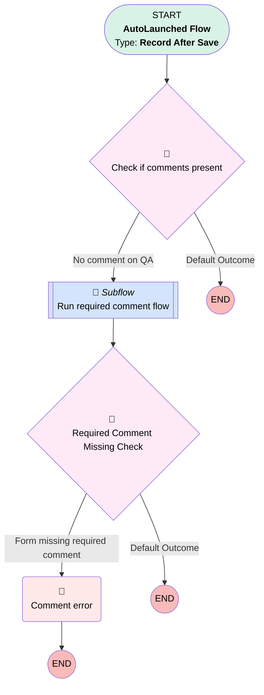

# QA | After Save | Pre Completion Checks

## Flow Diagram [(_View History_)](QA_After_Save_Pre_Completion_Checks-history.md)

<!-- Flow description -->

## General Information

|<!-- -->|<!-- -->|
|:---|:---|
|Object|Quality_Assurance_QA__c|
|Process Type| Auto Launched Flow|
|Trigger Type| Record After Save|
|Record Trigger Type| Update|
|Label|QA | After Save | Pre Completion Checks|
|Status|Active|
|Description|For dynamic QA forms.  Complex validation rules that run when a reviewer score is added.|
|Environments|Default|
|Interview Label|QA | After Save | Pre Completion Checks {!$Flow.CurrentDateTime}|
| Builder Type (PM)|LightningFlowBuilder|
| Canvas Mode (PM)|AUTO_LAYOUT_CANVAS|
| Origin Builder Type (PM)|LightningFlowBuilder|
|Connector|[Check_if_comments_present](#check_if_comments_present)|
|Next Node|[Check_if_comments_present](#check_if_comments_present)|

#### Filters (logic: **and**)

|Filter Id|Field|Operator|Value|
|:-- |:-- |:--:|:--: |
|1|Reviewer_Score__c| Is Null|<!-- -->|
|2|Reviewer_Score__c| Is Changed|✅|
|3|QA_Design_Version__c| Is Null|<!-- -->|

## Flow Nodes Details

### Comment_error

|<!-- -->|<!-- -->|
|:---|:---|
|Type|Custom Error|
|Label|Comment error|
|Custom Error Messages|errorMessage: '{!Run_required_comment_flow.requiredCommentMessage}' fieldSelection: Comments__c isFieldError: true |

### Check_if_comments_present

|<!-- -->|<!-- -->|
|:---|:---|
|Type|Decision|
|Label|Check if comments present|
|Default Connector Label|Default Outcome|

#### Rule No_comment_on_QA (No comment on QA)

|<!-- -->|<!-- -->|
|:---|:---|
|Connector|[Run_required_comment_flow](#run_required_comment_flow)|
|Condition Logic|and|

|Condition Id|Left Value Reference|Operator|Right Value|
|:-- |:-- |:--:|:--: |
|1|$Record.Comments__c| Is Blank|✅|

### Required_Comment_Missing_Check

|<!-- -->|<!-- -->|
|:---|:---|
|Type|Decision|
|Label|Required Comment Missing Check|
|Default Connector Label|Default Outcome|

#### Rule Form_missing_required_comment (Form missing required comment)

|<!-- -->|<!-- -->|
|:---|:---|
|Connector|[Comment_error](#comment_error)|
|Condition Logic|and|

|Condition Id|Left Value Reference|Operator|Right Value|
|:-- |:-- |:--:|:--: |
|1|Run_required_comment_flow.requiredCommentMessage| Is Blank|⬜|

### Run_required_comment_flow

|<!-- -->|<!-- -->|
|:---|:---|
|Type|Subflow|
|Label|Run required comment flow|
|Flow Name|QA_Autolaunched_Check_If_Notes_Required|
|Store Output Automatically|✅|
|Connector|[Required_Comment_Missing_Check](#required_comment_missing_check)|

#### Input Assignments

|Field|Value|
|:-- |:--: |
|<!-- -->|$Record|

___

_Documentation generated from branch monitoring_myubiquity by [sfdx-hardis](https://sfdx-hardis.cloudity.com), featuring [salesforce-flow-visualiser](https://github.com/toddhalfpenny/salesforce-flow-visualiser)_