# Route to Ubot Chat - Omni

## Flow Diagram [(_View History_)](Route_to_Ubot_Employee_Chat_Omni-history.md)

```mermaid
%% If you read this, your Markdown visualizer does not handle MermaidJS syntax.
%% - If you are in VS Code, install extension `Markdown Preview Mermaid Support` at https://marketplace.visualstudio.com/items?itemName=bierner.markdown-mermaid
%% - If you are using sfdx-hardis, try to define env variable `MERMAID_MODES=cli,docker` ,then run again the command to regenerate markdown with SVG images.
%% - If you are within mkdocs-material, define mermaid plugin in `mkdocs.yml` as described in https://squidfunk.github.io/mkdocs-material/extensions/mermaid/
%% - As a last resort, you can copy-paste this MermaidJS code into https://mermaid.live/ to see the flow diagram

flowchart TB
START(["START"]):::startClass
click START "#general-information" "4123508407"

Copy_1_of_Route_to_Employer_Bot("⚡ <em></em><br/>Copy 1 of Route to Employer Bot"):::actionCalls
click Copy_1_of_Route_to_Employer_Bot "#copy_1_of_route_to_employer_bot" "165345892"

Copy_1_of_Route_to_Ubot_Employee_Chat_Omni("⚡ <em></em><br/>Copy 1 of Route to Ubot Employee Chat - Omni"):::actionCalls
click Copy_1_of_Route_to_Ubot_Employee_Chat_Omni "#copy_1_of_route_to_ubot_employee_chat_omni" "3119019285"

Prechat_Role{"🔀 <em></em><br/>Prechat Role"}:::decisions
click Prechat_Role "#prechat_role" "2486139165"

Update_Prior_to_Routing[("🛠️ <em></em><br/>Update Prior to Routing")]:::recordUpdates
click Update_Prior_to_Routing "#update_prior_to_routing" "2377212131"

Copy_1_of_Route_to_Employer_Bot --> END_Copy_1_of_Route_to_Employer_Bot
Copy_1_of_Route_to_Ubot_Employee_Chat_Omni --> END_Copy_1_of_Route_to_Ubot_Employee_Chat_Omni
Prechat_Role --> |"Sponsor/Trustee"| Copy_1_of_Route_to_Ubot_Employee_Chat_Omni
Prechat_Role --> |"Advisor"| Copy_1_of_Route_to_Ubot_Employee_Chat_Omni
Prechat_Role --> |"Default Outcome"| Copy_1_of_Route_to_Employer_Bot
Update_Prior_to_Routing --> Prechat_Role
START -->  Update_Prior_to_Routing
END_Copy_1_of_Route_to_Employer_Bot(( END )):::endClass
END_Copy_1_of_Route_to_Ubot_Employee_Chat_Omni(( END )):::endClass


classDef actionCalls fill:#D4E4FC,color:black,text-decoration:none,max-height:100px
classDef assignments fill:#FBEED7,color:black,text-decoration:none,max-height:100px
classDef collectionProcessors fill:#F0E3FA,color:black,text-decoration:none,max-height:100px
classDef customErrors fill:#FFE9E9,color:black,text-decoration:none,max-height:100px
classDef decisions fill:#FDEAF6,color:black,text-decoration:none,max-height:100px
classDef loops fill:#FDEAF6,color:black,text-decoration:none,max-height:100px
classDef recordCreates fill:#FFF8C9,color:black,text-decoration:none,max-height:100px
classDef recordDeletes fill:#FFF8C9,color:black,text-decoration:none,max-height:100px
classDef recordLookups fill:#EDEAFF,color:black,text-decoration:none,max-height:100px
classDef recordUpdates fill:#FFF8C9,color:black,text-decoration:none,max-height:100px
classDef screens fill:#DFF6FF,color:black,text-decoration:none,max-height:100px
classDef subflows fill:#D4E4FC,color:black,text-decoration:none,max-height:100px
classDef startClass fill:#D9F2E6,color:black,text-decoration:none,max-height:100px
classDef endClass fill:#F9BABA,color:black,text-decoration:none,max-height:100px
classDef transforms fill:#FDEAF6,color:black,text-decoration:none,max-height:100px


```

<!-- Flow description -->

## General Information

|<!-- -->|<!-- -->|
|:---|:---|
|Process Type| Routing Flow|
|Label|Route to Ubot Chat - Omni|
|Status|Obsolete|
|Description|Routes each message to an enhanced bot. You can customize the flow with business and routing rules.|
|Environments|Default|
|Interview Label|Route to Ubot Employee Chat - Omni {!$Flow.CurrentDateTime}|
| Builder Type (PM)|LightningFlowBuilder|
| Canvas Mode (PM)|AUTO_LAYOUT_CANVAS|
| Origin Builder Type (PM)|LightningFlowBuilder|
|Connector|[Update_Prior_to_Routing](#update_prior_to_routing)|
|Next Node|[Update_Prior_to_Routing](#update_prior_to_routing)|

## Variables

|Name|Data Type|Is Collection|Is Input|Is Output|Object Type|Description|
|:-- |:--:|:--:|:--:|:--:|:--:|:--  |
|Email|String|⬜|✅|⬜|<!-- -->|<!-- -->|
|FirstName|String|⬜|✅|⬜|<!-- -->|<!-- -->|
|LastName|String|⬜|✅|⬜|<!-- -->|<!-- -->|
|Omni_Role|String|⬜|✅|⬜|<!-- -->|<!-- -->|
|recordId|String|⬜|✅|⬜|<!-- -->|<!-- -->|
|Subject|String|⬜|✅|⬜|<!-- -->|<!-- -->|

## Flow Nodes Details

### Copy_1_of_Route_to_Employer_Bot

|<!-- -->|<!-- -->|
|:---|:---|
|Type|Action Call|
|Label|Copy 1 of Route to Employer Bot|
|Action Type|Route Work|
|Action Name|routeWork|
|Flow Transaction Model|CurrentTransaction|
|Name Segment|routeWork|
|Record Id (input)|recordId|
|Service Channel Id (input)|0N9Ho000000DFI0KAO|
|Service Channel Label (input)|Messaging|
|Service Channel Dev Name (input)|sfdc_livemessage|
|Routing Type (input)|Bot|
|Routing Config Id (input)|<!-- -->|
|Routing Config Label (input)|<!-- -->|
|Queue Id (input)|00GHo000001bnnbMAA|
|Agent Id (input)|<!-- -->|
|Agent Label (input)|<!-- -->|
|Queue Label (input)|Omni Support|
|Skill Option (input)|<!-- -->|
|Skill Requirements Resource Item (input)|<!-- -->|
|Bot Id (input)|0XxHo000000PUTsKAO|
|Bot Label (input)|Ubot Employer Chat - Omni|

### Copy_1_of_Route_to_Ubot_Employee_Chat_Omni

|<!-- -->|<!-- -->|
|:---|:---|
|Type|Action Call|
|Label|Copy 1 of Route to Ubot Employee Chat - Omni|
|Action Type|Route Work|
|Action Name|routeWork|
|Description|Routes all messages to your enhanced bot.|
|Flow Transaction Model|CurrentTransaction|
|Name Segment|routeWork|
|Record Id (input)|recordId|
|Service Channel Id (input)|0N9Ho000000DFI0KAO|
|Service Channel Label (input)|Messaging|
|Service Channel Dev Name (input)|sfdc_livemessage|
|Routing Type (input)|Bot|
|Routing Config Id (input)|<!-- -->|
|Routing Config Label (input)|<!-- -->|
|Queue Id (input)|00GHo000001bnnbMAA|
|Agent Id (input)|<!-- -->|
|Agent Label (input)|<!-- -->|
|Queue Label (input)|Omni Support|
|Skill Option (input)|<!-- -->|
|Skill Requirements Resource Item (input)|<!-- -->|
|Bot Id (input)|0XxHo000000PTrFKAW|
|Bot Label (input)|Ubot Employee Chat - Omni|

### Prechat_Role

|<!-- -->|<!-- -->|
|:---|:---|
|Type|Decision|
|Label|Prechat Role|
|Default Connector|[Copy_1_of_Route_to_Employer_Bot](#copy_1_of_route_to_employer_bot)|
|Default Connector Label|Default Outcome|

#### Rule Sponsor_Trustee (Sponsor/Trustee)

|<!-- -->|<!-- -->|
|:---|:---|
|Connector|[Copy_1_of_Route_to_Ubot_Employee_Chat_Omni](#copy_1_of_route_to_ubot_employee_chat_omni)|
|Condition Logic|or|

|Condition Id|Left Value Reference|Operator|Right Value|
|:-- |:-- |:--:|:--: |
|1|Omni_Role| Contains|Plan Sponsor|
|2|Omni_Role| Contains|Plan Trustee|
|3|Omni_Role| Contains|Other|

#### Rule Advisor (Advisor)

|<!-- -->|<!-- -->|
|:---|:---|
|Connector|[Copy_1_of_Route_to_Ubot_Employee_Chat_Omni](#copy_1_of_route_to_ubot_employee_chat_omni)|
|Condition Logic|or|

|Condition Id|Left Value Reference|Operator|Right Value|
|:-- |:-- |:--:|:--: |
|1|Omni_Role| Equal To|Advisor|
|2|Omni_Role| Equal To|TPA|

### Update_Prior_to_Routing

|<!-- -->|<!-- -->|
|:---|:---|
|Type|Record Update|
|Object|MessagingSession|
|Label|Update Prior to Routing|
|Connector|[Prechat_Role](#prechat_role)|

#### Filters (logic: **and**)

|Filter Id|Field|Operator|Value|
|:-- |:-- |:--:|:--: |
|1|Id| Equal To|recordId|

#### Input Assignments

|Field|Value|
|:-- |:--: |
|Email__c|Email|
|First_Name__c|FirstName|
|Last_Name__c|LastName|
|Omni_Role__c|Omni_Role|
|Subject__c|Subject|

___

_Documentation generated from branch monitoring_myubiquity by [sfdx-hardis](https://sfdx-hardis.cloudity.com), featuring [salesforce-flow-visualiser](https://github.com/toddhalfpenny/salesforce-flow-visualiser)_