# Opportunity| After Trigger | Opportunity Won Next Steps

## Flow Diagram [(_View History_)](Sales_Opportunity_Won_Next_Steps-history.md)

```mermaid
%% If you read this, your Markdown visualizer does not handle MermaidJS syntax.
%% - If you are in VS Code, install extension `Markdown Preview Mermaid Support` at https://marketplace.visualstudio.com/items?itemName=bierner.markdown-mermaid
%% - If you are using sfdx-hardis, try to define env variable `MERMAID_MODES=cli,docker` ,then run again the command to regenerate markdown with SVG images.
%% - If you are within mkdocs-material, define mermaid plugin in `mkdocs.yml` as described in https://squidfunk.github.io/mkdocs-material/extensions/mermaid/
%% - As a last resort, you can copy-paste this MermaidJS code into https://mermaid.live/ to see the flow diagram

flowchart TB
START(["START<br/><b>AutoLaunched Flow</b></br>Type: <b> Record After Save</b>"]):::startClass
click START "#general-information" "3443331579"

Notify_Accounting("📧 <em></em><br/>Notify Accounting"):::actionCalls
click Notify_Accounting "#notify_accounting" "2016369796"

Notify_RPCs("📧 <em></em><br/>Notify RPCs"):::actionCalls
click Notify_RPCs "#notify_rpcs" "1058074025"

Send_CY_Accounting_Alert("📧 <em></em><br/>Send CY Accounting Alert"):::actionCalls
click Send_CY_Accounting_Alert "#send_cy_accounting_alert" "3658668533"

Send_Partner_Referral_Email("📧 <em></em><br/>Send Partner Referral Email"):::actionCalls
click Send_Partner_Referral_Email "#send_partner_referral_email" "1794264089"

Send_Sallus_Sale_Alert_Internal("📧 <em></em><br/>Send Sallus Sale Alert - Internal"):::actionCalls
click Send_Sallus_Sale_Alert_Internal "#send_sallus_sale_alert_internal" "3305481897"

Throw_objective_error("🚫 <em></em><br/>Throw objective error"):::customErrors
click Throw_objective_error "#throw_objective_error" "2302399321"

Additional_Advisors_Present{"🔀 <em></em><br/>Additional Advisors Present?"}:::decisions
click Additional_Advisors_Present "#additional_advisors_present" "2974350236"

CBIZ_Partner_Referral_Sale{"🔀 <em></em><br/>CBIZ | Partner Referral Sale?"}:::decisions
click CBIZ_Partner_Referral_Sale "#cbiz_partner_referral_sale" "2219115936"

CensiblyYours_Sale{"🔀 <em></em><br/>CensiblyYours Sale?"}:::decisions
click CensiblyYours_Sale "#censiblyyours_sale" "1182873497"

Change_Record_Type{"🔀 <em></em><br/>Change Record Type?"}:::decisions
click Change_Record_Type "#change_record_type" "213182051"

Conversion_Simply_Opp_Closes{"🔀 <em></em><br/>Conversion Simply Opp Closes?"}:::decisions
click Conversion_Simply_Opp_Closes "#conversion_simply_opp_closes" "761463502"

Fund_Lineup_Change_Closed{"🔀 <em></em><br/>Fund Lineup Change Closed?"}:::decisions
click Fund_Lineup_Change_Closed "#fund_lineup_change_closed" "3105708266"

Is_objective_complete{"🔀 <em></em><br/>Is objective complete?"}:::decisions
click Is_objective_complete "#is_objective_complete" "209348327"

New_Simply_Opp_Closes{"🔀 <em></em><br/>New Simply Opp Closes?"}:::decisions
click New_Simply_Opp_Closes "#new_simply_opp_closes" "3846552720"

Partnership_Opp_Check{"🔀 <em></em><br/>Partnership Opp Check"}:::decisions
click Partnership_Opp_Check "#partnership_opp_check" "3267109078"

Plan_Amendment_Sale{"🔀 <em></em><br/>Plan Amendment Sale?"}:::decisions
click Plan_Amendment_Sale "#plan_amendment_sale" "3894927609"

Sallus_PEP_Sold{"🔀 <em></em><br/>Sallus PEP Sold?"}:::decisions
click Sallus_PEP_Sold "#sallus_pep_sold" "1026501074"

Send_Welcome_Email1{"🔀 <em></em><br/>Send Welcome Email?"}:::decisions
click Send_Welcome_Email1 "#send_welcome_email1" "3843691237"

Single_k_Opportunity_Closes{"🔀 <em></em><br/>Single(k) Opportunity Closes?"}:::decisions
click Single_k_Opportunity_Closes "#single_k_opportunity_closes" "1145140373"

Single_k_Plus_Opp_Closes{"🔀 <em></em><br/>Single(k) Plus Opp Closes?"}:::decisions
click Single_k_Plus_Opp_Closes "#single_k_plus_opp_closes" "749989162"

X401_k_Opportunity_Closes{"🔀 <em></em><br/>401(k) Opportunity Closes?"}:::decisions
click X401_k_Opportunity_Closes "#x401_k_opportunity_closes" "3497621607"

X401k_or_SK_Opp_Closed{"🔀 <em></em><br/>401k or SK Opp Closed?"}:::decisions
click X401k_or_SK_Opp_Closed "#x401k_or_sk_opp_closed" "1566676732"

Create_CensiblyYours_Add_On[("➕ <em></em><br/>Create CensiblyYours Add-On")]:::recordCreates
click Create_CensiblyYours_Add_On "#create_censiblyyours_add_on" "368082092"

Create_Implementation[("➕ <em></em><br/>Create Implementation")]:::recordCreates
click Create_Implementation "#create_implementation" "254994328"

Create_Implementation2[("➕ <em></em><br/>Create Implementation")]:::recordCreates
click Create_Implementation2 "#create_implementation2" "509359082"

Create_Plan[("➕ <em></em><br/>Create Plan")]:::recordCreates
click Create_Plan "#create_plan" "3152028587"

Check_for_objective[("🔍 <em></em><br/>Check for objective")]:::recordLookups
click Check_for_objective "#check_for_objective" "2309779307"

Update_AC[("🛠️ <em></em><br/>Update AC")]:::recordUpdates
click Update_AC "#update_ac" "1484413084"

Update_Account_Record_Type[("🛠️ <em></em><br/>Update Account Record Type")]:::recordUpdates
click Update_Account_Record_Type "#update_account_record_type" "1603973081"

Update_Client_Details_on_Account_Record[("🛠️ <em></em><br/>Update Client Details on Account")]:::recordUpdates
click Update_Client_Details_on_Account_Record "#update_client_details_on_account_record" "546523888"

Update_CST_on_Account[("🛠️ <em></em><br/>Update CST on Account")]:::recordUpdates
click Update_CST_on_Account "#update_cst_on_account" "1379881331"

Update_Plan[("🛠️ <em></em><br/>Update Plan")]:::recordUpdates
click Update_Plan "#update_plan" "631561580"

Update_Plan4[("🛠️ <em></em><br/>Update Plan")]:::recordUpdates
click Update_Plan4 "#update_plan4" "2212644187"

Update_Proposal[("🛠️ <em></em><br/>Update Proposal")]:::recordUpdates
click Update_Proposal "#update_proposal" "1851882462"

Update_Proposal_Status[("🛠️ <em></em><br/>Update Proposal Status")]:::recordUpdates
click Update_Proposal_Status "#update_proposal_status" "2701235037"

Update_Proposal_Status2[("🛠️ <em></em><br/>Update Proposal Status")]:::recordUpdates
click Update_Proposal_Status2 "#update_proposal_status2" "2426404798"

Send_Welcome_Email[["🔗 <em>Subflow</em><br/>Send Welcome Email"]]:::subflows
click Send_Welcome_Email "#send_welcome_email" "119278459"

Notify_Accounting --> END_Notify_Accounting
Notify_RPCs --> New_Simply_Opp_Closes
Send_CY_Accounting_Alert --> Update_Plan4
Send_Partner_Referral_Email --> END_Send_Partner_Referral_Email
Send_Sallus_Sale_Alert_Internal --> Update_Proposal
Throw_objective_error --> END_Throw_objective_error
Additional_Advisors_Present --> |"TRUE"| Notify_RPCs
Additional_Advisors_Present --> |"FALSE"| New_Simply_Opp_Closes
CBIZ_Partner_Referral_Sale --> |"TRUE"| Send_Partner_Referral_Email
CBIZ_Partner_Referral_Sale --> |"FALSE"| Sallus_PEP_Sold
CensiblyYours_Sale --> |"TRUE"| Create_CensiblyYours_Add_On
CensiblyYours_Sale --> |"FALSE"| CBIZ_Partner_Referral_Sale
Change_Record_Type --> |"TRUE"| Update_Account_Record_Type
Change_Record_Type --> |"FALSE"| X401k_or_SK_Opp_Closed
Conversion_Simply_Opp_Closes --> |"TRUE"| Update_Proposal_Status2
Conversion_Simply_Opp_Closes --> |"FALSE"| Single_k_Opportunity_Closes
Fund_Lineup_Change_Closed --> |"TRUE"| Notify_Accounting
Fund_Lineup_Change_Closed --> |"FALSE"| CensiblyYours_Sale
Is_objective_complete --> |"Incomplete objective"| Throw_objective_error
New_Simply_Opp_Closes --> |"TRUE"| Update_Proposal_Status
New_Simply_Opp_Closes --> |"FALSE"| Conversion_Simply_Opp_Closes
Partnership_Opp_Check --> |"Partnership Launch"| Check_for_objective
Partnership_Opp_Check --> |"Default Outcome"| Send_Welcome_Email1
Plan_Amendment_Sale --> |"TRUE"| Update_Plan
Plan_Amendment_Sale --> |"FALSE"| Fund_Lineup_Change_Closed
Sallus_PEP_Sold --> |"TRUE"| Send_Sallus_Sale_Alert_Internal
Sallus_PEP_Sold --> |"FALSE"| END_Sallus_PEP_Sold
Send_Welcome_Email1 --> |"TRUE"| Send_Welcome_Email
Send_Welcome_Email1 --> |"FALSE"| Change_Record_Type
Single_k_Opportunity_Closes --> |"TRUE"| Create_Plan
Single_k_Opportunity_Closes --> |"FALSE"| Plan_Amendment_Sale
Single_k_Plus_Opp_Closes --> |"TRUE"| Create_Implementation2
Single_k_Plus_Opp_Closes --> |"FALSE"| Additional_Advisors_Present
X401_k_Opportunity_Closes --> |"TRUE"| Create_Implementation
X401_k_Opportunity_Closes --> |"FALSE"| Single_k_Plus_Opp_Closes
X401k_or_SK_Opp_Closed --> |"Update Client Details on Account"| Update_Client_Details_on_Account_Record
X401k_or_SK_Opp_Closed --> |"Default Outcome"| X401_k_Opportunity_Closes
Create_CensiblyYours_Add_On --> Send_CY_Accounting_Alert
Create_Implementation --> Single_k_Plus_Opp_Closes
Create_Implementation2 --> Additional_Advisors_Present
Create_Plan --> Update_CST_on_Account
Check_for_objective --> Is_objective_complete
Update_AC --> END_Update_AC
Update_Account_Record_Type --> X401k_or_SK_Opp_Closed
Update_Client_Details_on_Account_Record --> X401_k_Opportunity_Closes
Update_CST_on_Account --> Update_AC
Update_Plan --> Fund_Lineup_Change_Closed
Update_Plan4 --> END_Update_Plan4
Update_Proposal --> END_Update_Proposal
Update_Proposal_Status --> END_Update_Proposal_Status
Update_Proposal_Status2 --> END_Update_Proposal_Status2
START -->  Partnership_Opp_Check
Send_Welcome_Email --> Change_Record_Type
END_Notify_Accounting(( END )):::endClass
END_Send_Partner_Referral_Email(( END )):::endClass
END_Throw_objective_error(( END )):::endClass
END_Sallus_PEP_Sold(( END )):::endClass
END_Update_AC(( END )):::endClass
END_Update_Plan4(( END )):::endClass
END_Update_Proposal(( END )):::endClass
END_Update_Proposal_Status(( END )):::endClass
END_Update_Proposal_Status2(( END )):::endClass


classDef actionCalls fill:#D4E4FC,color:black,text-decoration:none,max-height:100px
classDef assignments fill:#FBEED7,color:black,text-decoration:none,max-height:100px
classDef collectionProcessors fill:#F0E3FA,color:black,text-decoration:none,max-height:100px
classDef customErrors fill:#FFE9E9,color:black,text-decoration:none,max-height:100px
classDef decisions fill:#FDEAF6,color:black,text-decoration:none,max-height:100px
classDef loops fill:#FDEAF6,color:black,text-decoration:none,max-height:100px
classDef recordCreates fill:#FFF8C9,color:black,text-decoration:none,max-height:100px
classDef recordDeletes fill:#FFF8C9,color:black,text-decoration:none,max-height:100px
classDef recordLookups fill:#EDEAFF,color:black,text-decoration:none,max-height:100px
classDef recordUpdates fill:#FFF8C9,color:black,text-decoration:none,max-height:100px
classDef screens fill:#DFF6FF,color:black,text-decoration:none,max-height:100px
classDef subflows fill:#D4E4FC,color:black,text-decoration:none,max-height:100px
classDef startClass fill:#D9F2E6,color:black,text-decoration:none,max-height:100px
classDef endClass fill:#F9BABA,color:black,text-decoration:none,max-height:100px
classDef transforms fill:#FDEAF6,color:black,text-decoration:none,max-height:100px


```

<!-- Flow description -->

## General Information

|<!-- -->|<!-- -->|
|:---|:---|
|Object|Opportunity|
|Process Type| Auto Launched Flow|
|Trigger Type| Record After Save|
|Record Trigger Type| Create And Update|
|Label|Opportunity| After Trigger | Opportunity Won Next Steps|
|Status|Active|
|Does Require Record Changed To Meet Criteria|✅|
|Description|Added validation for partnership opportunities with an associated objective.  Prevents closure with an incomplete objective|
|Environments|Default|
|Interview Label|Opportunity| After Trigger | Opportunity Won Next Steps {!$Flow.CurrentDateTime}|
| Builder Type (PM)|LightningFlowBuilder|
| Canvas Mode (PM)|AUTO_LAYOUT_CANVAS|
|Connector|[Partnership_Opp_Check](#partnership_opp_check)|
|Next Node|[Partnership_Opp_Check](#partnership_opp_check)|

#### Filters (logic: **or**)

|Filter Id|Field|Operator|Value|
|:-- |:-- |:--:|:--: |
|1|StageName| Equal To|Closed Won|
|2|StageName| Equal To|Partnership Launched|

## Variables

|Name|Data Type|Is Collection|Is Input|Is Output|Object Type|Description|
|:-- |:--:|:--:|:--:|:--:|:--:|:--  |
|TODAY|Date|⬜|⬜|⬜|<!-- -->|<!-- -->|

## Formulas

|Name|Data Type|Expression|Description|
|:-- |:--:|:-- |:--  |
|isSimplyDate|Date|IF(     ISPICKVAL({!$Record.Service_Option__c}, "Simply Retirement"),      TODAY(),     IF(         ISPICKVAL({!$Record.Service_Option__c}, "Custom(k) MML"),          {!$Record.Restatement_Date__c},          null     ) )|<!-- -->|
|PlanEffectiveDate|Date|IF( ISNULL({!$Record.Desired_Plan_Start_Date__c}), TODAY(), {!$Record.Desired_Plan_Start_Date__c})|<!-- -->|
|Platinum|String|IF({!$Record.Account.NumberOfEmployees} >= 100, "Platinum","Client Support")|<!-- -->|

## Constants

|Name|Data Type|Value|Description|
|:-- |:--:|:--:|:--  |
|doNotUse|Boolean|<!-- -->|Just to trigger change for dev pipeline|

## Flow Nodes Details

### Notify_Accounting

|<!-- -->|<!-- -->|
|:---|:---|
|Type|Action Call|
|Label|Notify Accounting|
|Action Type|Email Alert|
|Action Name|Opportunity.Accounting_Fund_List_Sale|
|Flow Transaction Model|CurrentTransaction|
|Name Segment|Opportunity.Accounting_Fund_List_Sale|
|Offset|0|
| SObject Row Id (input)|$Record.Id|

### Notify_RPCs

|<!-- -->|<!-- -->|
|:---|:---|
|Type|Action Call|
|Label|Notify RPCs|
|Action Type|Email Alert|
|Action Name|Opportunity.Additional_Financial_Professionals_Found|
|Flow Transaction Model|CurrentTransaction|
|Name Segment|Opportunity.Additional_Financial_Professionals_Found|
|Offset|0|
| SObject Row Id (input)|$Record.Id|
|Connector|[New_Simply_Opp_Closes](#new_simply_opp_closes)|

### Send_CY_Accounting_Alert

|<!-- -->|<!-- -->|
|:---|:---|
|Type|Action Call|
|Label|Send CY Accounting Alert|
|Action Type|Email Alert|
|Action Name|Opportunity.Accounting_CensiblyYours_Sale|
|Flow Transaction Model|CurrentTransaction|
|Name Segment|Opportunity.Accounting_CensiblyYours_Sale|
|Offset|0|
| SObject Row Id (input)|$Record.Id|
|Connector|[Update_Plan4](#update_plan4)|

### Send_Partner_Referral_Email

|<!-- -->|<!-- -->|
|:---|:---|
|Type|Action Call|
|Label|Send Partner Referral Email|
|Action Type|Email Alert|
|Action Name|Opportunity.Sales_CBIZ_Referral_Partner_Sale|
|Flow Transaction Model|CurrentTransaction|
|Name Segment|Opportunity.Sales_CBIZ_Referral_Partner_Sale|
|Offset|0|
| SObject Row Id (input)|$Record.Id|

### Send_Sallus_Sale_Alert_Internal

|<!-- -->|<!-- -->|
|:---|:---|
|Type|Action Call|
|Label|Send Sallus Sale Alert - Internal|
|Action Type|Email Alert|
|Action Name|Opportunity.Sallus_Plan_Sold_Internal|
|Flow Transaction Model|CurrentTransaction|
|Name Segment|Opportunity.Sallus_Plan_Sold_Internal|
|Offset|0|
| SObject Row Id (input)|$Record.Id|
|Connector|[Update_Proposal](#update_proposal)|

### Throw_objective_error

|<!-- -->|<!-- -->|
|:---|:---|
|Type|Custom Error|
|Label|Throw objective error|
|Custom Error Messages|errorMessage: >- &nbsp;&nbsp;The partnership objective is incomplete!  Please complete all key results and &nbsp;&nbsp;change the objective's status to Completed before closing opportunity. isFieldError: false |

### Additional_Advisors_Present

|<!-- -->|<!-- -->|
|:---|:---|
|Type|Decision|
|Label|Additional Advisors Present?|
|Default Connector|[New_Simply_Opp_Closes](#new_simply_opp_closes)|
|Default Connector Label|FALSE|

#### Rule TRUE_Additional_Advisors_Present (TRUE)

|<!-- -->|<!-- -->|
|:---|:---|
|Does Require Record Changed To Meet Criteria|✅|
|Connector|[Notify_RPCs](#notify_rpcs)|
|Condition Logic|and|

|Condition Id|Left Value Reference|Operator|Right Value|
|:-- |:-- |:--:|:--: |
|1|$Record.StageName| Equal To|Closed Won|
|2|$Record.Additional_Financial_Professional_Names__c| Is Null|⬜|

### CBIZ_Partner_Referral_Sale

|<!-- -->|<!-- -->|
|:---|:---|
|Type|Decision|
|Label|CBIZ | Partner Referral Sale?|
|Default Connector|[Sallus_PEP_Sold](#sallus_pep_sold)|
|Default Connector Label|FALSE|

#### Rule TRUE_CBIZ_Partner_Referral_Sale (TRUE)

|<!-- -->|<!-- -->|
|:---|:---|
|Connector|[Send_Partner_Referral_Email](#send_partner_referral_email)|
|Condition Logic|and|

|Condition Id|Left Value Reference|Operator|Right Value|
|:-- |:-- |:--:|:--: |
|1|$Record.StageName| Is Changed|✅|
|2|$Record.StageName| Equal To|Closed Won|
|3|$Record.CloseDate| Equal To|TODAY|
|4|$Record.Service_Option__c| Equal To|Partner Referral|

### CensiblyYours_Sale

|<!-- -->|<!-- -->|
|:---|:---|
|Type|Decision|
|Label|CensiblyYours Sale?|
|Default Connector|[CBIZ_Partner_Referral_Sale](#cbiz_partner_referral_sale)|
|Default Connector Label|FALSE|

#### Rule TRUE_CensiblyYours_Sale (TRUE)

|<!-- -->|<!-- -->|
|:---|:---|
|Does Require Record Changed To Meet Criteria|✅|
|Connector|[Create_CensiblyYours_Add_On](#create_censiblyyours_add_on)|
|Condition Logic|1 AND (2 OR 5) AND 3 AND 4|

|Condition Id|Left Value Reference|Operator|Right Value|
|:-- |:-- |:--:|:--: |
|1|$Record.Product_Type__c| Equal To|Add-On Product|
|2|$Record.Service_Option__c| Equal To|CensiblyYours_Prior338|
|3|$Record.StageName| Equal To|Closed Won|
|4|$Record.CloseDate| Equal To|TODAY|
|5|$Record.Service_Option__c| Equal To|CensiblyYours - No Prior 3(38)|

### Change_Record_Type

|<!-- -->|<!-- -->|
|:---|:---|
|Type|Decision|
|Label|Change Record Type?|
|Default Connector|[X401k_or_SK_Opp_Closed](#x401k_or_sk_opp_closed)|
|Default Connector Label|FALSE|

#### Rule TRUE_Change_Record_Type (TRUE)

|<!-- -->|<!-- -->|
|:---|:---|
|Connector|[Update_Account_Record_Type](#update_account_record_type)|
|Condition Logic|and|

|Condition Id|Left Value Reference|Operator|Right Value|
|:-- |:-- |:--:|:--: |
|1|$Record.Account.RecordTypeId| Equal To|01237000000XwVtAAK|

### Conversion_Simply_Opp_Closes

|<!-- -->|<!-- -->|
|:---|:---|
|Type|Decision|
|Label|Conversion Simply Opp Closes?|
|Default Connector|[Single_k_Opportunity_Closes](#single_k_opportunity_closes)|
|Default Connector Label|FALSE|

#### Rule TRUE_Conversion_Simply_Opp_Closes (TRUE)

|<!-- -->|<!-- -->|
|:---|:---|
|Does Require Record Changed To Meet Criteria|✅|
|Connector|[Update_Proposal_Status2](#update_proposal_status2)|
|Condition Logic|and|

|Condition Id|Left Value Reference|Operator|Right Value|
|:-- |:-- |:--:|:--: |
|1|$Record.Service_Option__c| Contains|Simply Retirement|
|2|$Record.CloseDate| Equal To|TODAY|
|3|$Record.StageName| Equal To|Closed Won|
|4|$Record.Plan_Type__c| Equal To|Conversion Plan|
|5|$Record.Type| Equal To|401(k) Plan Sale|

### Fund_Lineup_Change_Closed

|<!-- -->|<!-- -->|
|:---|:---|
|Type|Decision|
|Label|Fund Lineup Change Closed?|
|Default Connector|[CensiblyYours_Sale](#censiblyyours_sale)|
|Default Connector Label|FALSE|

#### Rule TRUE_Fund_Lineup_Change_Closed (TRUE)

|<!-- -->|<!-- -->|
|:---|:---|
|Connector|[Notify_Accounting](#notify_accounting)|
|Condition Logic|and|

|Condition Id|Left Value Reference|Operator|Right Value|
|:-- |:-- |:--:|:--: |
|1|$Record.Product_Type__c| Equal To|Plan Amendment|
|2|$Record.Service_Option__c| Equal To|Fund Lineup Change|
|3|$Record.StageName| Is Changed|✅|
|4|$Record.StageName| Equal To|Closed Won|
|5|$Record.CloseDate| Equal To|TODAY|

### Is_objective_complete

|<!-- -->|<!-- -->|
|:---|:---|
|Type|Decision|
|Label|Is objective complete?|
|Default Connector|[Throw_objective_error](#throw_objective_error)|
|Default Connector Label|Incomplete objective|

#### Rule Objective_complete_or_not_found (Objective complete or not found)

|<!-- -->|<!-- -->|
|:---|:---|
|Condition Logic|((1 OR 2) AND 3) OR 4|

|Condition Id|Left Value Reference|Operator|Right Value|
|:-- |:-- |:--:|:--: |
|1|Check_for_objective.Completion__c| Equal To|100|
|2|Check_for_objective.Completion_per__c| Equal To|100|
|3|Check_for_objective.Status__c| Equal To|Completed|
|4|[Check_for_objective](#check_for_objective)| Is Null|✅|

### New_Simply_Opp_Closes

|<!-- -->|<!-- -->|
|:---|:---|
|Type|Decision|
|Label|New Simply Opp Closes?|
|Default Connector|[Conversion_Simply_Opp_Closes](#conversion_simply_opp_closes)|
|Default Connector Label|FALSE|

#### Rule TRUE_New_Simply_Opp_Closes (TRUE)

|<!-- -->|<!-- -->|
|:---|:---|
|Does Require Record Changed To Meet Criteria|✅|
|Connector|[Update_Proposal_Status](#update_proposal_status)|
|Condition Logic|and|

|Condition Id|Left Value Reference|Operator|Right Value|
|:-- |:-- |:--:|:--: |
|1|$Record.StageName| Equal To|Closed Won|
|2|$Record.CloseDate| Equal To|TODAY|
|3|$Record.Service_Option__c| Contains|Simply Retirement|
|4|$Record.Type| Equal To|401(k) Plan Sale|
|5|$Record.Plan_Type__c| Equal To|New Plan|

### Partnership_Opp_Check

|<!-- -->|<!-- -->|
|:---|:---|
|Type|Decision|
|Label|Partnership Opp Check|
|Description|Is this a biz dev / partnership opp?  If so go to dedicated path|
|Default Connector|[Send_Welcome_Email1](#send_welcome_email1)|
|Default Connector Label|Default Outcome|

#### Rule Partnership_Launch (Partnership Launch)

|<!-- -->|<!-- -->|
|:---|:---|
|Connector|[Check_for_objective](#check_for_objective)|
|Condition Logic|and|

|Condition Id|Left Value Reference|Operator|Right Value|
|:-- |:-- |:--:|:--: |
|1|$Record.StageName| Equal To|Partnership Launched|

### Plan_Amendment_Sale

|<!-- -->|<!-- -->|
|:---|:---|
|Type|Decision|
|Label|Plan Amendment Sale?|
|Default Connector|[Fund_Lineup_Change_Closed](#fund_lineup_change_closed)|
|Default Connector Label|FALSE|

#### Rule TRUE_Plan_Amendment_Sale (TRUE)

|<!-- -->|<!-- -->|
|:---|:---|
|Connector|[Update_Plan](#update_plan)|
|Condition Logic|and|

|Condition Id|Left Value Reference|Operator|Right Value|
|:-- |:-- |:--:|:--: |
|1|$Record.Product_Type__c| Equal To|Plan Amendment|
|2|$Record.StageName| Is Changed|✅|
|3|$Record.StageName| Equal To|Closed Won|
|4|$Record.CloseDate| Equal To|TODAY|

### Sallus_PEP_Sold

|<!-- -->|<!-- -->|
|:---|:---|
|Type|Decision|
|Label|Sallus PEP Sold?|
|Default Connector Label|FALSE|

#### Rule TRUE_Sallus_PEP_Sold (TRUE)

|<!-- -->|<!-- -->|
|:---|:---|
|Connector|[Send_Sallus_Sale_Alert_Internal](#send_sallus_sale_alert_internal)|
|Condition Logic|and|

|Condition Id|Left Value Reference|Operator|Right Value|
|:-- |:-- |:--:|:--: |
|1|$Record.StageName| Equal To|Closed Won|
|2|$Record.StageName| Is Changed|✅|
|3|$Record.Product_Type__c| Equal To|PEP|
|4|$Record.LeadSource| Equal To|Sallus|
|5|$Record.CloseDate| Equal To|TODAY|

### Send_Welcome_Email1

|<!-- -->|<!-- -->|
|:---|:---|
|Type|Decision|
|Label|Send Welcome Email?|
|Default Connector|[Change_Record_Type](#change_record_type)|
|Default Connector Label|FALSE|

#### Rule TRUE_Send_Welcome_Email (TRUE)

|<!-- -->|<!-- -->|
|:---|:---|
|Connector|[Send_Welcome_Email](#send_welcome_email)|
|Condition Logic|and|

|Condition Id|Left Value Reference|Operator|Right Value|
|:-- |:-- |:--:|:--: |
|1|$Record.OwnerId| Contains|$User.User_ID__c|
|2|$Record.StageName| Is Changed|✅|
|3|$Record.StageName| Equal To|Closed Won|

### Single_k_Opportunity_Closes

|<!-- -->|<!-- -->|
|:---|:---|
|Type|Decision|
|Label|Single(k) Opportunity Closes?|
|Default Connector|[Plan_Amendment_Sale](#plan_amendment_sale)|
|Default Connector Label|FALSE|

#### Rule TRUE_Single_k_Opportunity_Closes (TRUE)

|<!-- -->|<!-- -->|
|:---|:---|
|Connector|[Create_Plan](#create_plan)|
|Condition Logic|and|

|Condition Id|Left Value Reference|Operator|Right Value|
|:-- |:-- |:--:|:--: |
|1|$Record.StageName| Is Changed|✅|
|2|$Record.StageName| Equal To|Closed Won|
|3|$Record.CloseDate| Equal To|TODAY|
|4|$Record.Product_Type__c| Equal To|Single(k)|
|5|$Record.Plan__c| Is Null|✅|
|6|$Record.Service_Option__c| Not Equal To|Single(k) Plus|

### Single_k_Plus_Opp_Closes

|<!-- -->|<!-- -->|
|:---|:---|
|Type|Decision|
|Label|Single(k) Plus Opp Closes?|
|Default Connector|[Additional_Advisors_Present](#additional_advisors_present)|
|Default Connector Label|FALSE|

#### Rule TRUE_Single_k_Plus_Opp_Closes (TRUE)

|<!-- -->|<!-- -->|
|:---|:---|
|Connector|[Create_Implementation2](#create_implementation2)|
|Condition Logic|and|

|Condition Id|Left Value Reference|Operator|Right Value|
|:-- |:-- |:--:|:--: |
|1|$Record.Service_Option__c| Equal To|Single(k) Plus|
|2|$Record.StageName| Equal To|Closed Won|
|3|$Record.StageName| Is Changed|✅|
|4|$Record.CloseDate| Equal To|TODAY|

### X401_k_Opportunity_Closes

|<!-- -->|<!-- -->|
|:---|:---|
|Type|Decision|
|Label|401(k) Opportunity Closes?|
|Default Connector|[Single_k_Plus_Opp_Closes](#single_k_plus_opp_closes)|
|Default Connector Label|FALSE|

#### Rule TRUE_401_k_Opportunity_Closes (TRUE)

|<!-- -->|<!-- -->|
|:---|:---|
|Connector|[Create_Implementation](#create_implementation)|
|Condition Logic|1 AND 2 AND 3 AND 4 AND ((5 AND 10) OR 6 OR 7 OR 8 OR 9 OR 11)|

|Condition Id|Left Value Reference|Operator|Right Value|
|:-- |:-- |:--:|:--: |
|1|$Record.StageName| Equal To|Closed Won|
|2|$Record.CloseDate| Equal To|TODAY|
|3|$Record.Agreement_for_Services_A4S__c| Equal To|✅|
|4|$Record.StageName| Is Changed|✅|
|5|$Record.Product_Type__c| Equal To|401(k)|
|6|$Record.Service_Option__c| Equal To|Single(k) to Express(k)|
|7|$Record.Service_Option__c| Equal To|Single(k) to Custom(k)|
|8|$Record.Service_Option__c| Equal To|Single(k) to Custom(k) w/ New Comp|
|9|$Record.Service_Option__c| Equal To|Single(k) to Legacy Saver(k)|
|10|$Record.Plan__c| Is Null|✅|
|11|$Record.Product_Type__c| Equal To|PEP|

### X401k_or_SK_Opp_Closed

|<!-- -->|<!-- -->|
|:---|:---|
|Type|Decision|
|Label|401k or SK Opp Closed?|
|Default Connector|[X401_k_Opportunity_Closes](#x401_k_opportunity_closes)|
|Default Connector Label|Default Outcome|

#### Rule Update_Client_Details_on_Account (Update Client Details on Account)

|<!-- -->|<!-- -->|
|:---|:---|
|Does Require Record Changed To Meet Criteria|✅|
|Connector|[Update_Client_Details_on_Account_Record](#update_client_details_on_account_record)|
|Condition Logic|and|

|Condition Id|Left Value Reference|Operator|Right Value|
|:-- |:-- |:--:|:--: |
|1|$Record.StageName| Equal To|Closed Won|
|2|$Record.Account.Client__c| Not Equal To|✅|

### Create_CensiblyYours_Add_On

|<!-- -->|<!-- -->|
|:---|:---|
|Type|Record Create|
|Object|Add_On_Products__c|
|Label|Create CensiblyYours Add-On|
|Store Output Automatically|✅|
|Connector|[Send_CY_Accounting_Alert](#send_cy_accounting_alert)|

#### Input Assignments

|Field|Value|
|:-- |:--: |
|Account__c|$Record.AccountId|
|Name|$Record.Name|
|Opportunity_Notes__c|$Record.Opportunity_Notes__c|
|Opportunity__c|$Record.Id|
|Product_Effective_Date__c|$Record.CloseDate|
|Product_Status__c|Complete|
|Product_Type__c|Add-On Product|
|RecordTypeId|01237000000AhkP|
|Service_Option__c|CensiblyYours|

### Create_Implementation

|<!-- -->|<!-- -->|
|:---|:---|
|Type|Record Create|
|Object|Implementation__c|
|Label|Create Implementation|
|Store Output Automatically|✅|
|Connector|[Single_k_Plus_Opp_Closes](#single_k_plus_opp_closes)|

#### Input Assignments

|Field|Value|
|:-- |:--: |
|Account__c|$Record.AccountId|
|Advisor_Fees_Paid_from_ESA__c|$Record.Advisor_Fees_Paid_from_ESA__c|
|Auto_Enroll_Escalation_Type__c|$Record.Auto_Enroll_Escalation_Type__c|
|Auto_Enrollment__c|$Record.AutoEnrollment__c|
|Brokerage_Accounts_PCRA__c|$Record.Brokerage_Accounts_PCRA__c|
|Business_Unit__c|$Record.Business_Unit__c|
|CST_Client_Support_Team__c|Platinum|
|Conversion_Type__c|$Record.Conversion_Type__c|
|Custodian__c|$Record.Custodian__c|
|Deferral_Change_Frequency__c|$Record.Deferral_Change_Frequency__c|
|Desired_Plan_Start_Date__c|$Record.Desired_Plan_Start_Date__c|
|Discretionary_Match_Formula_Notes__c|$Record.Discretionary_Match_Notes__c|
|Discretionary_Match__c|$Record.Discretionary_Match__c|
|Eligibility_Age__c|$Record.Eligibility_Age__c|
|Employer_Identification_Number__c|$Record.Account.Employer_Identification_Number_EIN__c|
|Fund_List__c|$Record.Fund_List__c|
|Hardship_Distrobutions__c|$Record.Hardships__c|
|Implementation_Stage__c|Introduction|
|Implementation_Status__c|Awaiting Assignment|
|Implementation_Steps__c|Introductory Tasks|
|Initial_Deferral_Rate__c|$Record.Initial_Deferral_Rate__c|
|Loans__c|$Record.Loans__c|
|Maximum_Deferral_Rate__c|$Record.Maximum_Deferral_Rate__c|
|Name|$Record.Name|
|Number_of_Employees__c|$Record.Number_of_Employees__c|
|Opp_Owner__c|$Record.OwnerId|
|Opportunity_Name__c|$Record.Id|
|Opportunity_Notes__c|$Record.Opportunity_Notes__c|
|OwnerId|00G1G000000wt1u|
|Participant_Fees_Paid_from_ESA__c|$Record.Participant_Fees_Paid_from_ESA__c|
|Plan_Eligibilty__c|$Record.Plan_Eligibility__c|
|Plan_Entry_Frequency__c|$Record.Plan_Entry_Frequency__c|
|Plan_Number__c|$Record.Plan_Number__c|
|Plan_Type__c|$Record.Plan_Type__c|
|Previous_Plan_Effective_Date__c|$Record.Previous_Plan_Effective_Date__c|
|Profit_Sharing_Vesting_Schedule__c|$Record.Profit_Sharing_Match_Vesting_Schedule__c|
|Profit_Sharing__c|$Record.Profit_Sharing__c|
|QACA_Safe_Harbor_Vesting_Schedule__c|$Record.QACA_Safe_Harbor_Vesting_Schedule__c|
|Roth__c|$Record.Roth__c|
|Safe_Harbor_Match_Determination_Period__c|$Record.Safe_Harbor_Match_Determination_Period__c|
|Safe_Harbor__c|$Record.Safe_Harbor__c|
|Service_Option__c|$Record.Service_Option__c|
|Sponsor_to_Pay_Participant_Fees__c|$Record.Sponsor_to_Pay_Participant_Fees__c|
|Ubiquity_Admin_Fees_Paid_by_ESA__c|$Record.Ubiquity_Admin_Fees_Paid_by_ESA__c|
|Ubiquity_Plan_Effective_Date__c|isSimplyDate|
|X3_38__c|$Record.X3_38__c|

### Create_Implementation2

|<!-- -->|<!-- -->|
|:---|:---|
|Type|Record Create|
|Object|Implementation__c|
|Label|Create Implementation|
|Store Output Automatically|✅|
|Connector|[Additional_Advisors_Present](#additional_advisors_present)|

#### Input Assignments

|Field|Value|
|:-- |:--: |
|Account__c|$Record.AccountId|
|Advisor_Fees_Paid_from_ESA__c|$Record.Advisor_Fees_Paid_from_ESA__c|
|Auto_Enroll_Escalation_Type__c|$Record.Auto_Enroll_Escalation_Type__c|
|Auto_Enrollment__c|$Record.AutoEnrollment__c|
|Brokerage_Accounts_PCRA__c|$Record.Brokerage_Accounts_PCRA__c|
|Business_Unit__c|$Record.Business_Unit__c|
|CST_Client_Support_Team__c|Platinum|
|Conversion_Type__c|$Record.Conversion_Type__c|
|Custodian__c|$Record.Custodian__c|
|Deferral_Change_Frequency__c|$Record.Deferral_Change_Frequency__c|
|Desired_Plan_Start_Date__c|$Record.Desired_Plan_Start_Date__c|
|Discretionary_Match_Formula_Notes__c|$Record.Discretionary_Match_Notes__c|
|Discretionary_Match__c|$Record.Discretionary_Match__c|
|Eligibility_Age__c|$Record.Eligibility_Age__c|
|Employer_Identification_Number__c|$Record.Account.Employer_Identification_Number_EIN__c|
|Fund_List__c|$Record.Fund_List__c|
|Hardship_Distrobutions__c|$Record.Hardships__c|
|Implementation_Stage__c|Introduction|
|Implementation_Status__c|Awaiting Assignment|
|Implementation_Steps__c|Introductory Tasks|
|Initial_Deferral_Rate__c|$Record.Initial_Deferral_Rate__c|
|Loans__c|$Record.Loans__c|
|Maximum_Deferral_Rate__c|$Record.Maximum_Deferral_Rate__c|
|Name|$Record.Name|
|Number_of_Employees__c|$Record.Number_of_Employees__c|
|Opp_Owner__c|$Record.OwnerId|
|Opportunity_Name__c|$Record.Id|
|Opportunity_Notes__c|$Record.Opportunity_Notes__c|
|OwnerId|00G1G000000wt1u|
|Participant_Fees_Paid_from_ESA__c|$Record.Participant_Fees_Paid_from_ESA__c|
|Plan_Eligibilty__c|$Record.Plan_Eligibility__c|
|Plan_Type__c|$Record.Plan_Type__c|
|Profit_Sharing_Vesting_Schedule__c|$Record.Profit_Sharing_Match_Vesting_Schedule__c|
|Profit_Sharing__c|$Record.Profit_Sharing__c|
|QACA_Safe_Harbor_Vesting_Schedule__c|$Record.QACA_Safe_Harbor_Vesting_Schedule__c|
|RecordTypeId|0121G000000RlbvQAC|
|Roth__c|$Record.Roth__c|
|Safe_Harbor_Match_Determination_Period__c|$Record.Safe_Harbor_Match_Determination_Period__c|
|Safe_Harbor__c|None|
|Service_Option__c|$Record.Service_Option__c|
|Sponsor_to_Pay_Participant_Fees__c|$Record.Sponsor_to_Pay_Participant_Fees__c|
|Ubiquity_Admin_Fees_Paid_by_ESA__c|$Record.Ubiquity_Admin_Fees_Paid_by_ESA__c|
|Ubiquity_Plan_Effective_Date__c|PlanEffectiveDate|

### Create_Plan

|<!-- -->|<!-- -->|
|:---|:---|
|Type|Record Create|
|Object|Plan__c|
|Label|Create Plan|
|Store Output Automatically|✅|
|Connector|[Update_CST_on_Account](#update_cst_on_account)|

#### Input Assignments

|Field|Value|
|:-- |:--: |
|Account__c|$Record.AccountId|
|Auto_Enroll_Escalation_Type__c|$Record.Auto_Enroll_Escalation_Type__c|
|CST_Client_Support_Team__c|Single(k)|
|Conversion_Type__c|$Record.Conversion_Type__c|
|Custodian__c|$Record.Custodian__c|
|Initial_Deferral_Rate__c|$Record.Initial_Deferral_Rate__c|
|LeadSourceDetail__c|$Record.LeadSourceDetail__c|
|Lead_Source__c|$Record.LeadSource|
|Maximum_Deferral_Rate__c|$Record.Maximum_Deferral_Rate__c|
|Name|$Record.Name|
|Opportunity__c|$Record.Id|
|OwnerId|00G00000006sDWfEAM|
|Plan_Sold_Date__c|$Record.CloseDate|
|Plan_Type1__c|$Record.Plan_Type__c|
|Product_Type1__c|Single(k)|
|RecordTypeId|01237000000Tgna|
|Service_Option__c|$Record.Service_Option__c|
|Status__c|Active|
|Ubiquity_Plan_Effective_Date__c|$Record.CloseDate|

### Check_for_objective

|<!-- -->|<!-- -->|
|:---|:---|
|Type|Record Lookup|
|Object|Objective__c|
|Label|Check for objective|
|Assign Null Values If No Records Found|⬜|
|Get First Record Only|✅|
|Queried Fields|- Id - Completion__c - Completion_per__c - Status__c |
|Sort Field|Completion_per__c|
|Sort Order|Desc|
|Store Output Automatically|✅|
|Connector|[Is_objective_complete](#is_objective_complete)|

#### Filters (logic: **and**)

|Filter Id|Field|Operator|Value|
|:-- |:-- |:--:|:--: |
|1|Opportunity__c| Equal To|$Record.Id|

### Update_AC

|<!-- -->|<!-- -->|
|:---|:---|
|Type|Record Update|
|Label|Update AC|
|Input Reference|$Record.Master_Contact_Associations__r|

#### Input Assignments

|Field|Value|
|:-- |:--: |
|New_Opportunity_Stage__c|$Record.StageName|

### Update_Account_Record_Type

|<!-- -->|<!-- -->|
|:---|:---|
|Type|Record Update|
|Label|Update Account Record Type|
|Input Reference|$Record.Account|
|Connector|[X401k_or_SK_Opp_Closed](#x401k_or_sk_opp_closed)|

#### Input Assignments

|Field|Value|
|:-- |:--: |
|Client__c|✅|
|RecordTypeId|012000000000mz3AAA|

### Update_Client_Details_on_Account_Record

|<!-- -->|<!-- -->|
|:---|:---|
|Type|Record Update|
|Label|Update Client Details on Account|
|Input Reference|$Record.Account|
|Connector|[X401_k_Opportunity_Closes](#x401_k_opportunity_closes)|

#### Input Assignments

|Field|Value|
|:-- |:--: |
|Client__c|✅|

### Update_CST_on_Account

|<!-- -->|<!-- -->|
|:---|:---|
|Type|Record Update|
|Label|Update CST on Account|
|Input Reference|$Record.Account|
|Connector|[Update_AC](#update_ac)|

#### Input Assignments

|Field|Value|
|:-- |:--: |
|Client_Support_Teams__c|Single(k)|

### Update_Plan

|<!-- -->|<!-- -->|
|:---|:---|
|Type|Record Update|
|Label|Update Plan|
|Input Reference|$Record.Plans__r|
|Connector|[Fund_Lineup_Change_Closed](#fund_lineup_change_closed)|

#### Input Assignments

|Field|Value|
|:-- |:--: |
|Custodian__c|$Record.Custodian__c|
|Fund_List__c|$Record.Fund_List__c|
|Plan_Amended__c|✅|
|Plan_Amendment_Date__c|$Record.CloseDate|

### Update_Plan4

|<!-- -->|<!-- -->|
|:---|:---|
|Type|Record Update|
|Label|Update Plan|
|Input Reference|$Record.Plan__r|

#### Input Assignments

|Field|Value|
|:-- |:--: |
|Fund_List__c|CensiblyYours|
|Plan_Amended__c|✅|
|Plan_Amendment_Date__c|TODAY|

### Update_Proposal

|<!-- -->|<!-- -->|
|:---|:---|
|Type|Record Update|
|Label|Update Proposal|
|Input Reference|$Record.Proposals__r|

#### Filters (logic: **and**)

|Filter Id|Field|Operator|Value|
|:-- |:-- |:--:|:--: |
|1|Id| Is Null|<!-- -->|

#### Input Assignments

|Field|Value|
|:-- |:--: |
|Status__c|Purchased|

### Update_Proposal_Status

|<!-- -->|<!-- -->|
|:---|:---|
|Type|Record Update|
|Label|Update Proposal Status|
|Input Reference|$Record.Proposals__r|

#### Filters (logic: **and**)

|Filter Id|Field|Operator|Value|
|:-- |:-- |:--:|:--: |
|1|Id| Is Null|<!-- -->|

#### Input Assignments

|Field|Value|
|:-- |:--: |
|Status__c|Purchased|

### Update_Proposal_Status2

|<!-- -->|<!-- -->|
|:---|:---|
|Type|Record Update|
|Label|Update Proposal Status|
|Input Reference|$Record.Proposals__r|

#### Filters (logic: **and**)

|Filter Id|Field|Operator|Value|
|:-- |:-- |:--:|:--: |
|1|Id| Is Null|<!-- -->|

#### Input Assignments

|Field|Value|
|:-- |:--: |
|Status__c|Purchased|

### Send_Welcome_Email

|<!-- -->|<!-- -->|
|:---|:---|
|Type|Subflow|
|Label|Send Welcome Email|
|Flow Name|Opportunity_Process_Send_Welcome_Email|
|Store Output Automatically|✅|
|Connector|[Change_Record_Type](#change_record_type)|

#### Input Assignments

|Field|Value|
|:-- |:--: |
|<!-- -->|$Record.Id|

___

_Documentation generated from branch monitoring_myubiquity by [sfdx-hardis](https://sfdx-hardis.cloudity.com), featuring [salesforce-flow-visualiser](https://github.com/toddhalfpenny/salesforce-flow-visualiser)_