# Support | Assign Department on Case Creation

## Flow Diagram [(_View History_)](Support_Assign_Department_on_Case_Creation-history.md)

```mermaid
%% If you read this, your Markdown visualizer does not handle MermaidJS syntax.
%% - If you are in VS Code, install extension `Markdown Preview Mermaid Support` at https://marketplace.visualstudio.com/items?itemName=bierner.markdown-mermaid
%% - If you are using sfdx-hardis, try to define env variable `MERMAID_MODES=cli,docker` ,then run again the command to regenerate markdown with SVG images.
%% - If you are within mkdocs-material, define mermaid plugin in `mkdocs.yml` as described in https://squidfunk.github.io/mkdocs-material/extensions/mermaid/
%% - As a last resort, you can copy-paste this MermaidJS code into https://mermaid.live/ to see the flow diagram

flowchart TB
START(["START<br/><b>Case</b></br>Type: <b>On Create Only</b>"]):::startClass
click START "#general-information" "3686002748"

START --> myDecision
myDecision{"🔀 <em></em><br/>myDecision"}:::decisions
click myDecision "#mydecision" "22768405"

myDecision10{"🔀 <em></em><br/>myDecision10"}:::decisions
click myDecision10 "#mydecision10" "1382023839"

myDecision12{"🔀 <em></em><br/>myDecision12"}:::decisions
click myDecision12 "#mydecision12" "252988217"

myDecision14{"🔀 <em></em><br/>myDecision14"}:::decisions
click myDecision14 "#mydecision14" "1481908287"

myDecision16{"🔀 <em></em><br/>myDecision16"}:::decisions
click myDecision16 "#mydecision16" "3588674498"

myDecision18{"🔀 <em></em><br/>myDecision18"}:::decisions
click myDecision18 "#mydecision18" "3727689443"

myDecision2{"🔀 <em></em><br/>myDecision2"}:::decisions
click myDecision2 "#mydecision2" "2330616748"

myDecision20{"🔀 <em></em><br/>myDecision20"}:::decisions
click myDecision20 "#mydecision20" "3328542400"

myDecision22{"🔀 <em></em><br/>myDecision22"}:::decisions
click myDecision22 "#mydecision22" "1119331695"

myDecision24{"🔀 <em></em><br/>myDecision24"}:::decisions
click myDecision24 "#mydecision24" "2479521077"

myDecision26{"🔀 <em></em><br/>myDecision26"}:::decisions
click myDecision26 "#mydecision26" "990381114"

myDecision28{"🔀 <em></em><br/>myDecision28"}:::decisions
click myDecision28 "#mydecision28" "2991452230"

myDecision30{"🔀 <em></em><br/>myDecision30"}:::decisions
click myDecision30 "#mydecision30" "439064241"

myDecision4{"🔀 <em></em><br/>myDecision4"}:::decisions
click myDecision4 "#mydecision4" "1684161574"

myDecision6{"🔀 <em></em><br/>myDecision6"}:::decisions
click myDecision6 "#mydecision6" "1995565110"

myDecision8{"🔀 <em></em><br/>myDecision8"}:::decisions
click myDecision8 "#mydecision8" "2315820664"

myRule_11_A1[("🛠️ <em></em><br/>Update Department")]:::recordUpdates
click myRule_11_A1 "#myrule_11_a1" "599353883"

myRule_13_A1[("🛠️ <em></em><br/>Update Department")]:::recordUpdates
click myRule_13_A1 "#myrule_13_a1" "3685978846"

myRule_15_A1[("🛠️ <em></em><br/>Update Department")]:::recordUpdates
click myRule_15_A1 "#myrule_15_a1" "2860039414"

myRule_17_A1[("🛠️ <em></em><br/>Update Department")]:::recordUpdates
click myRule_17_A1 "#myrule_17_a1" "2837938214"

myRule_19_A1[("🛠️ <em></em><br/>Update Department")]:::recordUpdates
click myRule_19_A1 "#myrule_19_a1" "511589864"

myRule_1_A1[("🛠️ <em></em><br/>Update Department")]:::recordUpdates
click myRule_1_A1 "#myrule_1_a1" "3983736259"

myRule_21_A1[("🛠️ <em></em><br/>Update Department")]:::recordUpdates
click myRule_21_A1 "#myrule_21_a1" "3619318484"

myRule_23_A1[("🛠️ <em></em><br/>Update Department")]:::recordUpdates
click myRule_23_A1 "#myrule_23_a1" "349380484"

myRule_25_A1[("🛠️ <em></em><br/>Update Department")]:::recordUpdates
click myRule_25_A1 "#myrule_25_a1" "2542848365"

myRule_27_A1[("🛠️ <em></em><br/>Update Department")]:::recordUpdates
click myRule_27_A1 "#myrule_27_a1" "3481522456"

myRule_29_A1[("🛠️ <em></em><br/>Department")]:::recordUpdates
click myRule_29_A1 "#myrule_29_a1" "2421045687"

myRule_31_A1[("🛠️ <em></em><br/>Department")]:::recordUpdates
click myRule_31_A1 "#myrule_31_a1" "1579824782"

myRule_3_A1[("🛠️ <em></em><br/>Update Department")]:::recordUpdates
click myRule_3_A1 "#myrule_3_a1" "2167347453"

myRule_5_A1[("🛠️ <em></em><br/>Update Department")]:::recordUpdates
click myRule_5_A1 "#myrule_5_a1" "2101521083"

myRule_7_A1[("🛠️ <em></em><br/>Update Department")]:::recordUpdates
click myRule_7_A1 "#myrule_7_a1" "3292031393"

myRule_9_A1[("🛠️ <em></em><br/>Update Department")]:::recordUpdates
click myRule_9_A1 "#myrule_9_a1" "4028255280"

myDecision --> |"Billing Origin"| myRule_1_A1
myDecision --> |"default"| myDecision2
myDecision10 --> |"Saver Dept Setting"| myRule_11_A1
myDecision10 --> |"default"| myDecision12
myDecision12 --> |"Implementations Origin"| myRule_13_A1
myDecision12 --> |"default"| myDecision14
myDecision14 --> |"Transitions Origin"| myRule_15_A1
myDecision14 --> |"default"| myDecision16
myDecision16 --> |"Operations Origin"| myRule_17_A1
myDecision16 --> |"default"| myDecision18
myDecision18 --> |"Distributions Origin"| myRule_19_A1
myDecision18 --> |"default"| myDecision20
myDecision2 --> |"Compliance Origin"| myRule_3_A1
myDecision2 --> |"default"| myDecision4
myDecision20 --> |"Payroll Origin"| myRule_21_A1
myDecision20 --> |"default"| myDecision22
myDecision22 --> |"Payroll Concierge"| myRule_23_A1
myDecision22 --> |"default"| myDecision24
myDecision24 --> |"Partnerships Origin"| myRule_25_A1
myDecision24 --> |"default"| myDecision26
myDecision26 --> |"Servicing Team Assignments"| myRule_27_A1
myDecision26 --> |"default"| myDecision28
myDecision28 --> |"Product Innovation"| myRule_29_A1
myDecision28 --> |"default"| myDecision30
myDecision30 --> |"Simply TPA Origin"| myRule_31_A1
myDecision30 --> |"default"| END_myDecision30
myDecision4 --> |"Servicing Origins"| myRule_5_A1
myDecision4 --> |"default"| myDecision6
myDecision6 --> |"Saver Origin"| myRule_7_A1
myDecision6 --> |"default"| myDecision8
myDecision8 --> |"Web Employee"| myRule_9_A1
myDecision8 --> |"default"| myDecision10
myRule_11_A1 --> END_myRule_11_A1
myRule_13_A1 --> END_myRule_13_A1
myRule_15_A1 --> END_myRule_15_A1
myRule_17_A1 --> END_myRule_17_A1
myRule_19_A1 --> END_myRule_19_A1
myRule_1_A1 --> END_myRule_1_A1
myRule_21_A1 --> END_myRule_21_A1
myRule_23_A1 --> END_myRule_23_A1
myRule_25_A1 --> END_myRule_25_A1
myRule_27_A1 --> END_myRule_27_A1
myRule_29_A1 --> END_myRule_29_A1
myRule_31_A1 --> END_myRule_31_A1
myRule_3_A1 --> END_myRule_3_A1
myRule_5_A1 --> END_myRule_5_A1
myRule_7_A1 --> END_myRule_7_A1
myRule_9_A1 --> END_myRule_9_A1
END_myDecision30(( END )):::endClass
END_myRule_11_A1(( END )):::endClass
END_myRule_13_A1(( END )):::endClass
END_myRule_15_A1(( END )):::endClass
END_myRule_17_A1(( END )):::endClass
END_myRule_19_A1(( END )):::endClass
END_myRule_1_A1(( END )):::endClass
END_myRule_21_A1(( END )):::endClass
END_myRule_23_A1(( END )):::endClass
END_myRule_25_A1(( END )):::endClass
END_myRule_27_A1(( END )):::endClass
END_myRule_29_A1(( END )):::endClass
END_myRule_31_A1(( END )):::endClass
END_myRule_3_A1(( END )):::endClass
END_myRule_5_A1(( END )):::endClass
END_myRule_7_A1(( END )):::endClass
END_myRule_9_A1(( END )):::endClass


classDef actionCalls fill:#D4E4FC,color:black,text-decoration:none,max-height:100px
classDef assignments fill:#FBEED7,color:black,text-decoration:none,max-height:100px
classDef collectionProcessors fill:#F0E3FA,color:black,text-decoration:none,max-height:100px
classDef customErrors fill:#FFE9E9,color:black,text-decoration:none,max-height:100px
classDef decisions fill:#FDEAF6,color:black,text-decoration:none,max-height:100px
classDef loops fill:#FDEAF6,color:black,text-decoration:none,max-height:100px
classDef recordCreates fill:#FFF8C9,color:black,text-decoration:none,max-height:100px
classDef recordDeletes fill:#FFF8C9,color:black,text-decoration:none,max-height:100px
classDef recordLookups fill:#EDEAFF,color:black,text-decoration:none,max-height:100px
classDef recordUpdates fill:#FFF8C9,color:black,text-decoration:none,max-height:100px
classDef screens fill:#DFF6FF,color:black,text-decoration:none,max-height:100px
classDef subflows fill:#D4E4FC,color:black,text-decoration:none,max-height:100px
classDef startClass fill:#D9F2E6,color:black,text-decoration:none,max-height:100px
classDef endClass fill:#F9BABA,color:black,text-decoration:none,max-height:100px
classDef transforms fill:#FDEAF6,color:black,text-decoration:none,max-height:100px


```

<!-- Flow description -->

## General Information

|<!-- -->|<!-- -->|
|:---|:---|
|Process Type| Workflow|
|Label|Support | Assign Department on Case Creation|
|Status|Obsolete|
|Description|Assign department based on owner when case is created|
|Interview Label|Support_Assign_Department_on_Case_Creation-8_InterviewLabel|
|Start Element Reference|[myDecision](#mydecision)|
| Object Type (PM)|Case|
| Object Variable (PM)|myVariable_current|
| Old Object Variable (PM)|myVariable_old|
| Trigger Type (PM)|onCreateOnly|

## Variables

|Name|Data Type|Is Collection|Is Input|Is Output|Object Type|Description|
|:-- |:--:|:--:|:--:|:--:|:--:|:--  |
|myVariable_current|SObject|⬜|✅|✅|Case|<!-- -->|
|myVariable_old|SObject|⬜|✅|⬜|Case|<!-- -->|

## Flow Nodes Details

### myDecision

|<!-- -->|<!-- -->|
|:---|:---|
|Type|Decision|
|Label|[myDecision](#mydecision)|
|Default Connector|[myDecision2](#mydecision2)|
|Default Connector Label|default|
|Index (PM)|numberValue: 0 |

#### Rule myRule_1 (Billing Origin)

|<!-- -->|<!-- -->|
|:---|:---|
|Connector|[myRule_1_A1](#myrule_1_a1)|
|Condition Logic|and|

|Condition Id|Left Value Reference|Operator|Right Value|
|:-- |:-- |:--:|:--: |
|1|myVariable_current.Origin| Equal To|Billing Inbox|

### myDecision10

|<!-- -->|<!-- -->|
|:---|:---|
|Type|Decision|
|Label|[myDecision10](#mydecision10)|
|Default Connector|[myDecision12](#mydecision12)|
|Default Connector Label|default|
|Index (PM)|5|

#### Rule myRule_11 (Saver Dept Setting)

|<!-- -->|<!-- -->|
|:---|:---|
|Connector|[myRule_11_A1](#myrule_11_a1)|
|Condition Logic|4 AND (1 OR 2 OR 3)|

|Condition Id|Left Value Reference|Operator|Right Value|
|:-- |:-- |:--:|:--: |
|1|myVariable_current.OwnerId| Contains|00537000003kzJOAAY|
|2|myVariable_current.OwnerId| Contains|00537000003kzJEAAY|
|3|myVariable_current.OwnerId| Contains|00537000003kzJYAAY|
|4|myVariable_current.Department__c| Is Null|✅|

### myDecision12

|<!-- -->|<!-- -->|
|:---|:---|
|Type|Decision|
|Label|[myDecision12](#mydecision12)|
|Default Connector|[myDecision14](#mydecision14)|
|Default Connector Label|default|
|Index (PM)|6|

#### Rule myRule_13 (Implementations Origin)

|<!-- -->|<!-- -->|
|:---|:---|
|Connector|[myRule_13_A1](#myrule_13_a1)|
|Condition Logic|and|

|Condition Id|Left Value Reference|Operator|Right Value|
|:-- |:-- |:--:|:--: |
|1|myVariable_current.Origin| Contains|Implementations Inbox|

### myDecision14

|<!-- -->|<!-- -->|
|:---|:---|
|Type|Decision|
|Label|[myDecision14](#mydecision14)|
|Default Connector|[myDecision16](#mydecision16)|
|Default Connector Label|default|
|Index (PM)|7|

#### Rule myRule_15 (Transitions Origin)

|<!-- -->|<!-- -->|
|:---|:---|
|Connector|[myRule_15_A1](#myrule_15_a1)|
|Condition Logic|and|

|Condition Id|Left Value Reference|Operator|Right Value|
|:-- |:-- |:--:|:--: |
|1|myVariable_current.Origin| Equal To|Transitions Inbox|

### myDecision16

|<!-- -->|<!-- -->|
|:---|:---|
|Type|Decision|
|Label|[myDecision16](#mydecision16)|
|Default Connector|[myDecision18](#mydecision18)|
|Default Connector Label|default|
|Index (PM)|8|

#### Rule myRule_17 (Operations Origin)

|<!-- -->|<!-- -->|
|:---|:---|
|Connector|[myRule_17_A1](#myrule_17_a1)|
|Condition Logic|and|

|Condition Id|Left Value Reference|Operator|Right Value|
|:-- |:-- |:--:|:--: |
|1|myVariable_current.Origin| Equal To|Operations Inbox|

### myDecision18

|<!-- -->|<!-- -->|
|:---|:---|
|Type|Decision|
|Label|[myDecision18](#mydecision18)|
|Default Connector|[myDecision20](#mydecision20)|
|Default Connector Label|default|
|Index (PM)|9|

#### Rule myRule_19 (Distributions Origin)

|<!-- -->|<!-- -->|
|:---|:---|
|Connector|[myRule_19_A1](#myrule_19_a1)|
|Condition Logic|and|

|Condition Id|Left Value Reference|Operator|Right Value|
|:-- |:-- |:--:|:--: |
|1|myVariable_current.Origin| Equal To|Distributions Inbox|

### myDecision2

|<!-- -->|<!-- -->|
|:---|:---|
|Type|Decision|
|Label|[myDecision2](#mydecision2)|
|Default Connector|[myDecision4](#mydecision4)|
|Default Connector Label|default|
|Index (PM)|1|

#### Rule myRule_3 (Compliance Origin)

|<!-- -->|<!-- -->|
|:---|:---|
|Connector|[myRule_3_A1](#myrule_3_a1)|
|Condition Logic|and|

|Condition Id|Left Value Reference|Operator|Right Value|
|:-- |:-- |:--:|:--: |
|1|myVariable_current.Origin| Equal To|Compliance Inbox|

### myDecision20

|<!-- -->|<!-- -->|
|:---|:---|
|Type|Decision|
|Label|[myDecision20](#mydecision20)|
|Default Connector|[myDecision22](#mydecision22)|
|Default Connector Label|default|
|Index (PM)|10|

#### Rule myRule_21 (Payroll Origin)

|<!-- -->|<!-- -->|
|:---|:---|
|Connector|[myRule_21_A1](#myrule_21_a1)|
|Condition Logic|and|

|Condition Id|Left Value Reference|Operator|Right Value|
|:-- |:-- |:--:|:--: |
|1|myVariable_current.Origin| Equal To|Payroll Inbox|

### myDecision22

|<!-- -->|<!-- -->|
|:---|:---|
|Type|Decision|
|Label|[myDecision22](#mydecision22)|
|Default Connector|[myDecision24](#mydecision24)|
|Default Connector Label|default|
|Index (PM)|11|

#### Rule myRule_23 (Payroll Concierge)

|<!-- -->|<!-- -->|
|:---|:---|
|Connector|[myRule_23_A1](#myrule_23_a1)|
|Condition Logic|and|

|Condition Id|Left Value Reference|Operator|Right Value|
|:-- |:-- |:--:|:--: |
|1|myVariable_current.Origin| Equal To|Payroll Koncierge|

### myDecision24

|<!-- -->|<!-- -->|
|:---|:---|
|Type|Decision|
|Label|[myDecision24](#mydecision24)|
|Default Connector|[myDecision26](#mydecision26)|
|Default Connector Label|default|
|Index (PM)|12|

#### Rule myRule_25 (Partnerships Origin)

|<!-- -->|<!-- -->|
|:---|:---|
|Connector|[myRule_25_A1](#myrule_25_a1)|
|Condition Logic|and|

|Condition Id|Left Value Reference|Operator|Right Value|
|:-- |:-- |:--:|:--: |
|1|myVariable_current.Origin| Equal To|Partnership Support Inbox|

### myDecision26

|<!-- -->|<!-- -->|
|:---|:---|
|Type|Decision|
|Label|[myDecision26](#mydecision26)|
|Default Connector|[myDecision28](#mydecision28)|
|Default Connector Label|default|
|Index (PM)|13|

#### Rule myRule_27 (Servicing Team Assignments)

|<!-- -->|<!-- -->|
|:---|:---|
|Connector|[myRule_27_A1](#myrule_27_a1)|
|Condition Logic|(1 OR 2) AND 3|

|Condition Id|Left Value Reference|Operator|Right Value|
|:-- |:-- |:--:|:--: |
|1|myVariable_current.Origin| Equal To|Support Inbox|
|2|myVariable_current.Origin| Equal To|Web|
|3|myVariable_current.OwnerId| Equal To|00G1G000001N3PAUA0|

### myDecision28

|<!-- -->|<!-- -->|
|:---|:---|
|Type|Decision|
|Label|[myDecision28](#mydecision28)|
|Default Connector|[myDecision30](#mydecision30)|
|Default Connector Label|default|
|Index (PM)|14|

#### Rule myRule_29 (Product Innovation)

|<!-- -->|<!-- -->|
|:---|:---|
|Connector|[myRule_29_A1](#myrule_29_a1)|
|Condition Logic|and|

|Condition Id|Left Value Reference|Operator|Right Value|
|:-- |:-- |:--:|:--: |
|1|myVariable_current.Origin| Equal To|Product Innovation|

### myDecision30

|<!-- -->|<!-- -->|
|:---|:---|
|Type|Decision|
|Label|[myDecision30](#mydecision30)|
|Default Connector Label|default|
|Index (PM)|15|

#### Rule myRule_31 (Simply TPA Origin)

|<!-- -->|<!-- -->|
|:---|:---|
|Connector|[myRule_31_A1](#myrule_31_a1)|
|Condition Logic|and|

|Condition Id|Left Value Reference|Operator|Right Value|
|:-- |:-- |:--:|:--: |
|1|myVariable_current.Origin| Equal To|Simply TPA|

### myDecision4

|<!-- -->|<!-- -->|
|:---|:---|
|Type|Decision|
|Label|[myDecision4](#mydecision4)|
|Default Connector|[myDecision6](#mydecision6)|
|Default Connector Label|default|
|Index (PM)|2|

#### Rule myRule_5 (Servicing Origins)

|<!-- -->|<!-- -->|
|:---|:---|
|Connector|[myRule_5_A1](#myrule_5_a1)|
|Condition Logic|(1 OR 2 ) AND 3|

|Condition Id|Left Value Reference|Operator|Right Value|
|:-- |:-- |:--:|:--: |
|1|myVariable_current.Origin| Equal To|Zenefits Inbox|
|2|myVariable_current.Origin| Equal To|Platinum Inbox|
|3|myVariable_current.OwnerId| Not Equal To|00G370000014GsOEAU|

### myDecision6

|<!-- -->|<!-- -->|
|:---|:---|
|Type|Decision|
|Label|[myDecision6](#mydecision6)|
|Default Connector|[myDecision8](#mydecision8)|
|Default Connector Label|default|
|Index (PM)|3|

#### Rule myRule_7 (Saver Origin)

|<!-- -->|<!-- -->|
|:---|:---|
|Connector|[myRule_7_A1](#myrule_7_a1)|
|Condition Logic|1 OR 2|

|Condition Id|Left Value Reference|Operator|Right Value|
|:-- |:-- |:--:|:--: |
|1|myVariable_current.Origin| Equal To|Saver Inbox|
|2|myVariable_current.OwnerId| Equal To|00G370000014GsOEAU|

### myDecision8

|<!-- -->|<!-- -->|
|:---|:---|
|Type|Decision|
|Label|[myDecision8](#mydecision8)|
|Default Connector|[myDecision10](#mydecision10)|
|Default Connector Label|default|
|Index (PM)|4|

#### Rule myRule_9 (Web Employee)

|<!-- -->|<!-- -->|
|:---|:---|
|Connector|[myRule_9_A1](#myrule_9_a1)|
|Condition Logic|and|

|Condition Id|Left Value Reference|Operator|Right Value|
|:-- |:-- |:--:|:--: |
|1|myVariable_current.Origin| Equal To|Web|
|2|myVariable_current.Web_Form_Role__c| Equal To|Employee|

### myRule_11_A1

|<!-- -->|<!-- -->|
|:---|:---|
|Type|Record Update|
|Object|Case|
|Label|Update Department|
|Evaluation Type (PM)|always|
|Extra Type Info (PM)|<!-- -->|
|Is Child Relationship (PM)|⬜|
|Reference (PM)|[Case]|
|Reference Target Field (PM)|<!-- -->|

#### Filters (logic: **and**)

|Filter Id|Field|Operator|Value|
|:-- |:-- |:--:|:--: |
|1|Id| Equal To|myVariable_current.Id|

#### Input Assignments

|Field|Value|
|:-- |:--: |
|Department__c|Servicing|

### myRule_13_A1

|<!-- -->|<!-- -->|
|:---|:---|
|Type|Record Update|
|Object|Case|
|Label|Update Department|
|Evaluation Type (PM)|always|
|Extra Type Info (PM)|<!-- -->|
|Is Child Relationship (PM)|⬜|
|Reference (PM)|[Case]|
|Reference Target Field (PM)|<!-- -->|

#### Filters (logic: **and**)

|Filter Id|Field|Operator|Value|
|:-- |:-- |:--:|:--: |
|1|Id| Equal To|myVariable_current.Id|

#### Input Assignments

|Field|Value|
|:-- |:--: |
|Department__c|Client Onboarding|

### myRule_15_A1

|<!-- -->|<!-- -->|
|:---|:---|
|Type|Record Update|
|Object|Case|
|Label|Update Department|
|Evaluation Type (PM)|always|
|Extra Type Info (PM)|<!-- -->|
|Is Child Relationship (PM)|⬜|
|Reference (PM)|[Case]|
|Reference Target Field (PM)|<!-- -->|

#### Filters (logic: **and**)

|Filter Id|Field|Operator|Value|
|:-- |:-- |:--:|:--: |
|1|Id| Equal To|myVariable_current.Id|

#### Input Assignments

|Field|Value|
|:-- |:--: |
|Department__c|Transitions|

### myRule_17_A1

|<!-- -->|<!-- -->|
|:---|:---|
|Type|Record Update|
|Object|Case|
|Label|Update Department|
|Evaluation Type (PM)|always|
|Extra Type Info (PM)|<!-- -->|
|Is Child Relationship (PM)|⬜|
|Reference (PM)|[Case]|
|Reference Target Field (PM)|<!-- -->|

#### Filters (logic: **and**)

|Filter Id|Field|Operator|Value|
|:-- |:-- |:--:|:--: |
|1|Id| Equal To|myVariable_current.Id|

#### Input Assignments

|Field|Value|
|:-- |:--: |
|Department__c|Reconciliations and Withdrawals|

### myRule_19_A1

|<!-- -->|<!-- -->|
|:---|:---|
|Type|Record Update|
|Object|Case|
|Label|Update Department|
|Evaluation Type (PM)|always|
|Extra Type Info (PM)|<!-- -->|
|Is Child Relationship (PM)|⬜|
|Reference (PM)|[Case]|
|Reference Target Field (PM)|<!-- -->|

#### Filters (logic: **and**)

|Filter Id|Field|Operator|Value|
|:-- |:-- |:--:|:--: |
|1|Id| Equal To|myVariable_current.Id|

#### Input Assignments

|Field|Value|
|:-- |:--: |
|Department__c|Reconciliations and Withdrawals|

### myRule_1_A1

|<!-- -->|<!-- -->|
|:---|:---|
|Type|Record Update|
|Object|Case|
|Label|Update Department|
|Evaluation Type (PM)|always|
|Extra Type Info (PM)|<!-- -->|
|Is Child Relationship (PM)|⬜|
|Reference (PM)|[Case]|
|Reference Target Field (PM)|<!-- -->|

#### Filters (logic: **and**)

|Filter Id|Field|Operator|Value|
|:-- |:-- |:--:|:--: |
|1|Id| Equal To|myVariable_current.Id|

#### Input Assignments

|Field|Value|
|:-- |:--: |
|Department__c|Accounting & Finance|

### myRule_21_A1

|<!-- -->|<!-- -->|
|:---|:---|
|Type|Record Update|
|Object|Case|
|Label|Update Department|
|Evaluation Type (PM)|always|
|Extra Type Info (PM)|<!-- -->|
|Is Child Relationship (PM)|⬜|
|Reference (PM)|[Case]|
|Reference Target Field (PM)|<!-- -->|

#### Filters (logic: **and**)

|Filter Id|Field|Operator|Value|
|:-- |:-- |:--:|:--: |
|1|Id| Equal To|myVariable_current.Id|

#### Input Assignments

|Field|Value|
|:-- |:--: |
|Department__c|Payroll|

### myRule_23_A1

|<!-- -->|<!-- -->|
|:---|:---|
|Type|Record Update|
|Object|Case|
|Label|Update Department|
|Evaluation Type (PM)|always|
|Extra Type Info (PM)|<!-- -->|
|Is Child Relationship (PM)|⬜|
|Reference (PM)|[Case]|
|Reference Target Field (PM)|<!-- -->|

#### Filters (logic: **and**)

|Filter Id|Field|Operator|Value|
|:-- |:-- |:--:|:--: |
|1|Id| Equal To|myVariable_current.Id|

#### Input Assignments

|Field|Value|
|:-- |:--: |
|Department__c|Payroll|

### myRule_25_A1

|<!-- -->|<!-- -->|
|:---|:---|
|Type|Record Update|
|Object|Case|
|Label|Update Department|
|Evaluation Type (PM)|always|
|Extra Type Info (PM)|<!-- -->|
|Is Child Relationship (PM)|⬜|
|Reference (PM)|[Case]|
|Reference Target Field (PM)|<!-- -->|

#### Filters (logic: **and**)

|Filter Id|Field|Operator|Value|
|:-- |:-- |:--:|:--: |
|1|Id| Equal To|myVariable_current.Id|

#### Input Assignments

|Field|Value|
|:-- |:--: |
|Department__c|Servicing|

### myRule_27_A1

|<!-- -->|<!-- -->|
|:---|:---|
|Type|Record Update|
|Object|Case|
|Label|Update Department|
|Evaluation Type (PM)|always|
|Extra Type Info (PM)|<!-- -->|
|Is Child Relationship (PM)|⬜|
|Reference (PM)|[Case]|
|Reference Target Field (PM)|<!-- -->|

#### Filters (logic: **and**)

|Filter Id|Field|Operator|Value|
|:-- |:-- |:--:|:--: |
|1|Id| Equal To|myVariable_current.Id|

#### Input Assignments

|Field|Value|
|:-- |:--: |
|Department__c|Servicing|

### myRule_29_A1

|<!-- -->|<!-- -->|
|:---|:---|
|Type|Record Update|
|Object|Case|
|Label|Department|
|Evaluation Type (PM)|always|
|Extra Type Info (PM)|<!-- -->|
|Is Child Relationship (PM)|⬜|
|Reference (PM)|[Case]|
|Reference Target Field (PM)|<!-- -->|

#### Filters (logic: **and**)

|Filter Id|Field|Operator|Value|
|:-- |:-- |:--:|:--: |
|1|Id| Equal To|myVariable_current.Id|

#### Input Assignments

|Field|Value|
|:-- |:--: |
|Department__c|Product Innovation|

### myRule_31_A1

|<!-- -->|<!-- -->|
|:---|:---|
|Type|Record Update|
|Object|Case|
|Label|Department|
|Evaluation Type (PM)|always|
|Extra Type Info (PM)|<!-- -->|
|Is Child Relationship (PM)|⬜|
|Reference (PM)|[Case]|
|Reference Target Field (PM)|<!-- -->|

#### Filters (logic: **and**)

|Filter Id|Field|Operator|Value|
|:-- |:-- |:--:|:--: |
|1|Id| Equal To|myVariable_current.Id|

#### Input Assignments

|Field|Value|
|:-- |:--: |
|Department__c|Servicing|

### myRule_3_A1

|<!-- -->|<!-- -->|
|:---|:---|
|Type|Record Update|
|Object|Case|
|Label|Update Department|
|Evaluation Type (PM)|always|
|Extra Type Info (PM)|<!-- -->|
|Is Child Relationship (PM)|⬜|
|Reference (PM)|[Case]|
|Reference Target Field (PM)|<!-- -->|

#### Filters (logic: **and**)

|Filter Id|Field|Operator|Value|
|:-- |:-- |:--:|:--: |
|1|Id| Equal To|myVariable_current.Id|

#### Input Assignments

|Field|Value|
|:-- |:--: |
|Department__c|Compliance|

### myRule_5_A1

|<!-- -->|<!-- -->|
|:---|:---|
|Type|Record Update|
|Object|Case|
|Label|Update Department|
|Evaluation Type (PM)|always|
|Extra Type Info (PM)|<!-- -->|
|Is Child Relationship (PM)|⬜|
|Reference (PM)|[Case]|
|Reference Target Field (PM)|<!-- -->|

#### Filters (logic: **and**)

|Filter Id|Field|Operator|Value|
|:-- |:-- |:--:|:--: |
|1|Id| Equal To|myVariable_current.Id|

#### Input Assignments

|Field|Value|
|:-- |:--: |
|Department__c|Servicing|

### myRule_7_A1

|<!-- -->|<!-- -->|
|:---|:---|
|Type|Record Update|
|Object|Case|
|Label|Update Department|
|Evaluation Type (PM)|always|
|Extra Type Info (PM)|<!-- -->|
|Is Child Relationship (PM)|⬜|
|Reference (PM)|[Case]|
|Reference Target Field (PM)|<!-- -->|

#### Filters (logic: **and**)

|Filter Id|Field|Operator|Value|
|:-- |:-- |:--:|:--: |
|1|Id| Equal To|myVariable_current.Id|

#### Input Assignments

|Field|Value|
|:-- |:--: |
|Department__c|Servicing|

### myRule_9_A1

|<!-- -->|<!-- -->|
|:---|:---|
|Type|Record Update|
|Object|Case|
|Label|Update Department|
|Evaluation Type (PM)|always|
|Extra Type Info (PM)|<!-- -->|
|Is Child Relationship (PM)|⬜|
|Reference (PM)|[Case]|
|Reference Target Field (PM)|<!-- -->|

#### Filters (logic: **and**)

|Filter Id|Field|Operator|Value|
|:-- |:-- |:--:|:--: |
|1|Id| Equal To|myVariable_current.Id|

#### Input Assignments

|Field|Value|
|:-- |:--: |
|Department__c|Servicing|

___

_Documentation generated from branch monitoring_myubiquity by [sfdx-hardis](https://sfdx-hardis.cloudity.com), featuring [salesforce-flow-visualiser](https://github.com/toddhalfpenny/salesforce-flow-visualiser)_