# Support | First Milestone Completed

## Flow Diagram [(_View History_)](Support_First_Milestone_Completed-history.md)

```mermaid
%% If you read this, your Markdown visualizer does not handle MermaidJS syntax.
%% - If you are in VS Code, install extension `Markdown Preview Mermaid Support` at https://marketplace.visualstudio.com/items?itemName=bierner.markdown-mermaid
%% - If you are using sfdx-hardis, try to define env variable `MERMAID_MODES=cli,docker` ,then run again the command to regenerate markdown with SVG images.
%% - If you are within mkdocs-material, define mermaid plugin in `mkdocs.yml` as described in https://squidfunk.github.io/mkdocs-material/extensions/mermaid/
%% - As a last resort, you can copy-paste this MermaidJS code into https://mermaid.live/ to see the flow diagram

flowchart TB
START(["START<br/><b>AutoLaunched Flow</b></br>"]):::startClass
click START "#general-information" "3175099753"

Add_to_Activity_Total[\"🟰 <em></em><br/>Add to Activity Total"/]:::assignments
click Add_to_Activity_Total "#add_to_activity_total" "3156506786"

Add_to_Activity_Total_0[\"🟰 <em></em><br/>Add to Activity Total"/]:::assignments
click Add_to_Activity_Total_0 "#add_to_activity_total_0" "1745955426"

Case_ID_Verification{"🔀 <em></em><br/>Case ID Verification"}:::decisions
click Case_ID_Verification "#case_id_verification" "3977230647"

Has_Activity_Number_Changed{"🔀 <em></em><br/>Has Activity Number Changed?"}:::decisions
click Has_Activity_Number_Changed "#has_activity_number_changed" "2662945834"

Is_Milestone_Complete{"🔀 <em></em><br/>Is Milestone Complete?"}:::decisions
click Is_Milestone_Complete "#is_milestone_complete" "3065539665"

Task_or_Email{"🔀 <em></em><br/>Task or Email?"}:::decisions
click Task_or_Email "#task_or_email" "144841647"

Task_Loop{{"🔁 <em></em><br/>Task Loop"}}:::loops
click Task_Loop "#task_loop" "1484359440"

Task_Loop_0{{"🔁 <em></em><br/>Task Loop"}}:::loops
click Task_Loop_0 "#task_loop_0" "4149358292"

Get_Case[("🔍 <em></em><br/>Get Case")]:::recordLookups
click Get_Case "#get_case" "3720529636"

Get_Email[("🔍 <em></em><br/>Get Email")]:::recordLookups
click Get_Email "#get_email" "3564500526"

Get_First_Response_Milestone[("🔍 <em></em><br/>Get First Response Milestone")]:::recordLookups
click Get_First_Response_Milestone "#get_first_response_milestone" "3340134704"

Get_Related_Tasks[("🔍 <em></em><br/>Get Related Tasks")]:::recordLookups
click Get_Related_Tasks "#get_related_tasks" "3905422142"

Get_Sent_Emails[("🔍 <em></em><br/>Get Sent Emails")]:::recordLookups
click Get_Sent_Emails "#get_sent_emails" "3379178504"

Get_Task[("🔍 <em></em><br/>Get Task")]:::recordLookups
click Get_Task "#get_task" "3430323737"

Update_Case[("🛠️ <em></em><br/>Update Case")]:::recordUpdates
click Update_Case "#update_case" "4021251606"

Update_First_Response_Milestone[("🛠️ <em></em><br/>Update First Response Milestone")]:::recordUpdates
click Update_First_Response_Milestone "#update_first_response_milestone" "2425228158"

Add_to_Activity_Total --> Task_Loop
Add_to_Activity_Total_0 --> Task_Loop_0
Case_ID_Verification --> |"Case Id Present"| Get_Case
Case_ID_Verification --> |"Default Outcome"| END_Case_ID_Verification
Has_Activity_Number_Changed --> |"Yes"| Update_Case
Has_Activity_Number_Changed --> |"No"| Get_First_Response_Milestone
Is_Milestone_Complete --> |"No"| Update_First_Response_Milestone
Is_Milestone_Complete --> |"Default Outcome"| END_Is_Milestone_Complete
Task_or_Email --> |"Task"| Get_Task
Task_or_Email --> |"Email"| Get_Email
Task_Loop --> |"For Each"|Add_to_Activity_Total
Task_Loop ---> |"After Last"|END
Task_Loop_0 --> |"For Each"|Add_to_Activity_Total_0
Task_Loop_0 ---> |"After Last"|Has_Activity_Number_Changed
Get_Case --> Get_Sent_Emails
Get_Email --> Case_ID_Verification
Get_First_Response_Milestone --> Is_Milestone_Complete
Get_Related_Tasks --> Task_Loop
Get_Sent_Emails --> Task_Loop_0
Get_Task --> Case_ID_Verification
Update_Case --> Get_First_Response_Milestone
Update_First_Response_Milestone --> END_Update_First_Response_Milestone
START -->  Task_or_Email
END_Case_ID_Verification(( END )):::endClass
END_Is_Milestone_Complete(( END )):::endClass
END_Update_First_Response_Milestone(( END )):::endClass


classDef actionCalls fill:#D4E4FC,color:black,text-decoration:none,max-height:100px
classDef assignments fill:#FBEED7,color:black,text-decoration:none,max-height:100px
classDef collectionProcessors fill:#F0E3FA,color:black,text-decoration:none,max-height:100px
classDef customErrors fill:#FFE9E9,color:black,text-decoration:none,max-height:100px
classDef decisions fill:#FDEAF6,color:black,text-decoration:none,max-height:100px
classDef loops fill:#FDEAF6,color:black,text-decoration:none,max-height:100px
classDef recordCreates fill:#FFF8C9,color:black,text-decoration:none,max-height:100px
classDef recordDeletes fill:#FFF8C9,color:black,text-decoration:none,max-height:100px
classDef recordLookups fill:#EDEAFF,color:black,text-decoration:none,max-height:100px
classDef recordUpdates fill:#FFF8C9,color:black,text-decoration:none,max-height:100px
classDef screens fill:#DFF6FF,color:black,text-decoration:none,max-height:100px
classDef subflows fill:#D4E4FC,color:black,text-decoration:none,max-height:100px
classDef startClass fill:#D9F2E6,color:black,text-decoration:none,max-height:100px
classDef endClass fill:#F9BABA,color:black,text-decoration:none,max-height:100px
classDef transforms fill:#FDEAF6,color:black,text-decoration:none,max-height:100px


```

<!-- Flow description -->

## General Information

|<!-- -->|<!-- -->|
|:---|:---|
|Process Type| Auto Launched Flow|
|Label|Support | First Milestone Completed|
|Status|Obsolete|
|Description|When an email or task related to a case is marked sent or completed, close the first response milestone.|
|Environments|Default|
|Interview Label|Support | First Milestone Completed {!$Flow.CurrentDateTime}|
| Builder Type (PM)|LightningFlowBuilder|
| Canvas Mode (PM)|FREE_FORM_CANVAS|
| Origin Builder Type (PM)|LightningFlowBuilder|
|Connector|[Task_or_Email](#task_or_email)|
|Next Node|[Task_or_Email](#task_or_email)|

## Variables

|Name|Data Type|Is Collection|Is Input|Is Output|Object Type|Description|
|:-- |:--:|:--:|:--:|:--:|:--:|:--  |
|activityNumber|Number|⬜|✅|✅|<!-- -->|<!-- -->|
|caseId|String|⬜|✅|✅|<!-- -->|<!-- -->|
|emailLoop|SObject|⬜|✅|✅|EmailMessage|<!-- -->|
|milestoneId|String|⬜|✅|✅|<!-- -->|<!-- -->|
|recordId|String|⬜|✅|✅|<!-- -->|<!-- -->|
|taskLoop|SObject|⬜|✅|✅|Task|<!-- -->|

## Formulas

|Name|Data Type|Expression|Description|
|:-- |:--:|:-- |:--  |
|now|DateTime|NOW()|<!-- -->|

## Flow Nodes Details

### Add_to_Activity_Total

|<!-- -->|<!-- -->|
|:---|:---|
|Type|Assignment|
|Label|Add to Activity Total|
|Connector|[Task_Loop](#task_loop)|

#### Assignments

|Assign To Reference|Operator|Value|
|:-- |:--:|:--: |
|activityNumber| Add|1|

### Add_to_Activity_Total_0

|<!-- -->|<!-- -->|
|:---|:---|
|Type|Assignment|
|Label|Add to Activity Total|
|Connector|[Task_Loop_0](#task_loop_0)|

#### Assignments

|Assign To Reference|Operator|Value|
|:-- |:--:|:--: |
|activityNumber| Add|1|

### Case_ID_Verification

|<!-- -->|<!-- -->|
|:---|:---|
|Type|Decision|
|Label|Case ID Verification|
|Default Connector Label|Default Outcome|

#### Rule Case_Id_Present (Case Id Present)

|<!-- -->|<!-- -->|
|:---|:---|
|Connector|[Get_Case](#get_case)|
|Condition Logic|and|

|Condition Id|Left Value Reference|Operator|Right Value|
|:-- |:-- |:--:|:--: |
|1|caseId| Starts With|500|

### Has_Activity_Number_Changed

|<!-- -->|<!-- -->|
|:---|:---|
|Type|Decision|
|Label|Has Activity Number Changed?|
|Default Connector|[Get_First_Response_Milestone](#get_first_response_milestone)|
|Default Connector Label|No|

#### Rule Yes (Yes)

|<!-- -->|<!-- -->|
|:---|:---|
|Connector|[Update_Case](#update_case)|
|Condition Logic|and|

|Condition Id|Left Value Reference|Operator|Right Value|
|:-- |:-- |:--:|:--: |
|1|activityNumber| Not Equal To|Get_Case.of_Activities_Emails__c|

### Is_Milestone_Complete

|<!-- -->|<!-- -->|
|:---|:---|
|Type|Decision|
|Label|Is Milestone Complete?|
|Default Connector Label|Default Outcome|

#### Rule No (No)

|<!-- -->|<!-- -->|
|:---|:---|
|Connector|[Update_First_Response_Milestone](#update_first_response_milestone)|
|Condition Logic|and|

|Condition Id|Left Value Reference|Operator|Right Value|
|:-- |:-- |:--:|:--: |
|1|milestoneId| Is Null|⬜|

### Task_or_Email

|<!-- -->|<!-- -->|
|:---|:---|
|Type|Decision|
|Label|Task or Email?|
|Default Connector|[Get_Email](#get_email)|
|Default Connector Label|Email|

#### Rule Task (Task)

|<!-- -->|<!-- -->|
|:---|:---|
|Connector|[Get_Task](#get_task)|
|Condition Logic|and|

|Condition Id|Left Value Reference|Operator|Right Value|
|:-- |:-- |:--:|:--: |
|1|recordId| Starts With|00T|

### Task_Loop

|<!-- -->|<!-- -->|
|:---|:---|
|Type|Loop|
|Label|Task Loop|
|Assign Next Value To Reference|taskLoop|
|Collection Reference|[Get_Related_Tasks](#get_related_tasks)|
|Iteration Order|Asc|
|Next Value Connector|[Add_to_Activity_Total](#add_to_activity_total)|

### Task_Loop_0

|<!-- -->|<!-- -->|
|:---|:---|
|Type|Loop|
|Label|Task Loop|
|Assign Next Value To Reference|emailLoop|
|Collection Reference|[Get_Sent_Emails](#get_sent_emails)|
|Iteration Order|Asc|
|Next Value Connector|[Add_to_Activity_Total_0](#add_to_activity_total_0)|
|No More Values Connector|[Has_Activity_Number_Changed](#has_activity_number_changed)|

### Get_Case

|<!-- -->|<!-- -->|
|:---|:---|
|Type|Record Lookup|
|Object|Case|
|Label|Get Case|
|Assign Null Values If No Records Found|⬜|
|Get First Record Only|✅|
|Store Output Automatically|✅|
|Connector|[Get_Sent_Emails](#get_sent_emails)|

#### Filters (logic: **and**)

|Filter Id|Field|Operator|Value|
|:-- |:-- |:--:|:--: |
|1|Id| Equal To|caseId|

### Get_Email

|<!-- -->|<!-- -->|
|:---|:---|
|Type|Record Lookup|
|Object|EmailMessage|
|Label|Get Email|
|Assign Null Values If No Records Found|✅|
|Output Assignments|assignToReference: caseId field: ParentId |
|Connector|[Case_ID_Verification](#case_id_verification)|

#### Filters (logic: **and**)

|Filter Id|Field|Operator|Value|
|:-- |:-- |:--:|:--: |
|1|Id| Equal To|recordId|
|2|Status| Equal To|3|

### Get_First_Response_Milestone

|<!-- -->|<!-- -->|
|:---|:---|
|Type|Record Lookup|
|Object|CaseMilestone|
|Label|Get First Response Milestone|
|Assign Null Values If No Records Found|✅|
|Output Assignments|assignToReference: milestoneId field: Id |
|Connector|[Is_Milestone_Complete](#is_milestone_complete)|

#### Filters (logic: **and**)

|Filter Id|Field|Operator|Value|
|:-- |:-- |:--:|:--: |
|1|CaseId| Equal To|caseId|
|2|MilestoneTypeId| Equal To|55737000000CafB|
|3|CompletionDate| Is Null|<!-- -->|

### Get_Related_Tasks

|<!-- -->|<!-- -->|
|:---|:---|
|Type|Record Lookup|
|Object|Task|
|Label|Get Related Tasks|
|Assign Null Values If No Records Found|⬜|
|Get First Record Only|⬜|
|Store Output Automatically|✅|
|Connector|[Task_Loop](#task_loop)|

#### Filters (logic: **and**)

|Filter Id|Field|Operator|Value|
|:-- |:-- |:--:|:--: |
|1|WhatId| Equal To|caseId|
|2|Status| Equal To|Completed|

### Get_Sent_Emails

|<!-- -->|<!-- -->|
|:---|:---|
|Type|Record Lookup|
|Object|EmailMessage|
|Label|Get Sent Emails|
|Assign Null Values If No Records Found|⬜|
|Get First Record Only|⬜|
|Store Output Automatically|✅|
|Connector|[Task_Loop_0](#task_loop_0)|

#### Filters (logic: **and**)

|Filter Id|Field|Operator|Value|
|:-- |:-- |:--:|:--: |
|1|ParentId| Equal To|caseId|
|2|Status| Equal To|3|

### Get_Task

|<!-- -->|<!-- -->|
|:---|:---|
|Type|Record Lookup|
|Object|Task|
|Label|Get Task|
|Assign Null Values If No Records Found|⬜|
|Output Assignments|assignToReference: caseId field: WhatId |
|Connector|[Case_ID_Verification](#case_id_verification)|

#### Filters (logic: **and**)

|Filter Id|Field|Operator|Value|
|:-- |:-- |:--:|:--: |
|1|Id| Equal To|recordId|
|2|Status| Equal To|Completed|

### Update_Case

|<!-- -->|<!-- -->|
|:---|:---|
|Type|Record Update|
|Object|Case|
|Label|Update Case|
|Connector|[Get_First_Response_Milestone](#get_first_response_milestone)|

#### Filters (logic: **and**)

|Filter Id|Field|Operator|Value|
|:-- |:-- |:--:|:--: |
|1|Id| Equal To|Get_Case.Id|

#### Input Assignments

|Field|Value|
|:-- |:--: |
|of_Activities_Emails__c|activityNumber|

### Update_First_Response_Milestone

|<!-- -->|<!-- -->|
|:---|:---|
|Type|Record Update|
|Object|CaseMilestone|
|Label|Update First Response Milestone|

#### Filters (logic: **and**)

|Filter Id|Field|Operator|Value|
|:-- |:-- |:--:|:--: |
|1|Id| Equal To|milestoneId|

#### Input Assignments

|Field|Value|
|:-- |:--: |
|CompletionDate|now|

___

_Documentation generated from branch monitoring_myubiquity by [sfdx-hardis](https://sfdx-hardis.cloudity.com), featuring [salesforce-flow-visualiser](https://github.com/toddhalfpenny/salesforce-flow-visualiser)_