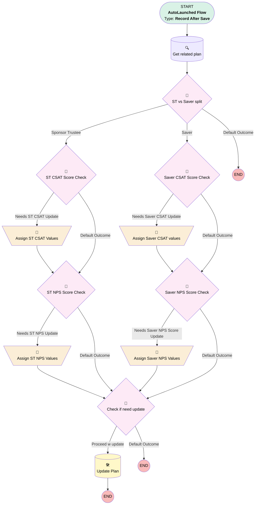

# Survey | After Save | Push Score to Plan

## Flow Diagram [(_View History_)](Survey_After_Save_Push_Score_to_Plan-history.md)

<!-- Flow description -->

## General Information

|<!-- -->|<!-- -->|
|:---|:---|
|Object|simplesurvey__Survey__c|
|Process Type| Auto Launched Flow|
|Trigger Type| Record After Save|
|Record Trigger Type| Create And Update|
|Label|Survey | After Save | Push Score to Plan|
|Status|Active|
|Description|Pushes CSAT and NPS scores to plan if they're more recent than what's currently on plan.|
|Environments|Default|
|Interview Label|Survey | After Save | Push Score to Plan {!$Flow.CurrentDateTime}|
| Builder Type (PM)|LightningFlowBuilder|
| Canvas Mode (PM)|AUTO_LAYOUT_CANVAS|
| Origin Builder Type (PM)|LightningFlowBuilder|
|Connector|[Get_related_plan](#get_related_plan)|
|Next Node|[Get_related_plan](#get_related_plan)|

#### Filters (logic: **(1 OR 2) AND 3 AND 4**)

|Filter Id|Field|Operator|Value|
|:-- |:-- |:--:|:--: |
|1|simplesurvey__Survey_Score__c| Is Null|<!-- -->|
|2|NPS_Score__c| Is Null|<!-- -->|
|3|Contact_Role__c| Is Null|<!-- -->|
|4|Plan__c| Is Null|<!-- -->|

## Variables

|Name|Data Type|Is Collection|Is Input|Is Output|Object Type|Description|
|:-- |:--:|:--:|:--:|:--:|:--:|:--  |
|planNeedsUpdate|Boolean|⬜|⬜|⬜|<!-- -->|<!-- -->|

## Flow Nodes Details

### Assign_Saver_CSAT_values

|<!-- -->|<!-- -->|
|:---|:---|
|Type|Assignment|
|Label|Assign Saver CSAT values|
|Connector|[Saver_NPS_Score_Check](#saver_nps_score_check)|

#### Assignments

|Assign To Reference|Operator|Value|
|:-- |:--:|:--: |
|Get_related_plan.Most_Recent_CSAT_Score_Saver__c| Assign|$Record.simplesurvey__Survey_Score__c|
|Get_related_plan.Date_Most_Recent_Saver_CSAT__c| Assign|$Record.CreatedDate|
|planNeedsUpdate| Assign|✅|

### Assign_Saver_NPS_Values

|<!-- -->|<!-- -->|
|:---|:---|
|Type|Assignment|
|Label|Assign Saver NPS Values|
|Connector|[Check_if_need_update](#check_if_need_update)|

#### Assignments

|Assign To Reference|Operator|Value|
|:-- |:--:|:--: |
|Get_related_plan.Date_Most_Recent_Saver_NPS__c| Assign|$Record.CreatedDate|
|Get_related_plan.Most_Recent_NPS_Score_Saver__c| Assign|$Record.NPS_Score__c|
|planNeedsUpdate| Assign|✅|

### Assign_ST_CSAT_Values

|<!-- -->|<!-- -->|
|:---|:---|
|Type|Assignment|
|Label|Assign ST CSAT Values|
|Connector|[ST_NPS_Score_Check](#st_nps_score_check)|

#### Assignments

|Assign To Reference|Operator|Value|
|:-- |:--:|:--: |
|Get_related_plan.Most_Recent_CSAT_Score_Sponsor_Trustee__c| Assign|$Record.simplesurvey__Survey_Score__c|
|Get_related_plan.Date_Most_Recent_Sponsor_Trustee_CSAT__c| Assign|$Record.CreatedDate|
|planNeedsUpdate| Assign|✅|

### Assign_ST_NPS_Values

|<!-- -->|<!-- -->|
|:---|:---|
|Type|Assignment|
|Label|Assign ST NPS Values|
|Connector|[Check_if_need_update](#check_if_need_update)|

#### Assignments

|Assign To Reference|Operator|Value|
|:-- |:--:|:--: |
|Get_related_plan.Date_Most_Recent_Sponsor_Trustee_NPS__c| Assign|$Record.CreatedDate|
|Get_related_plan.Most_Recent_NPS_Score_Sponsor_Trustee__c| Assign|$Record.NPS_Score__c|
|planNeedsUpdate| Assign|✅|

### Check_if_need_update

|<!-- -->|<!-- -->|
|:---|:---|
|Type|Decision|
|Label|Check if need update|
|Description|Were any new values assigned?|
|Default Connector Label|Default Outcome|

#### Rule Proceed_w_update (Proceed w update)

|<!-- -->|<!-- -->|
|:---|:---|
|Connector|[Update_Plan](#update_plan)|
|Condition Logic|and|

|Condition Id|Left Value Reference|Operator|Right Value|
|:-- |:-- |:--:|:--: |
|1|planNeedsUpdate| Equal To|✅|

### Saver_CSAT_Score_Check

|<!-- -->|<!-- -->|
|:---|:---|
|Type|Decision|
|Label|Saver CSAT Score Check|
|Default Connector|[Saver_NPS_Score_Check](#saver_nps_score_check)|
|Default Connector Label|Default Outcome|

#### Rule Needs_Saver_CSAT_Update (Needs Saver CSAT Update)

|<!-- -->|<!-- -->|
|:---|:---|
|Connector|[Assign_Saver_CSAT_values](#assign_saver_csat_values)|
|Condition Logic|and|

|Condition Id|Left Value Reference|Operator|Right Value|
|:-- |:-- |:--:|:--: |
|1|Get_related_plan.Date_Most_Recent_Saver_CSAT__c| Less Than Or Equal To|$Record.CreatedDate|
|2|$Record.simplesurvey__Survey_Score__c| Is Null|⬜|

### Saver_NPS_Score_Check

|<!-- -->|<!-- -->|
|:---|:---|
|Type|Decision|
|Label|Saver NPS Score Check|
|Default Connector|[Check_if_need_update](#check_if_need_update)|
|Default Connector Label|Default Outcome|

#### Rule Needs_Saver_NPS_Score_Update (Needs Saver NPS Score Update)

|<!-- -->|<!-- -->|
|:---|:---|
|Connector|[Assign_Saver_NPS_Values](#assign_saver_nps_values)|
|Condition Logic|and|

|Condition Id|Left Value Reference|Operator|Right Value|
|:-- |:-- |:--:|:--: |
|1|$Record.NPS_Score__c| Is Null|⬜|
|2|Get_related_plan.Date_Most_Recent_Saver_NPS__c| Less Than Or Equal To|$Record.CreatedDate|

### ST_CSAT_Score_Check

|<!-- -->|<!-- -->|
|:---|:---|
|Type|Decision|
|Label|ST CSAT Score Check|
|Default Connector|[ST_NPS_Score_Check](#st_nps_score_check)|
|Default Connector Label|Default Outcome|

#### Rule Needs_ST_CSAT_Update (Needs ST CSAT Update)

|<!-- -->|<!-- -->|
|:---|:---|
|Connector|[Assign_ST_CSAT_Values](#assign_st_csat_values)|
|Condition Logic|and|

|Condition Id|Left Value Reference|Operator|Right Value|
|:-- |:-- |:--:|:--: |
|1|Get_related_plan.Date_Most_Recent_Sponsor_Trustee_CSAT__c| Less Than Or Equal To|$Record.CreatedDate|
|2|$Record.simplesurvey__Survey_Score__c| Is Null|⬜|

### ST_NPS_Score_Check

|<!-- -->|<!-- -->|
|:---|:---|
|Type|Decision|
|Label|ST NPS Score Check|
|Default Connector|[Check_if_need_update](#check_if_need_update)|
|Default Connector Label|Default Outcome|

#### Rule Needs_ST_NPS_Update (Needs ST NPS Update)

|<!-- -->|<!-- -->|
|:---|:---|
|Connector|[Assign_ST_NPS_Values](#assign_st_nps_values)|
|Condition Logic|and|

|Condition Id|Left Value Reference|Operator|Right Value|
|:-- |:-- |:--:|:--: |
|1|$Record.NPS_Score__c| Is Null|⬜|
|2|Get_related_plan.Date_Most_Recent_Sponsor_Trustee_NPS__c| Less Than Or Equal To|$Record.CreatedDate|

### ST_vs_Saver_split

|<!-- -->|<!-- -->|
|:---|:---|
|Type|Decision|
|Label|ST vs Saver split|
|Description|Job creators vs plebs|
|Default Connector Label|Default Outcome|

#### Rule Sponsor_Trustee (Sponsor Trustee)

|<!-- -->|<!-- -->|
|:---|:---|
|Connector|[ST_CSAT_Score_Check](#st_csat_score_check)|
|Condition Logic|or|

|Condition Id|Left Value Reference|Operator|Right Value|
|:-- |:-- |:--:|:--: |
|1|$Record.Contact_Role__c| Contains|Sponsor|
|2|$Record.Contact_Role__c| Contains|Trustee|

#### Rule Saver (Saver)

|<!-- -->|<!-- -->|
|:---|:---|
|Connector|[Saver_CSAT_Score_Check](#saver_csat_score_check)|
|Condition Logic|and|

|Condition Id|Left Value Reference|Operator|Right Value|
|:-- |:-- |:--:|:--: |
|1|$Record.Contact_Role__c| Contains|Saver|

### Get_related_plan

|<!-- -->|<!-- -->|
|:---|:---|
|Type|Record Lookup|
|Object|Plan__c|
|Label|Get related plan|
|Assign Null Values If No Records Found|⬜|
|Get First Record Only|✅|
|Store Output Automatically|✅|
|Connector|[ST_vs_Saver_split](#st_vs_saver_split)|

#### Filters (logic: **and**)

|Filter Id|Field|Operator|Value|
|:-- |:-- |:--:|:--: |
|1|Id| Equal To|$Record.Plan__c|

### Update_Plan

|<!-- -->|<!-- -->|
|:---|:---|
|Type|Record Update|
|Label|Update Plan|
|Input Reference|[Get_related_plan](#get_related_plan)|

___

_Documentation generated from branch monitoring_myubiquity by [sfdx-hardis](https://sfdx-hardis.cloudity.com), featuring [salesforce-flow-visualiser](https://github.com/toddhalfpenny/salesforce-flow-visualiser)_