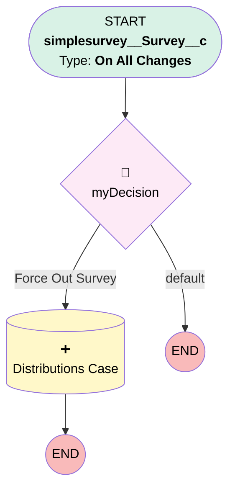

# Survey | Force Dist Request

## Flow Diagram [(_View History_)](Survey_Force_Dist_Request-history.md)

<!-- Flow description -->

## General Information

|<!-- -->|<!-- -->|
|:---|:---|
|Process Type| Workflow|
|Label|Survey | Force Dist Request|
|Status|Active|
|Description|Creates Case for Distribution team when new Force Dist Survey is completed|
|Interview Label|Survey_Force_Dist_Request-6_InterviewLabel|
|Start Element Reference|[myDecision](#mydecision)|
| Object Type (PM)|simplesurvey__Survey__c|
| Object Variable (PM)|myVariable_current|
| Old Object Variable (PM)|myVariable_old|
| Trigger Type (PM)|onAllChanges|

## Variables

|Name|Data Type|Is Collection|Is Input|Is Output|Object Type|Description|
|:-- |:--:|:--:|:--:|:--:|:--:|:--  |
|myVariable_current|SObject|⬜|✅|✅|simplesurvey__Survey__c|<!-- -->|
|myVariable_old|SObject|⬜|✅|⬜|simplesurvey__Survey__c|<!-- -->|

## Flow Nodes Details

### myDecision

|<!-- -->|<!-- -->|
|:---|:---|
|Type|Decision|
|Label|[myDecision](#mydecision)|
|Default Connector Label|default|
|Index (PM)|numberValue: 0 |

#### Rule myRule_1 (Force Out Survey)

|<!-- -->|<!-- -->|
|:---|:---|
|Connector|[myRule_1_A1](#myrule_1_a1)|
|Condition Logic|and|

|Condition Id|Left Value Reference|Operator|Right Value|
|:-- |:-- |:--:|:--: |
|1|myVariable_current.RecordType.Name| Contains|Force Out Distribution|
|2|myVariable_current.simplesurvey__Status__c| Equal To|Completed|

### myRule_1_A1

|<!-- -->|<!-- -->|
|:---|:---|
|Type|Record Create|
|Object|Case|
|Label|Distributions Case|

#### Input Assignments

|Field|Value|
|:-- |:--: |
|AccountId|myVariable_current.simplesurvey__Account__c|
|BusinessHoursId|01m37000000L07P|
|Case_Type__c|Single Case|
|Category__c|Force Out Distribution Survey|
|ContactId|myVariable_current.simplesurvey__Contact__c|
|Department__c|Reconciliations & Withdrawals|
|Description|A new force out distribution survey has been completed for the contact/account linked to this case|
|Inquiry_Source__c|Client|
|Origin|Distributions Inbox|
|OwnerId|005Ho00000AnvFJ|
|Plan__c|myVariable_current.Plan__c|
|Priority|Medium|
|RecordTypeId|012Ho000000NtUeIAK|
|Status|New|
|Subject|New Force Out Distribution Survey|
|Team_Member__c|Jessica Orcutt|

___

_Documentation generated from branch monitoring_myubiquity by [sfdx-hardis](https://sfdx-hardis.cloudity.com), featuring [salesforce-flow-visualiser](https://github.com/toddhalfpenny/salesforce-flow-visualiser)_