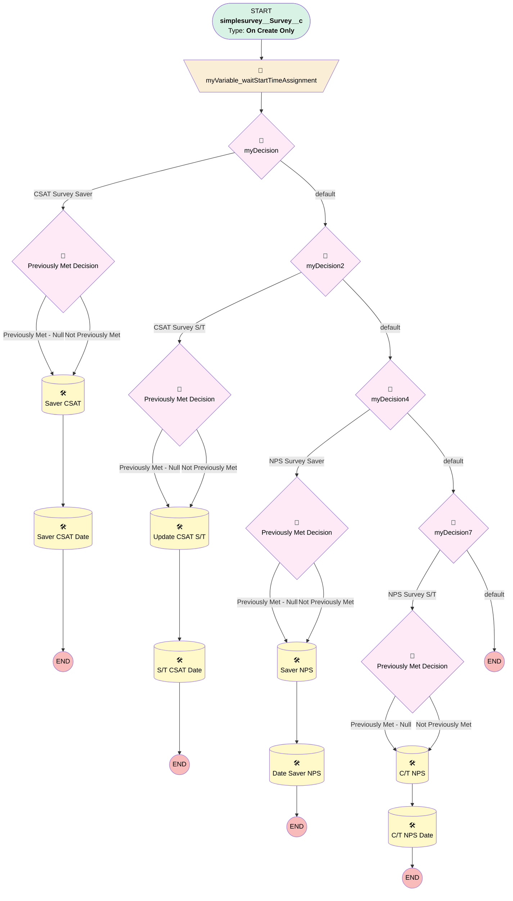

# Survey | Most Recent Survey Score Population (Creation)

## Flow Diagram [(_View History_)](Survey_Most_Recent_Surveyy_Score_Population_Creation-history.md)

<!-- Flow description -->

## General Information

|<!-- -->|<!-- -->|
|:---|:---|
|Process Type| Workflow|
|Label|Survey | Most Recent Survey Score Population (Creation)|
|Status|Obsolete|
|Description|Populates Survey Scores on Plan on Creation|
|Interview Label|Survey_Most_Recent_Surveyy_Score_Population_Creation-1_InterviewLabel|
|Start Element Reference|[myVariable_waitStartTimeAssignment](#myvariable_waitstarttimeassignment)|
| Object Type (PM)|simplesurvey__Survey__c|
| Object Variable (PM)|myVariable_current|
| Old Object Variable (PM)|myVariable_old|
| Trigger Type (PM)|onCreateOnly|

## Variables

|Name|Data Type|Is Collection|Is Input|Is Output|Object Type|Description|
|:-- |:--:|:--:|:--:|:--:|:--:|:--  |
|myVariable_current|SObject|⬜|✅|✅|simplesurvey__Survey__c|<!-- -->|
|myVariable_old|SObject|⬜|✅|⬜|simplesurvey__Survey__c|<!-- -->|
|myVariable_waitStartTimeVariable|DateTime|⬜|⬜|⬜|<!-- -->|<!-- -->|

## Formulas

|Name|Data Type|Expression|Description|
|:-- |:--:|:-- |:--  |
|formula_6_myRule_5_A1_4176481056|Number|VALUE(TEXT({!myVariable_current.NPS__c} ))|<!-- -->|
|formula_9_myRule_8_A1_3388934964|Number|VALUE(TEXT({!myVariable_current.NPS__c} ))|<!-- -->|

## Flow Nodes Details

### myVariable_waitStartTimeAssignment

|<!-- -->|<!-- -->|
|:---|:---|
|Type|Assignment|
|Label|[myVariable_waitStartTimeAssignment](#myvariable_waitstarttimeassignment)|
|Connector|[myDecision](#mydecision)|

#### Assignments

|Assign To Reference|Operator|Value|
|:-- |:--:|:--: |
|myVariable_waitStartTimeVariable| Assign|$Flow.CurrentDateTime|

### myDecision

|<!-- -->|<!-- -->|
|:---|:---|
|Type|Decision|
|Label|[myDecision](#mydecision)|
|Default Connector|[myDecision2](#mydecision2)|
|Default Connector Label|default|
|Index (PM)|numberValue: 0 |

#### Rule myRule_1 (CSAT Survey Saver)

|<!-- -->|<!-- -->|
|:---|:---|
|Connector|[myRule_1_pmetdec](#myrule_1_pmetdec)|
|Condition Logic|and|

|Condition Id|Left Value Reference|Operator|Right Value|
|:-- |:-- |:--:|:--: |
|1|myVariable_current.Survey_Type__c| Equal To|Case Resolution CSAT|
|2|myVariable_current.simplesurvey__Record_Owner__r.Team__c| Equal To|Saver Success|
|3|myVariable_current.Plan__c| Is Null|⬜|
|4|myVariable_current.simplesurvey__Survey_Score__c| Is Null|⬜|

### myDecision2

|<!-- -->|<!-- -->|
|:---|:---|
|Type|Decision|
|Label|[myDecision2](#mydecision2)|
|Default Connector|[myDecision4](#mydecision4)|
|Default Connector Label|default|
|Index (PM)|1|

#### Rule myRule_3 (CSAT Survey S/T)

|<!-- -->|<!-- -->|
|:---|:---|
|Connector|[myRule_3_pmetdec](#myrule_3_pmetdec)|
|Condition Logic|and|

|Condition Id|Left Value Reference|Operator|Right Value|
|:-- |:-- |:--:|:--: |
|1|myVariable_current.Survey_Type__c| Equal To|Case Resolution CSAT|
|2|myVariable_current.simplesurvey__Record_Owner__r.Team__c| Not Equal To|Saver Success|
|3|myVariable_current.Plan__c| Is Null|⬜|
|4|myVariable_current.simplesurvey__Survey_Score__c| Is Null|⬜|

### myDecision4

|<!-- -->|<!-- -->|
|:---|:---|
|Type|Decision|
|Label|[myDecision4](#mydecision4)|
|Default Connector|[myDecision7](#mydecision7)|
|Default Connector Label|default|
|Index (PM)|2|

#### Rule myRule_5 (NPS Survey Saver)

|<!-- -->|<!-- -->|
|:---|:---|
|Connector|[myRule_5_pmetdec](#myrule_5_pmetdec)|
|Condition Logic|and|

|Condition Id|Left Value Reference|Operator|Right Value|
|:-- |:-- |:--:|:--: |
|1|myVariable_current.NPS__c| Is Null|⬜|
|2|myVariable_current.Plan__c| Is Null|⬜|
|3|myVariable_current.simplesurvey__Record_Owner__r.Team__c| Equal To|Saver Success|

### myDecision7

|<!-- -->|<!-- -->|
|:---|:---|
|Type|Decision|
|Label|[myDecision7](#mydecision7)|
|Default Connector Label|default|
|Index (PM)|3|

#### Rule myRule_8 (NPS Survey S/T)

|<!-- -->|<!-- -->|
|:---|:---|
|Connector|[myRule_8_pmetdec](#myrule_8_pmetdec)|
|Condition Logic|and|

|Condition Id|Left Value Reference|Operator|Right Value|
|:-- |:-- |:--:|:--: |
|1|myVariable_current.NPS__c| Is Null|⬜|
|2|myVariable_current.simplesurvey__Record_Owner__r.Team__c| Not Equal To|Saver Success|
|3|myVariable_current.Plan__c| Is Null|⬜|

### myRule_1_pmetdec

|<!-- -->|<!-- -->|
|:---|:---|
|Type|Decision|
|Label|Previously Met Decision|
|Default Connector|[myRule_1_A1](#myrule_1_a1)|
|Default Connector Label|Not Previously Met|

#### Rule myRule_1_pmetnullrule (Previously Met - Null)

|<!-- -->|<!-- -->|
|:---|:---|
|Connector|[myRule_1_A1](#myrule_1_a1)|
|Condition Logic|or|

|Condition Id|Left Value Reference|Operator|Right Value|
|:-- |:-- |:--:|:--: |
|1|myVariable_old| Is Null|✅|

#### Rule myRule_1_pmetrule (Previously Met - Prev)

|<!-- -->|<!-- -->|
|:---|:---|
|Condition Logic|and|

|Condition Id|Left Value Reference|Operator|Right Value|
|:-- |:-- |:--:|:--: |
|1|myVariable_old.Survey_Type__c| Equal To|Case Resolution CSAT|
|2|myVariable_old.simplesurvey__Record_Owner__r.Team__c| Equal To|Saver Success|
|3|myVariable_old.Plan__c| Is Null|⬜|
|4|myVariable_old.simplesurvey__Survey_Score__c| Is Null|⬜|

### myRule_3_pmetdec

|<!-- -->|<!-- -->|
|:---|:---|
|Type|Decision|
|Label|Previously Met Decision|
|Default Connector|[myRule_3_A1](#myrule_3_a1)|
|Default Connector Label|Not Previously Met|

#### Rule myRule_3_pmetnullrule (Previously Met - Null)

|<!-- -->|<!-- -->|
|:---|:---|
|Connector|[myRule_3_A1](#myrule_3_a1)|
|Condition Logic|or|

|Condition Id|Left Value Reference|Operator|Right Value|
|:-- |:-- |:--:|:--: |
|1|myVariable_old| Is Null|✅|

#### Rule myRule_3_pmetrule (Previously Met - Prev)

|<!-- -->|<!-- -->|
|:---|:---|
|Condition Logic|and|

|Condition Id|Left Value Reference|Operator|Right Value|
|:-- |:-- |:--:|:--: |
|1|myVariable_old.Survey_Type__c| Equal To|Case Resolution CSAT|
|2|myVariable_old.simplesurvey__Record_Owner__r.Team__c| Not Equal To|Saver Success|
|3|myVariable_old.Plan__c| Is Null|⬜|
|4|myVariable_old.simplesurvey__Survey_Score__c| Is Null|⬜|

### myRule_5_pmetdec

|<!-- -->|<!-- -->|
|:---|:---|
|Type|Decision|
|Label|Previously Met Decision|
|Default Connector|[myRule_5_A1](#myrule_5_a1)|
|Default Connector Label|Not Previously Met|

#### Rule myRule_5_pmetnullrule (Previously Met - Null)

|<!-- -->|<!-- -->|
|:---|:---|
|Connector|[myRule_5_A1](#myrule_5_a1)|
|Condition Logic|or|

|Condition Id|Left Value Reference|Operator|Right Value|
|:-- |:-- |:--:|:--: |
|1|myVariable_old| Is Null|✅|

#### Rule myRule_5_pmetrule (Previously Met - Prev)

|<!-- -->|<!-- -->|
|:---|:---|
|Condition Logic|and|

|Condition Id|Left Value Reference|Operator|Right Value|
|:-- |:-- |:--:|:--: |
|1|myVariable_old.NPS__c| Is Null|⬜|
|2|myVariable_old.Plan__c| Is Null|⬜|
|3|myVariable_old.simplesurvey__Record_Owner__r.Team__c| Equal To|Saver Success|

### myRule_8_pmetdec

|<!-- -->|<!-- -->|
|:---|:---|
|Type|Decision|
|Label|Previously Met Decision|
|Default Connector|[myRule_8_A1](#myrule_8_a1)|
|Default Connector Label|Not Previously Met|

#### Rule myRule_8_pmetnullrule (Previously Met - Null)

|<!-- -->|<!-- -->|
|:---|:---|
|Connector|[myRule_8_A1](#myrule_8_a1)|
|Condition Logic|or|

|Condition Id|Left Value Reference|Operator|Right Value|
|:-- |:-- |:--:|:--: |
|1|myVariable_old| Is Null|✅|

#### Rule myRule_8_pmetrule (Previously Met - Prev)

|<!-- -->|<!-- -->|
|:---|:---|
|Condition Logic|and|

|Condition Id|Left Value Reference|Operator|Right Value|
|:-- |:-- |:--:|:--: |
|1|myVariable_old.NPS__c| Is Null|⬜|
|2|myVariable_old.simplesurvey__Record_Owner__r.Team__c| Not Equal To|Saver Success|
|3|myVariable_old.Plan__c| Is Null|⬜|

### myRule_1_A1

|<!-- -->|<!-- -->|
|:---|:---|
|Type|Record Update|
|Object|Plan__c|
|Label|Saver CSAT|
|Evaluation Type (PM)|always|
|Extra Type Info (PM)|<!-- -->|
|Is Child Relationship (PM)|⬜|
|Reference (PM)|[simplesurvey__Survey__c].Plan|
|Reference Target Field (PM)|<!-- -->|
|Connector|[myRule_1_A2](#myrule_1_a2)|

#### Filters (logic: **and**)

|Filter Id|Field|Operator|Value|
|:-- |:-- |:--:|:--: |
|1|Id| Equal To|myVariable_current.Plan__c|

#### Input Assignments

|Field|Value|
|:-- |:--: |
|Most_Recent_CSAT_Score_Saver__c|myVariable_current.simplesurvey__Survey_Score__c|

### myRule_1_A2

|<!-- -->|<!-- -->|
|:---|:---|
|Type|Record Update|
|Object|Plan__c|
|Label|Saver CSAT Date|
|Evaluation Type (PM)|always|
|Extra Type Info (PM)|<!-- -->|
|Is Child Relationship (PM)|⬜|
|Reference (PM)|[simplesurvey__Survey__c].Plan|
|Reference Target Field (PM)|<!-- -->|

#### Filters (logic: **and**)

|Filter Id|Field|Operator|Value|
|:-- |:-- |:--:|:--: |
|1|Id| Equal To|myVariable_current.Plan__c|

#### Input Assignments

|Field|Value|
|:-- |:--: |
|Date_Most_Recent_Saver_CSAT__c|myVariable_current.CreatedDate|

### myRule_3_A1

|<!-- -->|<!-- -->|
|:---|:---|
|Type|Record Update|
|Object|Plan__c|
|Label|Update CSAT S/T|
|Evaluation Type (PM)|always|
|Extra Type Info (PM)|<!-- -->|
|Is Child Relationship (PM)|⬜|
|Reference (PM)|[simplesurvey__Survey__c].Plan|
|Reference Target Field (PM)|<!-- -->|
|Connector|[myRule_3_A2](#myrule_3_a2)|

#### Filters (logic: **and**)

|Filter Id|Field|Operator|Value|
|:-- |:-- |:--:|:--: |
|1|Id| Equal To|myVariable_current.Plan__c|

#### Input Assignments

|Field|Value|
|:-- |:--: |
|Most_Recent_CSAT_Score_Sponsor_Trustee__c|myVariable_current.simplesurvey__Survey_Score__c|

### myRule_3_A2

|<!-- -->|<!-- -->|
|:---|:---|
|Type|Record Update|
|Object|Plan__c|
|Label|S/T CSAT Date|
|Evaluation Type (PM)|always|
|Extra Type Info (PM)|<!-- -->|
|Is Child Relationship (PM)|⬜|
|Reference (PM)|[simplesurvey__Survey__c].Plan|
|Reference Target Field (PM)|<!-- -->|

#### Filters (logic: **and**)

|Filter Id|Field|Operator|Value|
|:-- |:-- |:--:|:--: |
|1|Id| Equal To|myVariable_current.Plan__c|

#### Input Assignments

|Field|Value|
|:-- |:--: |
|Date_Most_Recent_Sponsor_Trustee_CSAT__c|myVariable_current.CreatedDate|

### myRule_5_A1

|<!-- -->|<!-- -->|
|:---|:---|
|Type|Record Update|
|Object|Plan__c|
|Label|Saver NPS|
|Evaluation Type (PM)|always|
|Extra Type Info (PM)|<!-- -->|
|Is Child Relationship (PM)|⬜|
|Reference (PM)|[simplesurvey__Survey__c].Plan|
|Reference Target Field (PM)|<!-- -->|
|Connector|[myRule_5_A2](#myrule_5_a2)|

#### Filters (logic: **and**)

|Filter Id|Field|Operator|Value|
|:-- |:-- |:--:|:--: |
|1|Id| Equal To|myVariable_current.Plan__c|

#### Input Assignments

|Field|Value|
|:-- |:--: |
|Most_Recent_NPS_Score_Saver__c|formula_6_myRule_5_A1_4176481056|

### myRule_5_A2

|<!-- -->|<!-- -->|
|:---|:---|
|Type|Record Update|
|Object|Plan__c|
|Label|Date Saver NPS|
|Evaluation Type (PM)|always|
|Extra Type Info (PM)|<!-- -->|
|Is Child Relationship (PM)|⬜|
|Reference (PM)|[simplesurvey__Survey__c].Plan|
|Reference Target Field (PM)|<!-- -->|

#### Filters (logic: **and**)

|Filter Id|Field|Operator|Value|
|:-- |:-- |:--:|:--: |
|1|Id| Equal To|myVariable_current.Plan__c|

#### Input Assignments

|Field|Value|
|:-- |:--: |
|Date_Most_Recent_Saver_NPS__c|myVariable_current.CreatedDate|

### myRule_8_A1

|<!-- -->|<!-- -->|
|:---|:---|
|Type|Record Update|
|Object|Plan__c|
|Label|C/T NPS|
|Evaluation Type (PM)|always|
|Extra Type Info (PM)|<!-- -->|
|Is Child Relationship (PM)|⬜|
|Reference (PM)|[simplesurvey__Survey__c].Plan|
|Reference Target Field (PM)|<!-- -->|
|Connector|[myRule_8_A2](#myrule_8_a2)|

#### Filters (logic: **and**)

|Filter Id|Field|Operator|Value|
|:-- |:-- |:--:|:--: |
|1|Id| Equal To|myVariable_current.Plan__c|

#### Input Assignments

|Field|Value|
|:-- |:--: |
|Most_Recent_NPS_Score_Sponsor_Trustee__c|formula_9_myRule_8_A1_3388934964|

### myRule_8_A2

|<!-- -->|<!-- -->|
|:---|:---|
|Type|Record Update|
|Object|Plan__c|
|Label|C/T NPS Date|
|Evaluation Type (PM)|always|
|Extra Type Info (PM)|<!-- -->|
|Is Child Relationship (PM)|⬜|
|Reference (PM)|[simplesurvey__Survey__c].Plan|
|Reference Target Field (PM)|<!-- -->|

#### Filters (logic: **and**)

|Filter Id|Field|Operator|Value|
|:-- |:-- |:--:|:--: |
|1|Id| Equal To|myVariable_current.Plan__c|

#### Input Assignments

|Field|Value|
|:-- |:--: |
|Date_Most_Recent_Sponsor_Trustee_NPS__c|myVariable_current.CreatedDate|

___

_Documentation generated from branch monitoring_myubiquity by [sfdx-hardis](https://sfdx-hardis.cloudity.com), featuring [salesforce-flow-visualiser](https://github.com/toddhalfpenny/salesforce-flow-visualiser)_