# QA | After Save | Sync QA Status

## Flow Diagram [(_View History_)](Sync_QA_Status-history.md)

```mermaid
%% If you read this, your Markdown visualizer does not handle MermaidJS syntax.
%% - If you are in VS Code, install extension `Markdown Preview Mermaid Support` at https://marketplace.visualstudio.com/items?itemName=bierner.markdown-mermaid
%% - If you are using sfdx-hardis, try to define env variable `MERMAID_MODES=cli,docker` ,then run again the command to regenerate markdown with SVG images.
%% - If you are within mkdocs-material, define mermaid plugin in `mkdocs.yml` as described in https://squidfunk.github.io/mkdocs-material/extensions/mermaid/
%% - As a last resort, you can copy-paste this MermaidJS code into https://mermaid.live/ to see the flow diagram

flowchart TB
START(["START<br/><b>AutoLaunched Flow</b></br>Type: <b> Record After Save</b>"]):::startClass
click START "#general-information" "1780007441"

Send_Ops_Alert("📧 <em></em><br/>Send Ops Alert"):::actionCalls
click Send_Ops_Alert "#send_ops_alert" "3044738162"

Is_Status_Mirrored{"🔀 <em></em><br/>Is Status Mirrored"}:::decisions
click Is_Status_Mirrored "#is_status_mirrored" "190370127"

QA_completed_this_save{"🔀 <em></em><br/>QA completed this save"}:::decisions
click QA_completed_this_save "#qa_completed_this_save" "2306868652"

Sync_Case_QA_Status[("🛠️ <em></em><br/>Sync Case QA Status")]:::recordUpdates
click Sync_Case_QA_Status "#sync_case_qa_status" "1585889406"

Sync_QA_Status[("🛠️ <em></em><br/>Sync QA Status")]:::recordUpdates
click Sync_QA_Status "#sync_qa_status" "2499097837"

Send_Ops_Alert --> END_Send_Ops_Alert
Is_Status_Mirrored --> |"PT Update Needed"| Sync_QA_Status
Is_Status_Mirrored --> |"Case Update Needed"| Sync_Case_QA_Status
Is_Status_Mirrored --> |"Already Synced"| QA_completed_this_save
QA_completed_this_save --> |"Ops Alert Needed"| Send_Ops_Alert
QA_completed_this_save --> |"End Flow"| END_QA_completed_this_save
Sync_Case_QA_Status --> QA_completed_this_save
Sync_QA_Status --> QA_completed_this_save
START -->  Is_Status_Mirrored
END_Send_Ops_Alert(( END )):::endClass
END_QA_completed_this_save(( END )):::endClass


classDef actionCalls fill:#D4E4FC,color:black,text-decoration:none,max-height:100px
classDef assignments fill:#FBEED7,color:black,text-decoration:none,max-height:100px
classDef collectionProcessors fill:#F0E3FA,color:black,text-decoration:none,max-height:100px
classDef customErrors fill:#FFE9E9,color:black,text-decoration:none,max-height:100px
classDef decisions fill:#FDEAF6,color:black,text-decoration:none,max-height:100px
classDef loops fill:#FDEAF6,color:black,text-decoration:none,max-height:100px
classDef recordCreates fill:#FFF8C9,color:black,text-decoration:none,max-height:100px
classDef recordDeletes fill:#FFF8C9,color:black,text-decoration:none,max-height:100px
classDef recordLookups fill:#EDEAFF,color:black,text-decoration:none,max-height:100px
classDef recordUpdates fill:#FFF8C9,color:black,text-decoration:none,max-height:100px
classDef screens fill:#DFF6FF,color:black,text-decoration:none,max-height:100px
classDef subflows fill:#D4E4FC,color:black,text-decoration:none,max-height:100px
classDef startClass fill:#D9F2E6,color:black,text-decoration:none,max-height:100px
classDef endClass fill:#F9BABA,color:black,text-decoration:none,max-height:100px
classDef transforms fill:#FDEAF6,color:black,text-decoration:none,max-height:100px


```

<!-- Flow description -->

## General Information

|<!-- -->|<!-- -->|
|:---|:---|
|Object|Quality_Assurance_QA__c|
|Process Type| Auto Launched Flow|
|Trigger Type| Record After Save|
|Record Trigger Type| Create And Update|
|Label|QA | After Save | Sync QA Status|
|Status|Active|
|Description|Removed renaming and migrated it to before save  Syncs a QA's completion status with record being reviewed|
|Environments|Default|
|Interview Label|Sync QA Status {!$Flow.CurrentDateTime}|
| Builder Type (PM)|LightningFlowBuilder|
| Canvas Mode (PM)|AUTO_LAYOUT_CANVAS|
| Origin Builder Type (PM)|LightningFlowBuilder|
|Connector|[Is_Status_Mirrored](#is_status_mirrored)|
|Next Node|[Is_Status_Mirrored](#is_status_mirrored)|

## Formulas

|Name|Data Type|Expression|Description|
|:-- |:--:|:-- |:--  |
|qaSubject|String|IF(OR(ISPICKVAL({!$Record.QA_Type__c},"Implementation"),ISPICKVAL({!$Record.QA_Type__c},"Operations Case"),ISPICKVAL({!$Record.QA_Type__c},"BI"),ISPICKVAL({!$Record.QA_Type__c},"Accounting"),ISPICKVAL({!$Record.QA_Type__c},"PRKS")), TEXT({!$Record.QA_Type__c}) + " - " + IF(ISBLANK({!$Record.Ubiquity_Employee__r.Full_Name__c}),"NO EMPLOYEE",{!$Record.Ubiquity_Employee__r.Full_Name__c})  + " - " + TEXT({!$Record.Date__c}), TEXT({!$Record.QA_Type__c}) + " - " + IF(ISBLANK({!$Record.Ubiquity_Employee__r.Full_Name__c}),"NO EMPLOYEE",{!$Record.Ubiquity_Employee__r.Full_Name__c}) + " - " + {!$Record.Case__r.Plan__r.Name} )|<!-- -->|
|StatusTranslate|String|CASE({!$Record.QA_Completion__c}, "Incomplete","In Progress", "Complete","Complete","" )|<!-- -->|
|trimmedSubject|String|IF(LEN({!qaSubject}) > 80, LEFT({!qaSubject},77) + "...", {!qaSubject})|cap it to 80|

## Flow Nodes Details

### Send_Ops_Alert

|<!-- -->|<!-- -->|
|:---|:---|
|Type|Action Call|
|Label|Send Ops Alert|
|Action Type|Email Alert|
|Action Name|Quality_Assurance_QA__c.Ops_QA_Completed|
|Flow Transaction Model|CurrentTransaction|
|Name Segment|Quality_Assurance_QA__c.Ops_QA_Completed|
|Offset|0|
| SObject Row Id (input)|$Record.Id|

### Is_Status_Mirrored

|<!-- -->|<!-- -->|
|:---|:---|
|Type|Decision|
|Label|Is Status Mirrored|
|Default Connector|[QA_completed_this_save](#qa_completed_this_save)|
|Default Connector Label|Already Synced|

#### Rule PT_Update_Needed (PT Update Needed)

|<!-- -->|<!-- -->|
|:---|:---|
|Connector|[Sync_QA_Status](#sync_qa_status)|
|Condition Logic|and|

|Condition Id|Left Value Reference|Operator|Right Value|
|:-- |:-- |:--:|:--: |
|1|StatusTranslate| Not Equal To|$Record.Project_Task__r.QA_Status__c|
|2|$Record.Project_Task__c| Is Null|⬜|

#### Rule Case_Update_Needed (Case Update Needed)

|<!-- -->|<!-- -->|
|:---|:---|
|Connector|[Sync_Case_QA_Status](#sync_case_qa_status)|
|Condition Logic|and|

|Condition Id|Left Value Reference|Operator|Right Value|
|:-- |:-- |:--:|:--: |
|1|StatusTranslate| Not Equal To|$Record.Case__r.QA_Status__c|
|2|$Record.Case__c| Is Null|⬜|

### QA_completed_this_save

|<!-- -->|<!-- -->|
|:---|:---|
|Type|Decision|
|Label|QA completed this save|
|Description|Will need to edit this for dynamic build once details with related teams are settled|
|Default Connector Label|End Flow|

#### Rule Ops_Alert_Needed (Ops Alert Needed)

|<!-- -->|<!-- -->|
|:---|:---|
|Does Require Record Changed To Meet Criteria|✅|
|Connector|[Send_Ops_Alert](#send_ops_alert)|
|Condition Logic|and|

|Condition Id|Left Value Reference|Operator|Right Value|
|:-- |:-- |:--:|:--: |
|1|$Record.QA_Completion__c| Equal To|Complete|
|2|$Record.QA_Type__c| Equal To|Operations Case|
|3|$Record.Ubiquity_Employee__c| Is Null|⬜|

### Sync_Case_QA_Status

|<!-- -->|<!-- -->|
|:---|:---|
|Type|Record Update|
|Object|Case|
|Label|Sync Case QA Status|
|Connector|[QA_completed_this_save](#qa_completed_this_save)|

#### Filters (logic: **and**)

|Filter Id|Field|Operator|Value|
|:-- |:-- |:--:|:--: |
|1|Id| Equal To|$Record.Case__c|

#### Input Assignments

|Field|Value|
|:-- |:--: |
|QA_Status__c|StatusTranslate|

### Sync_QA_Status

|<!-- -->|<!-- -->|
|:---|:---|
|Type|Record Update|
|Object|Project_Task__c|
|Label|Sync QA Status|
|Connector|[QA_completed_this_save](#qa_completed_this_save)|

#### Filters (logic: **and**)

|Filter Id|Field|Operator|Value|
|:-- |:-- |:--:|:--: |
|1|Id| Equal To|$Record.Project_Task__c|

#### Input Assignments

|Field|Value|
|:-- |:--: |
|QA_Status__c|StatusTranslate|

___

_Documentation generated from branch monitoring_myubiquity by [sfdx-hardis](https://sfdx-hardis.cloudity.com), featuring [salesforce-flow-visualiser](https://github.com/toddhalfpenny/salesforce-flow-visualiser)_