# Task | Before Save | Stamp Completion Date

## Flow Diagram [(_View History_)](Task_Before_Save_Stamp_Completion_Date-history.md)

```mermaid
%% If you read this, your Markdown visualizer does not handle MermaidJS syntax.
%% - If you are in VS Code, install extension `Markdown Preview Mermaid Support` at https://marketplace.visualstudio.com/items?itemName=bierner.markdown-mermaid
%% - If you are using sfdx-hardis, try to define env variable `MERMAID_MODES=cli,docker` ,then run again the command to regenerate markdown with SVG images.
%% - If you are within mkdocs-material, define mermaid plugin in `mkdocs.yml` as described in https://squidfunk.github.io/mkdocs-material/extensions/mermaid/
%% - As a last resort, you can copy-paste this MermaidJS code into https://mermaid.live/ to see the flow diagram

flowchart TB
START(["START<br/><b>AutoLaunched Flow</b></br>Type: <b> Record Before Save</b>"]):::startClass
click START "#general-information" "3829538247"

Stamp_Completion_Datetime[("🛠️ <em></em><br/>Stamp Completion Datetime")]:::recordUpdates
click Stamp_Completion_Datetime "#stamp_completion_datetime" "1167374897"

Stamp_Completion_Datetime --> END_Stamp_Completion_Datetime
START -->  Stamp_Completion_Datetime
END_Stamp_Completion_Datetime(( END )):::endClass


classDef actionCalls fill:#D4E4FC,color:black,text-decoration:none,max-height:100px
classDef assignments fill:#FBEED7,color:black,text-decoration:none,max-height:100px
classDef collectionProcessors fill:#F0E3FA,color:black,text-decoration:none,max-height:100px
classDef customErrors fill:#FFE9E9,color:black,text-decoration:none,max-height:100px
classDef decisions fill:#FDEAF6,color:black,text-decoration:none,max-height:100px
classDef loops fill:#FDEAF6,color:black,text-decoration:none,max-height:100px
classDef recordCreates fill:#FFF8C9,color:black,text-decoration:none,max-height:100px
classDef recordDeletes fill:#FFF8C9,color:black,text-decoration:none,max-height:100px
classDef recordLookups fill:#EDEAFF,color:black,text-decoration:none,max-height:100px
classDef recordUpdates fill:#FFF8C9,color:black,text-decoration:none,max-height:100px
classDef screens fill:#DFF6FF,color:black,text-decoration:none,max-height:100px
classDef subflows fill:#D4E4FC,color:black,text-decoration:none,max-height:100px
classDef startClass fill:#D9F2E6,color:black,text-decoration:none,max-height:100px
classDef endClass fill:#F9BABA,color:black,text-decoration:none,max-height:100px
classDef transforms fill:#FDEAF6,color:black,text-decoration:none,max-height:100px


```

<!-- Flow description -->

## General Information

|<!-- -->|<!-- -->|
|:---|:---|
|Object|Task|
|Process Type| Auto Launched Flow|
|Trigger Type| Record Before Save|
|Record Trigger Type| Create And Update|
|Label|Task | Before Save | Stamp Completion Date|
|Status|Active|
|Filter Formula|((ISNEW() && ISPICKVAL({!$Record.Status},"Completed")) || ISCHANGED({!$Record.Status}) && ISPICKVAL({!$Record.Status},"Completed")) && ISNULL({!$Record.Stamped_Complete__c}) && {!$User.Profile_ID__c} = "00e37000000kyMz"|
|Description|Used to record when a task is first marked as completed|
|Environments|Default|
|Interview Label|Task | Before Save | Stamp Completion Date {!$Flow.CurrentDateTime}|
| Builder Type (PM)|LightningFlowBuilder|
| Canvas Mode (PM)|AUTO_LAYOUT_CANVAS|
| Origin Builder Type (PM)|LightningFlowBuilder|
|Connector|[Stamp_Completion_Datetime](#stamp_completion_datetime)|
|Next Node|[Stamp_Completion_Datetime](#stamp_completion_datetime)|

## Flow Nodes Details

### Stamp_Completion_Datetime

|<!-- -->|<!-- -->|
|:---|:---|
|Type|Record Update|
|Label|Stamp Completion Datetime|
|Input Reference|$Record|

#### Input Assignments

|Field|Value|
|:-- |:--: |
|Stamped_Complete__c|$Flow.CurrentDateTime|

___

_Documentation generated from branch monitoring_myubiquity by [sfdx-hardis](https://sfdx-hardis.cloudity.com), featuring [salesforce-flow-visualiser](https://github.com/toddhalfpenny/salesforce-flow-visualiser)_