# Project Task | Button | Not Needed

## Flow Diagram [(_View History_)](Task_Not_Needed-history.md)

```mermaid
%% If you read this, your Markdown visualizer does not handle MermaidJS syntax.
%% - If you are in VS Code, install extension `Markdown Preview Mermaid Support` at https://marketplace.visualstudio.com/items?itemName=bierner.markdown-mermaid
%% - If you are using sfdx-hardis, try to define env variable `MERMAID_MODES=cli,docker` ,then run again the command to regenerate markdown with SVG images.
%% - If you are within mkdocs-material, define mermaid plugin in `mkdocs.yml` as described in https://squidfunk.github.io/mkdocs-material/extensions/mermaid/
%% - As a last resort, you can copy-paste this MermaidJS code into https://mermaid.live/ to see the flow diagram

flowchart TB
START(["START<br/><b>AutoLaunched Flow</b></br>"]):::startClass
click START "#general-information" "588547585"

Assign_Completion_Date[\"🟰 <em></em><br/>Assign Completion Date"/]:::assignments
click Assign_Completion_Date "#assign_completion_date" "1854559150"

Get_Task[("🔍 <em></em><br/>Get Task")]:::recordLookups
click Get_Task "#get_task" "2042038593"

Update_Records[("🛠️ <em></em><br/>Update Records")]:::recordUpdates
click Update_Records "#update_records" "447306925"

Assign_Completion_Date --> Update_Records
Get_Task --> Assign_Completion_Date
Update_Records --> END_Update_Records
START -->  Get_Task
END_Update_Records(( END )):::endClass


classDef actionCalls fill:#D4E4FC,color:black,text-decoration:none,max-height:100px
classDef assignments fill:#FBEED7,color:black,text-decoration:none,max-height:100px
classDef collectionProcessors fill:#F0E3FA,color:black,text-decoration:none,max-height:100px
classDef customErrors fill:#FFE9E9,color:black,text-decoration:none,max-height:100px
classDef decisions fill:#FDEAF6,color:black,text-decoration:none,max-height:100px
classDef loops fill:#FDEAF6,color:black,text-decoration:none,max-height:100px
classDef recordCreates fill:#FFF8C9,color:black,text-decoration:none,max-height:100px
classDef recordDeletes fill:#FFF8C9,color:black,text-decoration:none,max-height:100px
classDef recordLookups fill:#EDEAFF,color:black,text-decoration:none,max-height:100px
classDef recordUpdates fill:#FFF8C9,color:black,text-decoration:none,max-height:100px
classDef screens fill:#DFF6FF,color:black,text-decoration:none,max-height:100px
classDef subflows fill:#D4E4FC,color:black,text-decoration:none,max-height:100px
classDef startClass fill:#D9F2E6,color:black,text-decoration:none,max-height:100px
classDef endClass fill:#F9BABA,color:black,text-decoration:none,max-height:100px
classDef transforms fill:#FDEAF6,color:black,text-decoration:none,max-height:100px


```

<!-- Flow description -->

## General Information

|<!-- -->|<!-- -->|
|:---|:---|
|Process Type| Auto Launched Flow|
|Label|Project Task | Button | Not Needed|
|Status|Active|
|Description|Marks Project Task as "Not Needed"|
|Environments|Default|
|Interview Label|Task Not Needed {!$Flow.CurrentDateTime}|
| Builder Type (PM)|LightningFlowBuilder|
| Canvas Mode (PM)|FREE_FORM_CANVAS|
| Origin Builder Type (PM)|LightningFlowBuilder|
|Connector|[Get_Task](#get_task)|
|Next Node|[Get_Task](#get_task)|

## Variables

|Name|Data Type|Is Collection|Is Input|Is Output|Object Type|Description|
|:-- |:--:|:--:|:--:|:--:|:--:|:--  |
|id|String|⬜|✅|✅|<!-- -->|<!-- -->|
|ids|String|✅|✅|⬜|<!-- -->|<!-- -->|
|recordId|String|⬜|✅|✅|<!-- -->|<!-- -->|
|updateIds|SObject|✅|✅|✅|Project_Task__c|<!-- -->|

## Formulas

|Name|Data Type|Expression|Description|
|:-- |:--:|:-- |:--  |
|Now|DateTime|NOW()|<!-- -->|

## Flow Nodes Details

### Assign_Completion_Date

|<!-- -->|<!-- -->|
|:---|:---|
|Type|Assignment|
|Label|Assign Completion Date|
|Connector|[Update_Records](#update_records)|

#### Assignments

|Assign To Reference|Operator|Value|
|:-- |:--:|:--: |
|Get_Task.Actual_Completion_Date__c| Assign|Now|
|Get_Task.Status__c| Assign|Not Needed|

### Get_Task

|<!-- -->|<!-- -->|
|:---|:---|
|Type|Record Lookup|
|Object|Project_Task__c|
|Label|Get Task|
|Assign Null Values If No Records Found|⬜|
|Get First Record Only|✅|
|Store Output Automatically|✅|
|Connector|[Assign_Completion_Date](#assign_completion_date)|

#### Filters (logic: **and**)

|Filter Id|Field|Operator|Value|
|:-- |:-- |:--:|:--: |
|1|Id| In|ids|

### Update_Records

|<!-- -->|<!-- -->|
|:---|:---|
|Type|Record Update|
|Label|Update Records|
|Input Reference|[Get_Task](#get_task)|

___

_Documentation generated from branch monitoring_myubiquity by [sfdx-hardis](https://sfdx-hardis.cloudity.com), featuring [salesforce-flow-visualiser](https://github.com/toddhalfpenny/salesforce-flow-visualiser)_