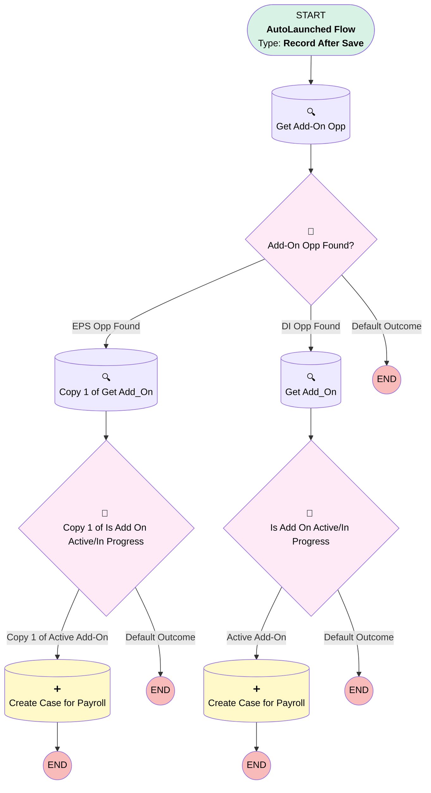

# Transition | After Trigger | Create Case for Payroll

## Flow Diagram [(_View History_)](Transition_After_Trigger_Create_Case_for_Payroll-history.md)

<!-- Flow description -->

## General Information

|<!-- -->|<!-- -->|
|:---|:---|
|Object|Transition__c|
|Process Type| Auto Launched Flow|
|Trigger Type| Record After Save|
|Record Trigger Type| Create|
|Label|Transition | After Trigger | Create Case for Payroll|
|Status|Obsolete|
|Description|When a Termination or Deconversion Transition record is created, create case for Payroll team if there is an EPS or DI Add-On/Opp. Checks to see if there is an open or closed/won opp, then checks to see if there is an add-on record. If there is no add-on or if the add-on isn't terminated, create the case.|
|Environments|Default|
|Interview Label|Transition | After Trigger | Create Case for Payroll {!$Flow.CurrentDateTime}|
| Builder Type (PM)|LightningFlowBuilder|
| Canvas Mode (PM)|AUTO_LAYOUT_CANVAS|
| Origin Builder Type (PM)|LightningFlowBuilder|
|Connector|[Get_Add_On_Opp](#get_add_on_opp)|
|Next Node|[Get_Add_On_Opp](#get_add_on_opp)|

#### Filters (logic: **or**)

|Filter Id|Field|Operator|Value|
|:-- |:-- |:--:|:--: |
|1|Transition_Type__c| Equal To|Deconversion|
|2|Transition_Type__c| Equal To|Termination|

## Variables

|Name|Data Type|Is Collection|Is Input|Is Output|Object Type|Description|
|:-- |:--:|:--:|:--:|:--:|:--:|:--  |
|AddOn|SObject|⬜|✅|⬜|Add_On_Products__c|<!-- -->|
|AddOnOpp|SObject|⬜|✅|⬜|Opportunity|<!-- -->|

## Formulas

|Name|Data Type|Expression|Description|
|:-- |:--:|:-- |:--  |
|caseDesc|String|"A Transition record has been created for " + {!$Record.Plan__r.Name} + ", please begin the process to terminate payroll services"|<!-- -->|
|caseSubject|String|"Terminate Integration Services for: " + {!$Record.Plan__r.Name}|<!-- -->|

## Flow Nodes Details

### Add_On_Opp_Found

|<!-- -->|<!-- -->|
|:---|:---|
|Type|Decision|
|Label|Add-On Opp Found?|
|Default Connector Label|Default Outcome|

#### Rule Opp_Found (EPS Opp Found)

|<!-- -->|<!-- -->|
|:---|:---|
|Connector|[Copy_1_of_Get_Add_On](#copy_1_of_get_add_on)|
|Condition Logic|and|

|Condition Id|Left Value Reference|Operator|Right Value|
|:-- |:-- |:--:|:--: |
|1|AddOnOpp.Id| Is Null|⬜|
|2|AddOnOpp.Service_Option__c| Equal To|Enhanced Payroll Service|

#### Rule DI_Opp_Found (DI Opp Found)

|<!-- -->|<!-- -->|
|:---|:---|
|Connector|[Get_Add_On](#get_add_on)|
|Condition Logic|and|

|Condition Id|Left Value Reference|Operator|Right Value|
|:-- |:-- |:--:|:--: |
|1|AddOnOpp.Id| Is Null|⬜|
|2|AddOnOpp.Service_Option__c| Equal To|Direct Integration|

### Copy_1_of_Is_Add_On_Active_In_Progress

|<!-- -->|<!-- -->|
|:---|:---|
|Type|Decision|
|Label|Copy 1 of Is Add On Active/In Progress|
|Default Connector Label|Default Outcome|

#### Rule Copy_1_of_Active_Add_On (Copy 1 of Active Add-On)

|<!-- -->|<!-- -->|
|:---|:---|
|Connector|[Create_Case_for_Payroll](#create_case_for_payroll)|
|Condition Logic|1 OR (2 AND 3 AND 4 AND 5)|

|Condition Id|Left Value Reference|Operator|Right Value|
|:-- |:-- |:--:|:--: |
|1|AddOn.Id| Is Null|✅|
|2|AddOn.Product_Status__c| Not Equal To|No Start|
|3|AddOn.Product_Status__c| Not Equal To|Product_Terminated|
|4|AddOn.Product_Status__c| Not Equal To|Cancelled Setup|
|5|AddOn.Product_Status__c| Not Equal To|Terminated Integration|

### Is_Add_On_Active_In_Progress

|<!-- -->|<!-- -->|
|:---|:---|
|Type|Decision|
|Label|Is Add On Active/In Progress|
|Default Connector Label|Default Outcome|

#### Rule Active_Add_On (Active Add-On)

|<!-- -->|<!-- -->|
|:---|:---|
|Connector|[Copy_1_of_Create_Case_for_Payroll](#copy_1_of_create_case_for_payroll)|
|Condition Logic|1 OR (2 AND 3 AND 4 AND 5)|

|Condition Id|Left Value Reference|Operator|Right Value|
|:-- |:-- |:--:|:--: |
|1|AddOn.Id| Is Null|✅|
|2|AddOn.Product_Status__c| Not Equal To|No Start|
|3|AddOn.Product_Status__c| Not Equal To|Product_Terminated|
|4|AddOn.Product_Status__c| Not Equal To|Cancelled Setup|
|5|AddOn.Product_Status__c| Not Equal To|Terminated Integration|

### Copy_1_of_Create_Case_for_Payroll

|<!-- -->|<!-- -->|
|:---|:---|
|Type|Record Create|
|Object|Case|
|Label|Create Case for Payroll|
|Store Output Automatically|✅|

#### Input Assignments

|Field|Value|
|:-- |:--: |
|AccountId|$Record.Account__c|
|Case_Type__c|Single Case|
|Category__c|Payroll|
|Department__c|Payroll|
|Description|caseDesc|
|Is_Ancillary_Billing_Needed__c|No|
|Opportunity__c|AddOnOpp.Id|
|Origin|Internal|
|OwnerId|00537000002STLD|
|Plan__c|$Record.Plan__c|
|RecordTypeId|01237000000XwGFAA0|
|Status|New|
|Sub_Category__c|Last Payroll|
|Subject|caseSubject|
|Team_Member__c|Liz Ohlhausen|

### Create_Case_for_Payroll

|<!-- -->|<!-- -->|
|:---|:---|
|Type|Record Create|
|Object|Case|
|Label|Create Case for Payroll|
|Store Output Automatically|✅|

#### Input Assignments

|Field|Value|
|:-- |:--: |
|AccountId|$Record.Account__c|
|Case_Type__c|Single Case|
|Category__c|Payroll|
|Department__c|Payroll|
|Description|caseDesc|
|Is_Ancillary_Billing_Needed__c|No|
|Opportunity__c|AddOnOpp.Id|
|Origin|Internal|
|OwnerId|00537000002STLD|
|Plan__c|$Record.Plan__c|
|RecordTypeId|01237000000XwGFAA0|
|Status|New|
|Sub_Category__c|Last Payroll|
|Subject|caseSubject|
|Team_Member__c|Stormy Bearry|

### Copy_1_of_Get_Add_On

|<!-- -->|<!-- -->|
|:---|:---|
|Type|Record Lookup|
|Object|Add_On_Products__c|
|Label|Copy 1 of Get Add_On|
|Assign Null Values If No Records Found|✅|
|Output Reference|AddOn|
|Queried Fields|- Id - Product_Status__c |
|Connector|[Copy_1_of_Is_Add_On_Active_In_Progress](#copy_1_of_is_add_on_active_in_progress)|

#### Filters (logic: **and**)

|Filter Id|Field|Operator|Value|
|:-- |:-- |:--:|:--: |
|1|Opportunity__c| Equal To|AddOnOpp.Id|

### Get_Add_On

|<!-- -->|<!-- -->|
|:---|:---|
|Type|Record Lookup|
|Object|Add_On_Products__c|
|Label|Get Add_On|
|Assign Null Values If No Records Found|✅|
|Output Reference|AddOn|
|Queried Fields|- Id - Product_Status__c |
|Connector|[Is_Add_On_Active_In_Progress](#is_add_on_active_in_progress)|

#### Filters (logic: **and**)

|Filter Id|Field|Operator|Value|
|:-- |:-- |:--:|:--: |
|1|Opportunity__c| Equal To|AddOnOpp.Id|

### Get_Add_On_Opp

|<!-- -->|<!-- -->|
|:---|:---|
|Type|Record Lookup|
|Object|Opportunity|
|Label|Get Add-On Opp|
|Assign Null Values If No Records Found|✅|
|Output Reference|AddOnOpp|
|Queried Fields|- Id - Service_Option__c |
|Connector|[Add_On_Opp_Found](#add_on_opp_found)|

#### Filters (logic: **1 AND (2 OR 3) AND 4**)

|Filter Id|Field|Operator|Value|
|:-- |:-- |:--:|:--: |
|1|AccountId| Equal To|$Record.Account__c|
|2|Service_Option__c| Equal To|Enhanced Payroll Service|
|3|Service_Option__c| Equal To|Direct Integration|
|4|StageName| Not Equal To|Closed Lost|

___

_Documentation generated from branch monitoring_myubiquity by [sfdx-hardis](https://sfdx-hardis.cloudity.com), featuring [salesforce-flow-visualiser](https://github.com/toddhalfpenny/salesforce-flow-visualiser)_