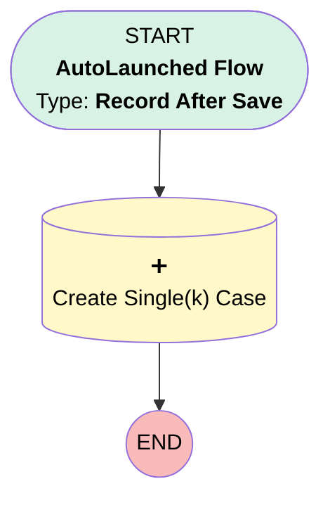

# Transition | After Trigger | Create Single(k) Case for Product Change

## Flow Diagram [(_View History_)](Transition_After_Trigger_Create_Single_k_Case_for_Product_Change-history.md)

<!-- Flow description -->

## General Information

|<!-- -->|<!-- -->|
|:---|:---|
|Object|Transition__c|
|Process Type| Auto Launched Flow|
|Trigger Type| Record After Save|
|Record Trigger Type| Create And Update|
|Label|Transition | After Trigger | Create Single(k) Case for Product Change|
|Status|Active|
|Does Require Record Changed To Meet Criteria|✅|
|Environments|Default|
|Interview Label|Transition | After Trigger | Create Single(k) Case for Product Change {!$Flow.CurrentDateTime}|
| Builder Type (PM)|LightningFlowBuilder|
| Canvas Mode (PM)|AUTO_LAYOUT_CANVAS|
| Origin Builder Type (PM)|LightningFlowBuilder|
|Connector|[Create_Single_k_Case](#create_single_k_case)|
|Next Node|[Create_Single_k_Case](#create_single_k_case)|

#### Filters (logic: **and**)

|Filter Id|Field|Operator|Value|
|:-- |:-- |:--:|:--: |
|1|Transition_Reason__c| Equal To|Switched to Another Ubiquity Plan|

## Text Templates

|Name|Text|Description|
|:-- |:-- |:--  |
|caseDesc|
Single(k) Team, Please ensure you are working with this plan on the Single(k) account set up. Please confirm with Transitions Department when the new account can accept funds and provide the wire instructions.
|<!-- -->|
|caseSubject|
Single(k) downgrade notification received {<strong>!$Record.Plan__c}</strong> 
|<!-- -->|

## Flow Nodes Details

### Create_Single_k_Case

|<!-- -->|<!-- -->|
|:---|:---|
|Type|Record Create|
|Object|Case|
|Label|Create Single(k) Case|
|Store Output Automatically|✅|

#### Input Assignments

|Field|Value|
|:-- |:--: |
|AccountId|$Record.Account__c|
|Department__c|Single(k)|
|Description|caseDesc|
|Origin|Internal|
|OwnerId|00G00000006sDWf|
|Plan__c|$Record.Plan__c|
|Subject|caseSubject|

___

_Documentation generated from branch monitoring_myubiquity by [sfdx-hardis](https://sfdx-hardis.cloudity.com), featuring [salesforce-flow-visualiser](https://github.com/toddhalfpenny/salesforce-flow-visualiser)_