# Transition | After Trigger | Launch Junction To Contact/Partner Flows

## Flow Diagram [(_View History_)](Transition_After_Trigger_Launch_Junction_To_Contact_Partner_Flows-history.md)

```mermaid
%% If you read this, your Markdown visualizer does not handle MermaidJS syntax.
%% - If you are in VS Code, install extension `Markdown Preview Mermaid Support` at https://marketplace.visualstudio.com/items?itemName=bierner.markdown-mermaid
%% - If you are using sfdx-hardis, try to define env variable `MERMAID_MODES=cli,docker` ,then run again the command to regenerate markdown with SVG images.
%% - If you are within mkdocs-material, define mermaid plugin in `mkdocs.yml` as described in https://squidfunk.github.io/mkdocs-material/extensions/mermaid/
%% - As a last resort, you can copy-paste this MermaidJS code into https://mermaid.live/ to see the flow diagram

flowchart TB
START(["START<br/><b>AutoLaunched Flow</b></br>Type: <b> Record After Save</b>"]):::startClass
click START "#general-information" "3390385030"

Junction_Partner[["🔗 <em>Subflow</em><br/>Junction Partner"]]:::subflows
click Junction_Partner "#junction_partner" "728931952"

Junction_to_Contact[["🔗 <em>Subflow</em><br/>Junction to Contact"]]:::subflows
click Junction_to_Contact "#junction_to_contact" "575095096"

START -->  Junction_to_Contact
Junction_Partner --> END_Junction_Partner
Junction_to_Contact --> Junction_Partner
END_Junction_Partner(( END )):::endClass


classDef actionCalls fill:#D4E4FC,color:black,text-decoration:none,max-height:100px
classDef assignments fill:#FBEED7,color:black,text-decoration:none,max-height:100px
classDef collectionProcessors fill:#F0E3FA,color:black,text-decoration:none,max-height:100px
classDef customErrors fill:#FFE9E9,color:black,text-decoration:none,max-height:100px
classDef decisions fill:#FDEAF6,color:black,text-decoration:none,max-height:100px
classDef loops fill:#FDEAF6,color:black,text-decoration:none,max-height:100px
classDef recordCreates fill:#FFF8C9,color:black,text-decoration:none,max-height:100px
classDef recordDeletes fill:#FFF8C9,color:black,text-decoration:none,max-height:100px
classDef recordLookups fill:#EDEAFF,color:black,text-decoration:none,max-height:100px
classDef recordUpdates fill:#FFF8C9,color:black,text-decoration:none,max-height:100px
classDef screens fill:#DFF6FF,color:black,text-decoration:none,max-height:100px
classDef subflows fill:#D4E4FC,color:black,text-decoration:none,max-height:100px
classDef startClass fill:#D9F2E6,color:black,text-decoration:none,max-height:100px
classDef endClass fill:#F9BABA,color:black,text-decoration:none,max-height:100px
classDef transforms fill:#FDEAF6,color:black,text-decoration:none,max-height:100px


```

<!-- Flow description -->

## General Information

|<!-- -->|<!-- -->|
|:---|:---|
|Object|Transition__c|
|Process Type| Auto Launched Flow|
|Trigger Type| Record After Save|
|Record Trigger Type| Create|
|Label|Transition | After Trigger | Launch Junction To Contact/Partner Flows|
|Status|Obsolete|
|Description|Flow replaces PB that calls two subflows|
|Environments|Default|
|Interview Label|Transition | After Trigger | Launch Junction To Contact/Partner Flows {!$Flow.CurrentDateTime}|
| Builder Type (PM)|LightningFlowBuilder|
| Canvas Mode (PM)|AUTO_LAYOUT_CANVAS|
| Origin Builder Type (PM)|LightningFlowBuilder|
|Connector|[Junction_to_Contact](#junction_to_contact)|
|Next Node|[Junction_to_Contact](#junction_to_contact)|

#### Filters (logic: **and**)

|Filter Id|Field|Operator|Value|
|:-- |:-- |:--:|:--: |
|1|Plan__c| Is Null|<!-- -->|

## Flow Nodes Details

### Junction_Partner

|<!-- -->|<!-- -->|
|:---|:---|
|Type|Subflow|
|Label|Junction Partner|
|Flow Name|Assign_Transition_to_Partner|
|Store Output Automatically|✅|

#### Input Assignments

|Field|Value|
|:-- |:--: |
|<!-- -->|$Record.Id|

### Junction_to_Contact

|<!-- -->|<!-- -->|
|:---|:---|
|Type|Subflow|
|Label|Junction to Contact|
|Flow Name|Assign_Transition_to_Junction|
|Store Output Automatically|✅|
|Connector|[Junction_Partner](#junction_partner)|

#### Input Assignments

|Field|Value|
|:-- |:--: |
|<!-- -->|$Record.Id|

___

_Documentation generated from branch monitoring_myubiquity by [sfdx-hardis](https://sfdx-hardis.cloudity.com), featuring [salesforce-flow-visualiser](https://github.com/toddhalfpenny/salesforce-flow-visualiser)_