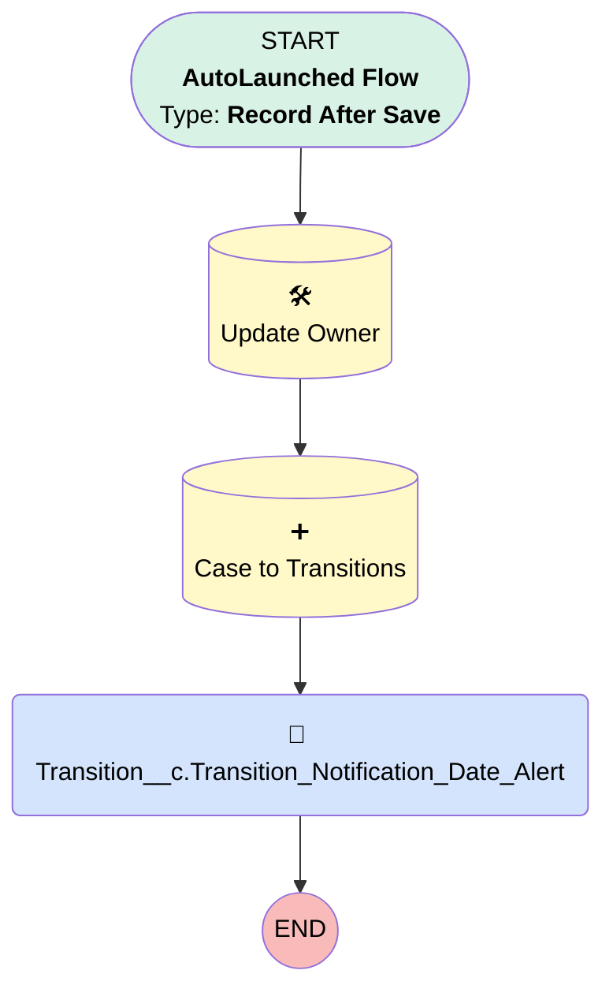

# Transition | After Update | Save Attempts Exhausted

## Flow Diagram [(_View History_)](Transition_After_Update_Save_Attempts_Exhausted-history.md)

<!-- Flow description -->

## General Information

|<!-- -->|<!-- -->|
|:---|:---|
|Object|Transition__c|
|Process Type| Auto Launched Flow|
|Trigger Type| Record After Save|
|Record Trigger Type| Create And Update|
|Label|Transition | After Update | Save Attempts Exhausted|
|Status|Obsolete|
|Does Require Record Changed To Meet Criteria|✅|
|Environments|Default|
|Interview Label|Transition | After Update | Save Attempts Exhausted {!$Flow.CurrentDateTime}|
|Migrated From Workflow Rule Name|Transition - Email - Notification Date Entered|
| Builder Type (PM)|LightningFlowBuilder|
| Canvas Mode (PM)|AUTO_LAYOUT_CANVAS|
|Connector|[Update_Owner](#update_owner)|
|Next Node|[Update_Owner](#update_owner)|

#### Filters (logic: **and**)

|Filter Id|Field|Operator|Value|
|:-- |:-- |:--:|:--: |
|1|Save_Attempts_Exhausted__c| Is Null|<!-- -->|

## Flow Nodes Details

### Transition_Notification_Date_Alert

|<!-- -->|<!-- -->|
|:---|:---|
|Type|Action Call|
|Label|Transition__c.Transition_Notification_Date_Alert|
|Action Type|Email Alert|
|Action Name|Transition__c.Transition_Notification_Date_Alert|
|Flow Transaction Model|CurrentTransaction|
|Name Segment|Transition__c.Transition_Notification_Date_Alert|
|Offset|0|
| SObject Row Id (input)|$Record.Id|

### Case_to_Transitions

|<!-- -->|<!-- -->|
|:---|:---|
|Type|Record Create|
|Object|Case|
|Label|Case to Transitions|
|Store Output Automatically|✅|
|Connector|[Transition_Notification_Date_Alert](#transition_notification_date_alert)|

#### Input Assignments

|Field|Value|
|:-- |:--: |
|AccountId|$Record.Account__c|
|Department__c|Transitions|
|Description|Save attempts for this plan have been exhausted. Please begin work transitioning plan. Thank you.|
|Origin|Internal|
|OwnerId|00500000006xUkf|
|Plan__c|$Record.Plan__c|
|Priority|Medium|
|Status|New|
|Subject|caseSubj|
|Transition__c|$Record.Id|

### Update_Owner

|<!-- -->|<!-- -->|
|:---|:---|
|Type|Record Update|
|Label|Update Owner|
|Input Reference|$Record|
|Connector|[Case_to_Transitions](#case_to_transitions)|

#### Input Assignments

|Field|Value|
|:-- |:--: |
|OwnerId|00500000006xUkf|

___

_Documentation generated from branch monitoring_myubiquity by [sfdx-hardis](https://sfdx-hardis.cloudity.com), featuring [salesforce-flow-visualiser](https://github.com/toddhalfpenny/salesforce-flow-visualiser)_