# Transition | Before Trigger | Master

## Flow Diagram [(_View History_)](Transition_Before_Trigger_Master-history.md)

```mermaid
%% If you read this, your Markdown visualizer does not handle MermaidJS syntax.
%% - If you are in VS Code, install extension `Markdown Preview Mermaid Support` at https://marketplace.visualstudio.com/items?itemName=bierner.markdown-mermaid
%% - If you are using sfdx-hardis, try to define env variable `MERMAID_MODES=cli,docker` ,then run again the command to regenerate markdown with SVG images.
%% - If you are within mkdocs-material, define mermaid plugin in `mkdocs.yml` as described in https://squidfunk.github.io/mkdocs-material/extensions/mermaid/
%% - As a last resort, you can copy-paste this MermaidJS code into https://mermaid.live/ to see the flow diagram

flowchart TB
START(["START<br/><b>AutoLaunched Flow</b></br>Type: <b> Record Before Save</b>"]):::startClass
click START "#general-information" "331216485"

Assign_Notification_Date[\"🟰 <em></em><br/>Assign Notification Date"/]:::assignments
click Assign_Notification_Date "#assign_notification_date" "3349128237"

Complete[\"🟰 <em></em><br/>Complete"/]:::assignments
click Complete "#complete" "1631604700"

Copy_1_of_Complete[\"🟰 <em></em><br/>Copy 1 of Complete"/]:::assignments
click Copy_1_of_Complete "#copy_1_of_complete" "2874960331"

Copy_1_of_Record_Type_Assignment[\"🟰 <em></em><br/>Copy 1 of Record Type Assignment"/]:::assignments
click Copy_1_of_Record_Type_Assignment "#copy_1_of_record_type_assignment" "2479595357"

Copy_2_of_Record_Type_Assignment[\"🟰 <em></em><br/>Copy 2 of Record Type Assignment"/]:::assignments
click Copy_2_of_Record_Type_Assignment "#copy_2_of_record_type_assignment" "659393004"

Copy_3_of_Record_Type_Assignment[\"🟰 <em></em><br/>Copy 3 of Record Type Assignment"/]:::assignments
click Copy_3_of_Record_Type_Assignment "#copy_3_of_record_type_assignment" "2684649820"

Copy_4_of_Record_Type_Assignment[\"🟰 <em></em><br/>Copy 4 of Record Type Assignment"/]:::assignments
click Copy_4_of_Record_Type_Assignment "#copy_4_of_record_type_assignment" "3762381904"

Copy_5_of_Record_Type_Assignment[\"🟰 <em></em><br/>Copy 5 of Record Type Assignment"/]:::assignments
click Copy_5_of_Record_Type_Assignment "#copy_5_of_record_type_assignment" "1110831823"

Record_Type_Assignment[\"🟰 <em></em><br/>Record Type Assignment"/]:::assignments
click Record_Type_Assignment "#record_type_assignment" "1746100271"

Update_to_Final_Questionnaire[\"🟰 <em></em><br/>Update to Final Questionnaire"/]:::assignments
click Update_to_Final_Questionnaire "#update_to_final_questionnaire" "3764214278"

Update_to_Final_Val_Complete[\"🟰 <em></em><br/>Update to Final Val Complete"/]:::assignments
click Update_to_Final_Val_Complete "#update_to_final_val_complete" "1108172553"

Update_to_Saved[\"🟰 <em></em><br/>Update to Saved"/]:::assignments
click Update_to_Saved "#update_to_saved" "2548331779"

Update_to_Transition_in_Progress[\"🟰 <em></em><br/>Update to Transition in Progress"/]:::assignments
click Update_to_Transition_in_Progress "#update_to_transition_in_progress" "795997232"

Status_Update{"🔀 <em></em><br/>Status Update"}:::decisions
click Status_Update "#status_update" "1510534023"

Type_Update{"🔀 <em></em><br/>Type Update?"}:::decisions
click Type_Update "#type_update" "2817374324"

Assign_Notification_Date --> END_Assign_Notification_Date
Complete --> END_Complete
Copy_1_of_Complete --> END_Copy_1_of_Complete
Copy_1_of_Record_Type_Assignment --> Status_Update
Copy_2_of_Record_Type_Assignment --> Status_Update
Copy_3_of_Record_Type_Assignment --> Status_Update
Copy_4_of_Record_Type_Assignment --> Status_Update
Copy_5_of_Record_Type_Assignment --> Status_Update
Record_Type_Assignment --> Status_Update
Update_to_Final_Questionnaire --> END_Update_to_Final_Questionnaire
Update_to_Final_Val_Complete --> END_Update_to_Final_Val_Complete
Update_to_Saved --> END_Update_to_Saved
Update_to_Transition_in_Progress --> END_Update_to_Transition_in_Progress
Status_Update --> |"Saved"| Update_to_Saved
Status_Update --> |"Final Questionnaire in Sent"| Update_to_Final_Questionnaire
Status_Update --> |"Docusign In Progress"| Assign_Notification_Date
Status_Update --> |"Skip DS in Progress"| Update_to_Transition_in_Progress
Status_Update --> |"Final Valuation Complete"| Update_to_Final_Val_Complete
Status_Update --> |"Termination Transition Complete"| Complete
Status_Update --> |"Non-Termination Transition Complete"| Copy_1_of_Complete
Status_Update --> |"Default Outcome"| END_Status_Update
Type_Update --> |"Change to Termination"| Copy_5_of_Record_Type_Assignment
Type_Update --> |"Change to Decon"| Copy_4_of_Record_Type_Assignment
Type_Update --> |"Change to Term Merger"| Copy_1_of_Record_Type_Assignment
Type_Update --> |"Change to Abandon"| Copy_2_of_Record_Type_Assignment
Type_Update --> |"Change to Contract Term"| Record_Type_Assignment
Type_Update --> |"Change to SK or SK+"| Copy_3_of_Record_Type_Assignment
Type_Update --> |"Default Outcome"| Status_Update
START -->  Type_Update
END_Assign_Notification_Date(( END )):::endClass
END_Complete(( END )):::endClass
END_Copy_1_of_Complete(( END )):::endClass
END_Update_to_Final_Questionnaire(( END )):::endClass
END_Update_to_Final_Val_Complete(( END )):::endClass
END_Update_to_Saved(( END )):::endClass
END_Update_to_Transition_in_Progress(( END )):::endClass
END_Status_Update(( END )):::endClass


classDef actionCalls fill:#D4E4FC,color:black,text-decoration:none,max-height:100px
classDef assignments fill:#FBEED7,color:black,text-decoration:none,max-height:100px
classDef collectionProcessors fill:#F0E3FA,color:black,text-decoration:none,max-height:100px
classDef customErrors fill:#FFE9E9,color:black,text-decoration:none,max-height:100px
classDef decisions fill:#FDEAF6,color:black,text-decoration:none,max-height:100px
classDef loops fill:#FDEAF6,color:black,text-decoration:none,max-height:100px
classDef recordCreates fill:#FFF8C9,color:black,text-decoration:none,max-height:100px
classDef recordDeletes fill:#FFF8C9,color:black,text-decoration:none,max-height:100px
classDef recordLookups fill:#EDEAFF,color:black,text-decoration:none,max-height:100px
classDef recordUpdates fill:#FFF8C9,color:black,text-decoration:none,max-height:100px
classDef screens fill:#DFF6FF,color:black,text-decoration:none,max-height:100px
classDef subflows fill:#D4E4FC,color:black,text-decoration:none,max-height:100px
classDef startClass fill:#D9F2E6,color:black,text-decoration:none,max-height:100px
classDef endClass fill:#F9BABA,color:black,text-decoration:none,max-height:100px
classDef transforms fill:#FDEAF6,color:black,text-decoration:none,max-height:100px


```

<!-- Flow description -->

## General Information

|<!-- -->|<!-- -->|
|:---|:---|
|Object|Transition__c|
|Process Type| Auto Launched Flow|
|Trigger Type| Record Before Save|
|Record Trigger Type| Update|
|Label|Transition | Before Trigger | Master|
|Status|Active|
|Environments|Default|
|Interview Label|Transition | Before Trigger | Master {!$Flow.CurrentDateTime}|
| Builder Type (PM)|LightningFlowBuilder|
| Canvas Mode (PM)|AUTO_LAYOUT_CANVAS|
| Origin Builder Type (PM)|LightningFlowBuilder|
|Connector|[Type_Update](#type_update)|
|Next Node|[Type_Update](#type_update)|

## Formulas

|Name|Data Type|Expression|Description|
|:-- |:--:|:-- |:--  |
|dontSendDocusign|Boolean|((ISPICKVAL({!$Record.Transition_Type__c}, "Deconversion") || ISPICKVAL({!$Record.Transition_Type__c}, "Termination/Merger")) && ISPICKVAL({!$Record.Service_Option__c}, "RK Only")) || (ISPICKVAL({!$Record.Transition_Type__c}, "Deconversion") && ({!fullServiceNonSimplyMatrix} = TRUE || {!fullServiceSchwabBD} = TRUE))|Some transitions do not get docusigns, this web lets you know they should not|
|fullServiceNonSimplyMatrix|Boolean|ISPICKVAL({!$Record.Custodian__c}, "MG Trust Company, LLC.") && NOT(ISPICKVAL({!$Record.Plan__r.Business_Unit__c}, "Simply Retirement")) && (ISPICKVAL({!$Record.Plan__r.Product_Type1__c}, "401(k)") || ISPICKVAL({!$Record.Plan__r.Product_Type1__c}, "PEP"))|Full service plans that are not simply where the custodian is matrix|
|fullServiceSchwabBD|Boolean|ISPICKVAL({!$Record.Custodian__c}, "Schwab & Co., Inc.") && (ISPICKVAL({!$Record.Plan__r.Product_Type1__c}, "401(k)") || ISPICKVAL({!$Record.Plan__r.Product_Type1__c}, "PEP"))|<!-- -->|
|isLiquidationDateToday|Boolean|TODAY() = {!$Record.Liquidation_Date__c}|<!-- -->|

## Flow Nodes Details

### Assign_Notification_Date

|<!-- -->|<!-- -->|
|:---|:---|
|Type|Assignment|
|Label|Assign Notification Date|

#### Assignments

|Assign To Reference|Operator|Value|
|:-- |:--:|:--: |
|$Record.Notification_Date__c| Assign|$Flow.CurrentDate|

### Complete

|<!-- -->|<!-- -->|
|:---|:---|
|Type|Assignment|
|Label|[Complete](#complete)|

#### Assignments

|Assign To Reference|Operator|Value|
|:-- |:--:|:--: |
|$Record.Status__c| Assign|Transition Complete|
|$Record.Completion_Date__c| Assign|$Flow.CurrentDate|

### Copy_1_of_Complete

|<!-- -->|<!-- -->|
|:---|:---|
|Type|Assignment|
|Label|Copy 1 of Complete|

#### Assignments

|Assign To Reference|Operator|Value|
|:-- |:--:|:--: |
|$Record.Completion_Date__c| Assign|$Flow.CurrentDate|

### Copy_1_of_Record_Type_Assignment

|<!-- -->|<!-- -->|
|:---|:---|
|Type|Assignment|
|Label|Copy 1 of Record Type Assignment|
|Connector|[Status_Update](#status_update)|

#### Assignments

|Assign To Reference|Operator|Value|
|:-- |:--:|:--: |
|$Record.RecordTypeId| Assign|01237000000EyYDAA0|

### Copy_2_of_Record_Type_Assignment

|<!-- -->|<!-- -->|
|:---|:---|
|Type|Assignment|
|Label|Copy 2 of Record Type Assignment|
|Connector|[Status_Update](#status_update)|

#### Assignments

|Assign To Reference|Operator|Value|
|:-- |:--:|:--: |
|$Record.RecordTypeId| Assign|01237000000EyYIAA0|

### Copy_3_of_Record_Type_Assignment

|<!-- -->|<!-- -->|
|:---|:---|
|Type|Assignment|
|Label|Copy 3 of Record Type Assignment|
|Connector|[Status_Update](#status_update)|

#### Assignments

|Assign To Reference|Operator|Value|
|:-- |:--:|:--: |
|$Record.RecordTypeId| Assign|01237000000Eyo1AAC|

### Copy_4_of_Record_Type_Assignment

|<!-- -->|<!-- -->|
|:---|:---|
|Type|Assignment|
|Label|Copy 4 of Record Type Assignment|
|Connector|[Status_Update](#status_update)|

#### Assignments

|Assign To Reference|Operator|Value|
|:-- |:--:|:--: |
|$Record.RecordTypeId| Assign|01237000000XwaeAAC|

### Copy_5_of_Record_Type_Assignment

|<!-- -->|<!-- -->|
|:---|:---|
|Type|Assignment|
|Label|Copy 5 of Record Type Assignment|
|Connector|[Status_Update](#status_update)|

#### Assignments

|Assign To Reference|Operator|Value|
|:-- |:--:|:--: |
|$Record.RecordTypeId| Assign|01237000000XwajAAC|

### Record_Type_Assignment

|<!-- -->|<!-- -->|
|:---|:---|
|Type|Assignment|
|Label|Record Type Assignment|
|Connector|[Status_Update](#status_update)|

#### Assignments

|Assign To Reference|Operator|Value|
|:-- |:--:|:--: |
|$Record.RecordTypeId| Assign|0121G000000bquUQAQ|

### Update_to_Final_Questionnaire

|<!-- -->|<!-- -->|
|:---|:---|
|Type|Assignment|
|Label|Update to Final Questionnaire|

#### Assignments

|Assign To Reference|Operator|Value|
|:-- |:--:|:--: |
|$Record.Status__c| Assign|Final Questionnaire Sent|

### Update_to_Final_Val_Complete

|<!-- -->|<!-- -->|
|:---|:---|
|Type|Assignment|
|Label|Update to Final Val Complete|

#### Assignments

|Assign To Reference|Operator|Value|
|:-- |:--:|:--: |
|$Record.Status__c| Assign|Final Valuation Complete|

### Update_to_Saved

|<!-- -->|<!-- -->|
|:---|:---|
|Type|Assignment|
|Label|Update to Saved|

#### Assignments

|Assign To Reference|Operator|Value|
|:-- |:--:|:--: |
|$Record.Status__c| Assign|Saved|

### Update_to_Transition_in_Progress

|<!-- -->|<!-- -->|
|:---|:---|
|Type|Assignment|
|Label|Update to Transition in Progress|
|Description|These plans don't get docusign for some reason so move right to in progress.|

#### Assignments

|Assign To Reference|Operator|Value|
|:-- |:--:|:--: |
|$Record.Status__c| Assign|Transition Processes in Progress|

### Status_Update

|<!-- -->|<!-- -->|
|:---|:---|
|Type|Decision|
|Label|Status Update|
|Description|Not including "Save in Process" or "Docusign in Progress" because those values will be set when the Jotform(s) are filled out. Record will move to "Transition Process in Progress" through separate flow when Docusign is signed. Remaining statuses are controlled in another flow because they require scheduled runs.|
|Default Connector Label|Default Outcome|

#### Rule Saved (Saved)

|<!-- -->|<!-- -->|
|:---|:---|
|Does Require Record Changed To Meet Criteria|✅|
|Connector|[Update_to_Saved](#update_to_saved)|
|Condition Logic|and|

|Condition Id|Left Value Reference|Operator|Right Value|
|:-- |:-- |:--:|:--: |
|1|$Record.Saved_Date__c| Is Blank|⬜|

#### Rule Final_Questionnaire_in_Sent (Final Questionnaire in Sent)

|<!-- -->|<!-- -->|
|:---|:---|
|Does Require Record Changed To Meet Criteria|✅|
|Connector|[Update_to_Final_Questionnaire](#update_to_final_questionnaire)|
|Condition Logic|and|

|Condition Id|Left Value Reference|Operator|Right Value|
|:-- |:-- |:--:|:--: |
|1|$Record.Save_Attempts_Exhausted__c| Is Blank|⬜|

#### Rule Docusign_In_Progress (Docusign In Progress)

|<!-- -->|<!-- -->|
|:---|:---|
|Does Require Record Changed To Meet Criteria|✅|
|Connector|[Assign_Notification_Date](#assign_notification_date)|
|Condition Logic|and|

|Condition Id|Left Value Reference|Operator|Right Value|
|:-- |:-- |:--:|:--: |
|1|$Record.Status__c| Equal To|DocuSign in Progress|

#### Rule Skip_DS_in_Progress (Skip DS in Progress)

|<!-- -->|<!-- -->|
|:---|:---|
|Does Require Record Changed To Meet Criteria|✅|
|Connector|[Update_to_Transition_in_Progress](#update_to_transition_in_progress)|
|Condition Logic|and|

|Condition Id|Left Value Reference|Operator|Right Value|
|:-- |:-- |:--:|:--: |
|1|$Record.Status__c| Equal To|DocuSign in Progress|
|2|dontSendDocusign| Equal To|✅|

#### Rule Final_Valuation_Complete (Final Valuation Complete)

|<!-- -->|<!-- -->|
|:---|:---|
|Does Require Record Changed To Meet Criteria|✅|
|Connector|[Update_to_Final_Val_Complete](#update_to_final_val_complete)|
|Condition Logic|and|

|Condition Id|Left Value Reference|Operator|Right Value|
|:-- |:-- |:--:|:--: |
|1|$Record.Final_Valuation_Completed__c| Is Blank|⬜|

#### Rule Termination_Transition_Complete (Termination Transition Complete)

|<!-- -->|<!-- -->|
|:---|:---|
|Does Require Record Changed To Meet Criteria|✅|
|Connector|[Complete](#complete)|
|Condition Logic|and|

|Condition Id|Left Value Reference|Operator|Right Value|
|:-- |:-- |:--:|:--: |
|1|$Record.Transition_Type__c| Equal To|Termination|
|2|$Record.Liquidation_Date__c| Is Blank|⬜|

#### Rule Non_Termination_Transition_Complete (Non-Termination Transition Complete)

|<!-- -->|<!-- -->|
|:---|:---|
|Does Require Record Changed To Meet Criteria|✅|
|Connector|[Copy_1_of_Complete](#copy_1_of_complete)|
|Condition Logic|and|

|Condition Id|Left Value Reference|Operator|Right Value|
|:-- |:-- |:--:|:--: |
|1|$Record.Status__c| Equal To|Transition Complete|
|2|$Record.Transition_Type__c| Not Equal To|Termination|

### Type_Update

|<!-- -->|<!-- -->|
|:---|:---|
|Type|Decision|
|Label|Type Update?|
|Description|If the type changes, the record type needs to change|
|Default Connector|[Status_Update](#status_update)|
|Default Connector Label|Default Outcome|

#### Rule Change_to_Termination (Change to Termination)

|<!-- -->|<!-- -->|
|:---|:---|
|Does Require Record Changed To Meet Criteria|✅|
|Connector|[Copy_5_of_Record_Type_Assignment](#copy_5_of_record_type_assignment)|
|Condition Logic|and|

|Condition Id|Left Value Reference|Operator|Right Value|
|:-- |:-- |:--:|:--: |
|1|$Record.Transition_Type__c| Equal To|Termination|

#### Rule Change_to_Decon (Change to Decon)

|<!-- -->|<!-- -->|
|:---|:---|
|Does Require Record Changed To Meet Criteria|✅|
|Connector|[Copy_4_of_Record_Type_Assignment](#copy_4_of_record_type_assignment)|
|Condition Logic|and|

|Condition Id|Left Value Reference|Operator|Right Value|
|:-- |:-- |:--:|:--: |
|1|$Record.Transition_Type__c| Equal To|Deconversion|

#### Rule Change_to_Term_Merger (Change to Term Merger)

|<!-- -->|<!-- -->|
|:---|:---|
|Does Require Record Changed To Meet Criteria|✅|
|Connector|[Copy_1_of_Record_Type_Assignment](#copy_1_of_record_type_assignment)|
|Condition Logic|and|

|Condition Id|Left Value Reference|Operator|Right Value|
|:-- |:-- |:--:|:--: |
|1|$Record.Transition_Type__c| Equal To|Termination/Merger|

#### Rule Change_to_Abandon (Change to Abandon)

|<!-- -->|<!-- -->|
|:---|:---|
|Does Require Record Changed To Meet Criteria|✅|
|Connector|[Copy_2_of_Record_Type_Assignment](#copy_2_of_record_type_assignment)|
|Condition Logic|and|

|Condition Id|Left Value Reference|Operator|Right Value|
|:-- |:-- |:--:|:--: |
|1|$Record.Transition_Type__c| Equal To|Abandonment|

#### Rule Change_to_Contract_Term (Change to Contract Term)

|<!-- -->|<!-- -->|
|:---|:---|
|Does Require Record Changed To Meet Criteria|✅|
|Connector|[Record_Type_Assignment](#record_type_assignment)|
|Condition Logic|and|

|Condition Id|Left Value Reference|Operator|Right Value|
|:-- |:-- |:--:|:--: |
|1|$Record.Transition_Type__c| Equal To|Contract Termination|

#### Rule Change_to_SK_or_SK (Change to SK or SK+)

|<!-- -->|<!-- -->|
|:---|:---|
|Does Require Record Changed To Meet Criteria|✅|
|Connector|[Copy_3_of_Record_Type_Assignment](#copy_3_of_record_type_assignment)|
|Condition Logic|and|

|Condition Id|Left Value Reference|Operator|Right Value|
|:-- |:-- |:--:|:--: |
|1|$Record.Transition_Type__c| Contains|Single(k)|

___

_Documentation generated from branch monitoring_myubiquity by [sfdx-hardis](https://sfdx-hardis.cloudity.com), featuring [salesforce-flow-visualiser](https://github.com/toddhalfpenny/salesforce-flow-visualiser)_