# Transition | Scheduled | Update Statuses and Create Cases

## Flow Diagram [(_View History_)](Transition_Scheduled_Update_Statuses_and_Create_Cases-history.md)

```mermaid
%% If you read this, your Markdown visualizer does not handle MermaidJS syntax.
%% - If you are in VS Code, install extension `Markdown Preview Mermaid Support` at https://marketplace.visualstudio.com/items?itemName=bierner.markdown-mermaid
%% - If you are using sfdx-hardis, try to define env variable `MERMAID_MODES=cli,docker` ,then run again the command to regenerate markdown with SVG images.
%% - If you are within mkdocs-material, define mermaid plugin in `mkdocs.yml` as described in https://squidfunk.github.io/mkdocs-material/extensions/mermaid/
%% - As a last resort, you can copy-paste this MermaidJS code into https://mermaid.live/ to see the flow diagram

flowchart TB
START(["START<br/><b>AutoLaunched Flow</b></br>Type: <b> Scheduled</b>"]):::startClass
click START "#general-information" "1943417847"

Send_Decon_Email("📧 <em></em><br/>Send Decon Email"):::actionCalls
click Send_Decon_Email "#send_decon_email" "2238984145"

Status_to_Force_Outs_in_Progress[\"🟰 <em></em><br/>Status to Force Outs in Progress"/]:::assignments
click Status_to_Force_Outs_in_Progress "#status_to_force_outs_in_progress" "162643819"

Status_to_Plan_in_Blackout[\"🟰 <em></em><br/>Status to Plan in Blackout"/]:::assignments
click Status_to_Plan_in_Blackout "#status_to_plan_in_blackout" "969354077"

Case_to_R_W_to_Charge_Fees{"🔀 <em></em><br/>Case to R&W to Charge Fees"}:::decisions
click Case_to_R_W_to_Charge_Fees "#case_to_r_w_to_charge_fees" "1275532410"

Decon_Date{"🔀 <em></em><br/>Decon"}:::decisions
click Decon_Date "#decon_date" "3176025278"

Find_an_Active_Payroll_Integration{"🔀 <em></em><br/>Find an Active Payroll Integration?"}:::decisions
click Find_an_Active_Payroll_Integration "#find_an_active_payroll_integration" "1065331642"

Force_Outs_in_Progress{"🔀 <em></em><br/>Force Outs in Progress"}:::decisions
click Force_Outs_in_Progress "#force_outs_in_progress" "3237109796"

Last_Payroll{"🔀 <em></em><br/>Last Payroll"}:::decisions
click Last_Payroll "#last_payroll" "3214094727"

Plan_in_Blackout{"🔀 <em></em><br/>Plan in Blackout"}:::decisions
click Plan_in_Blackout "#plan_in_blackout" "2224224942"

Schwab_Cancel_Kotapay{"🔀 <em></em><br/>Schwab, Cancel Kotapay?"}:::decisions
click Schwab_Cancel_Kotapay "#schwab_cancel_kotapay" "2905865176"

Status_to_Complete_for_Decon_Term_Merger{"🔀 <em></em><br/>Status to Complete for Decon/Term Merger"}:::decisions
click Status_to_Complete_for_Decon_Term_Merger "#status_to_complete_for_decon_term_merger" "1207753388"

X3_Days_before_Decon{"🔀 <em></em><br/>3 Days before Decon"}:::decisions
click X3_Days_before_Decon "#x3_days_before_decon" "3110625525"

Case_to_Payroll_to_Cancel_Kotapay[("➕ <em></em><br/>Case to Payroll to Cancel Kotapay")]:::recordCreates
click Case_to_Payroll_to_Cancel_Kotapay "#case_to_payroll_to_cancel_kotapay" "4236950974"

Case_to_RW_to_Charge_Custodial_and_Advisor_Fees[("➕ <em></em><br/>Case to RW to Charge Custodial and Advisor Fees")]:::recordCreates
click Case_to_RW_to_Charge_Custodial_and_Advisor_Fees "#case_to_rw_to_charge_custodial_and_advisor_fees" "3182124224"

Case_to_RW_to_Charge_Custodial_and_Advisor_Fees_for_Decons[("➕ <em></em><br/>Case to RW to Charge Custodial and Advisor Fees for Decons")]:::recordCreates
click Case_to_RW_to_Charge_Custodial_and_Advisor_Fees_for_Decons "#case_to_rw_to_charge_custodial_and_advisor_fees_for_decons" "1575462335"

Copy_1_of_Case_to_RW_to_Charge_Custodial_and_Advisor_Fees_for_Decons[("➕ <em></em><br/>Case to RW to Check Residuals and Force Outs for Decons")]:::recordCreates
click Copy_1_of_Case_to_RW_to_Charge_Custodial_and_Advisor_Fees_for_Decons "#copy_1_of_case_to_rw_to_charge_custodial_and_advisor_fees_for_decons" "968106765"

Create_Case_for_Payroll_to_Turn_off_Payroll_Integration[("➕ <em></em><br/>Create Case for Payroll to Turn off Payroll Integration")]:::recordCreates
click Create_Case_for_Payroll_to_Turn_off_Payroll_Integration "#create_case_for_payroll_to_turn_off_payroll_integration" "1285740873"

Create_Fault_Case[("➕ <em></em><br/>Create Fault Case")]:::recordCreates
click Create_Fault_Case "#create_fault_case" "230045103"

Look_For_Active_Payroll_Integration[("🔍 <em></em><br/>Look For Active Payroll Integration")]:::recordLookups
click Look_For_Active_Payroll_Integration "#look_for_active_payroll_integration" "2872314824"

Copy_2_of_Update_Status[("🛠️ <em></em><br/>Copy 2 of Update Status")]:::recordUpdates
click Copy_2_of_Update_Status "#copy_2_of_update_status" "1508406633"

Update_Status[("🛠️ <em></em><br/>Update Status")]:::recordUpdates
click Update_Status "#update_status" "3968832646"

Update_Status_to_Blackout[("🛠️ <em></em><br/>Update Status to Blackout")]:::recordUpdates
click Update_Status_to_Blackout "#update_status_to_blackout" "1957728634"

Send_Decon_Email --> Plan_in_Blackout
Send_Decon_Email -. Fault .->Create_Fault_Case
Status_to_Force_Outs_in_Progress --> Update_Status
Status_to_Plan_in_Blackout --> Update_Status_to_Blackout
Case_to_R_W_to_Charge_Fees --> |"Yes, Termination or Term/Merger"| Case_to_RW_to_Charge_Custodial_and_Advisor_Fees
Case_to_R_W_to_Charge_Fees --> |"Default Outcome"| Schwab_Cancel_Kotapay
Decon_Date --> |"20Days Before Decon"| Case_to_RW_to_Charge_Custodial_and_Advisor_Fees_for_Decons
Decon_Date --> |"Default Outcome"| X3_Days_before_Decon
Find_an_Active_Payroll_Integration --> |"Found Payroll Integration"| Create_Case_for_Payroll_to_Turn_off_Payroll_Integration
Find_an_Active_Payroll_Integration --> |"Default Outcome"| Case_to_R_W_to_Charge_Fees
Force_Outs_in_Progress --> |"Force 'em Out"| Status_to_Force_Outs_in_Progress
Force_Outs_in_Progress --> |"Default Outcome"| Status_to_Complete_for_Decon_Term_Merger
Last_Payroll --> |"Two Weeks After Last Payroll"| Look_For_Active_Payroll_Integration
Last_Payroll --> |"Default Outcome"| Decon_Date
Plan_in_Blackout --> |"Blackout"| Status_to_Plan_in_Blackout
Plan_in_Blackout --> |"Default Outcome"| Force_Outs_in_Progress
Schwab_Cancel_Kotapay --> |"Yes, Schwab so Cancel Kotapay"| Case_to_Payroll_to_Cancel_Kotapay
Schwab_Cancel_Kotapay --> |"Default Outcome"| Decon_Date
Status_to_Complete_for_Decon_Term_Merger --> |"Move to Complete"| Copy_2_of_Update_Status
Status_to_Complete_for_Decon_Term_Merger --> |"Default Outcome"| END_Status_to_Complete_for_Decon_Term_Merger
X3_Days_before_Decon --> |"3 Days Before"| Send_Decon_Email
X3_Days_before_Decon --> |"Default Outcome"| Plan_in_Blackout
Case_to_Payroll_to_Cancel_Kotapay --> Decon_Date
Case_to_RW_to_Charge_Custodial_and_Advisor_Fees --> Schwab_Cancel_Kotapay
Case_to_RW_to_Charge_Custodial_and_Advisor_Fees_for_Decons --> X3_Days_before_Decon
Copy_1_of_Case_to_RW_to_Charge_Custodial_and_Advisor_Fees_for_Decons --> Status_to_Complete_for_Decon_Term_Merger
Create_Case_for_Payroll_to_Turn_off_Payroll_Integration --> Case_to_R_W_to_Charge_Fees
Create_Fault_Case --> Plan_in_Blackout
Look_For_Active_Payroll_Integration --> Find_an_Active_Payroll_Integration
Copy_2_of_Update_Status --> END_Copy_2_of_Update_Status
Update_Status --> Copy_1_of_Case_to_RW_to_Charge_Custodial_and_Advisor_Fees_for_Decons
Update_Status_to_Blackout --> Force_Outs_in_Progress
START -->  Last_Payroll
END_Status_to_Complete_for_Decon_Term_Merger(( END )):::endClass
END_Copy_2_of_Update_Status(( END )):::endClass


classDef actionCalls fill:#D4E4FC,color:black,text-decoration:none,max-height:100px
classDef assignments fill:#FBEED7,color:black,text-decoration:none,max-height:100px
classDef collectionProcessors fill:#F0E3FA,color:black,text-decoration:none,max-height:100px
classDef customErrors fill:#FFE9E9,color:black,text-decoration:none,max-height:100px
classDef decisions fill:#FDEAF6,color:black,text-decoration:none,max-height:100px
classDef loops fill:#FDEAF6,color:black,text-decoration:none,max-height:100px
classDef recordCreates fill:#FFF8C9,color:black,text-decoration:none,max-height:100px
classDef recordDeletes fill:#FFF8C9,color:black,text-decoration:none,max-height:100px
classDef recordLookups fill:#EDEAFF,color:black,text-decoration:none,max-height:100px
classDef recordUpdates fill:#FFF8C9,color:black,text-decoration:none,max-height:100px
classDef screens fill:#DFF6FF,color:black,text-decoration:none,max-height:100px
classDef subflows fill:#D4E4FC,color:black,text-decoration:none,max-height:100px
classDef startClass fill:#D9F2E6,color:black,text-decoration:none,max-height:100px
classDef endClass fill:#F9BABA,color:black,text-decoration:none,max-height:100px
classDef transforms fill:#FDEAF6,color:black,text-decoration:none,max-height:100px


```

<!-- Flow description -->

## General Information

|<!-- -->|<!-- -->|
|:---|:---|
|Object|Transition__c|
|Process Type| Auto Launched Flow|
|Trigger Type| Scheduled|
|Label|Transition | Scheduled | Update Statuses and Create Cases|
|Status|Active|
|Environments|Default|
|Interview Label|Transition | Scheduled | Update Statuses and Create Cases {!$Flow.CurrentDateTime}|
| Builder Type (PM)|LightningFlowBuilder|
| Canvas Mode (PM)|AUTO_LAYOUT_CANVAS|
| Origin Builder Type (PM)|LightningFlowBuilder|
|Connector|[Last_Payroll](#last_payroll)|
|Next Node|[Last_Payroll](#last_payroll)|

#### Schedules

|Frequency|Start Date|Start Time|
|:-- |:--:|:--: |
|Daily|Apr 22, 2025|05:00|

#### Filters (logic: **and**)

|Filter Id|Field|Operator|Value|
|:-- |:-- |:--:|:--: |
|1|Status__c| Not Equal To|Saved|
|2|Status__c| Not Equal To|Transition Complete|
|3|Status__c| Not Equal To|Cancelled|

## Variables

|Name|Data Type|Is Collection|Is Input|Is Output|Object Type|Description|
|:-- |:--:|:--:|:--:|:--:|:--:|:--  |
|activeAddOn|SObject|⬜|✅|⬜|Add_On_Products__c|<!-- -->|

## Formulas

|Name|Data Type|Expression|Description|
|:-- |:--:|:-- |:--  |
|formattedName|String|TRIM( LEFT(  {!$Record.Name}, 60))|<!-- -->|
|isLiquidationDateToday|Boolean|TODAY() = {!$Record.Liquidation_Date__c}|<!-- -->|
|x10DaysBeforeBlackout|Boolean|{!$Record.Liquidation_Date__c} - TODAY() = 10|10 days before liquidation date, the plan moves to Blackout|
|x20DaysBeforeDecon|Boolean|{!$Record.Deconversion_Date__c} - TODAY() = 20|<!-- -->|
|x3daysBeforeDecon|Boolean|{!$Record.Deconversion_Date__c} - TODAY() = 3|<!-- -->|
|x5DaysAfterLastPayroll|Boolean|TODAY() - {!$Record.Last_Payroll__c} = 5|<!-- -->|
|x90DaysAfterFinVal|Boolean|TODAY() - {!$Record.Final_Valuation_Completed__c}  = 90|<!-- -->|

## Text Templates

|Name|Text|Description|
|:-- |:-- |:--  |
|payrollCaseDesc|{!$Record.Account__r.Name} has started the Transition process. Please turn off payroll integration for this plan.|<!-- -->|
|payrollCaseSubj|Turn off Payroll Integration for {!formattedName}|<!-- -->|

## Flow Nodes Details

### Send_Decon_Email

|<!-- -->|<!-- -->|
|:---|:---|
|Type|Action Call|
|Label|Send Decon Email|
|Action Type|Email Simple|
|Action Name|emailSimple|
|Fault Connector|[Create_Fault_Case](#create_fault_case)|
|Flow Transaction Model|CurrentTransaction|
|Name Segment|emailSimple|
|Offset|0|
|Version String|1.0.1|
|Sender Type (input)|OrgWideEmailAddress|
|Sender Address (input)|donotrespond@myubiquity.com|
|Use Email Template (input)|True|
|Email Template Id (input)|00XUo000002hWOUMA2|
|Recipient Id (input)|$Record.Contact__c|
|Related Record Id (input)|$Record.Id|
|Log Email On Send (input)|✅|
|Connector|[Plan_in_Blackout](#plan_in_blackout)|

### Status_to_Force_Outs_in_Progress

|<!-- -->|<!-- -->|
|:---|:---|
|Type|Assignment|
|Label|Status to Force Outs in Progress|
|Connector|[Update_Status](#update_status)|

#### Assignments

|Assign To Reference|Operator|Value|
|:-- |:--:|:--: |
|$Record.Status__c| Assign|Force Outs in Progress|

### Status_to_Plan_in_Blackout

|<!-- -->|<!-- -->|
|:---|:---|
|Type|Assignment|
|Label|Status to Plan in Blackout|
|Connector|[Update_Status_to_Blackout](#update_status_to_blackout)|

#### Assignments

|Assign To Reference|Operator|Value|
|:-- |:--:|:--: |
|$Record.Status__c| Assign|Plan in Blackout|

### Case_to_R_W_to_Charge_Fees

|<!-- -->|<!-- -->|
|:---|:---|
|Type|Decision|
|Label|Case to R&W to Charge Fees|
|Default Connector|[Schwab_Cancel_Kotapay](#schwab_cancel_kotapay)|
|Default Connector Label|Default Outcome|

#### Rule Yes_Termination_or_Term_Merger (Yes, Termination or Term/Merger)

|<!-- -->|<!-- -->|
|:---|:---|
|Connector|[Case_to_RW_to_Charge_Custodial_and_Advisor_Fees](#case_to_rw_to_charge_custodial_and_advisor_fees)|
|Condition Logic|or|

|Condition Id|Left Value Reference|Operator|Right Value|
|:-- |:-- |:--:|:--: |
|1|$Record.Transition_Type__c| Equal To|Termination|
|2|$Record.Transition_Type__c| Equal To|Termination/Merger|

### Decon_Date

|<!-- -->|<!-- -->|
|:---|:---|
|Type|Decision|
|Label|Decon|
|Description|For Simply Unbundled Decons, the case to charge custodial/advisor fees is 14 days BEFORE the Deconversion Date instead of 14 days after Last Payroll date. *Change requested by Callie 9/4/25, now sending the case 20days before the Decon Date and doing it for all transition types.|
|Default Connector|[X3_Days_before_Decon](#x3_days_before_decon)|
|Default Connector Label|Default Outcome|

#### Rule X20Days_Before_Decon (20Days Before Decon)

|<!-- -->|<!-- -->|
|:---|:---|
|Connector|[Case_to_RW_to_Charge_Custodial_and_Advisor_Fees_for_Decons](#case_to_rw_to_charge_custodial_and_advisor_fees_for_decons)|
|Condition Logic|and|

|Condition Id|Left Value Reference|Operator|Right Value|
|:-- |:-- |:--:|:--: |
|1|x20DaysBeforeDecon| Equal To|✅|

### Find_an_Active_Payroll_Integration

|<!-- -->|<!-- -->|
|:---|:---|
|Type|Decision|
|Label|Find an Active Payroll Integration?|
|Default Connector|[Case_to_R_W_to_Charge_Fees](#case_to_r_w_to_charge_fees)|
|Default Connector Label|Default Outcome|

#### Rule Found_Payroll_Integration (Found Payroll Integration)

|<!-- -->|<!-- -->|
|:---|:---|
|Connector|[Create_Case_for_Payroll_to_Turn_off_Payroll_Integration](#create_case_for_payroll_to_turn_off_payroll_integration)|
|Condition Logic|and|

|Condition Id|Left Value Reference|Operator|Right Value|
|:-- |:-- |:--:|:--: |
|1|activeAddOn.Id| Is Null|⬜|

### Force_Outs_in_Progress

|<!-- -->|<!-- -->|
|:---|:---|
|Type|Decision|
|Label|Force Outs in Progress|
|Default Connector|[Status_to_Complete_for_Decon_Term_Merger](#status_to_complete_for_decon_term_merger)|
|Default Connector Label|Default Outcome|

#### Rule Force_em_Out (Force 'em Out)

|<!-- -->|<!-- -->|
|:---|:---|
|Connector|[Status_to_Force_Outs_in_Progress](#status_to_force_outs_in_progress)|
|Condition Logic|and|

|Condition Id|Left Value Reference|Operator|Right Value|
|:-- |:-- |:--:|:--: |
|1|$Record.Transition_Type__c| Equal To|Termination|
|2|x90DaysAfterFinVal| Equal To|✅|

### Last_Payroll

|<!-- -->|<!-- -->|
|:---|:---|
|Type|Decision|
|Label|Last Payroll|
|Default Connector|[Decon_Date](#decon_date)|
|Default Connector Label|Default Outcome|

#### Rule Two_Weeks_After_Last_Payroll (Two Weeks After Last Payroll)

|<!-- -->|<!-- -->|
|:---|:---|
|Connector|[Look_For_Active_Payroll_Integration](#look_for_active_payroll_integration)|
|Condition Logic|and|

|Condition Id|Left Value Reference|Operator|Right Value|
|:-- |:-- |:--:|:--: |
|1|x5DaysAfterLastPayroll| Equal To|✅|

### Plan_in_Blackout

|<!-- -->|<!-- -->|
|:---|:---|
|Type|Decision|
|Label|Plan in Blackout|
|Default Connector|[Force_Outs_in_Progress](#force_outs_in_progress)|
|Default Connector Label|Default Outcome|

#### Rule Blackout (Blackout)

|<!-- -->|<!-- -->|
|:---|:---|
|Connector|[Status_to_Plan_in_Blackout](#status_to_plan_in_blackout)|
|Condition Logic|(1 OR 2) AND 3|

|Condition Id|Left Value Reference|Operator|Right Value|
|:-- |:-- |:--:|:--: |
|1|$Record.Transition_Type__c| Equal To|Deconversion|
|2|$Record.Transition_Type__c| Equal To|Termination/Merger|
|3|x10DaysBeforeBlackout| Equal To|✅|

### Schwab_Cancel_Kotapay

|<!-- -->|<!-- -->|
|:---|:---|
|Type|Decision|
|Label|Schwab, Cancel Kotapay?|
|Default Connector|[Decon_Date](#decon_date)|
|Default Connector Label|Default Outcome|

#### Rule Yes_Schwab_so_Cancel_Kotapay (Yes, Schwab so Cancel Kotapay)

|<!-- -->|<!-- -->|
|:---|:---|
|Connector|[Case_to_Payroll_to_Cancel_Kotapay](#case_to_payroll_to_cancel_kotapay)|
|Condition Logic|or|

|Condition Id|Left Value Reference|Operator|Right Value|
|:-- |:-- |:--:|:--: |
|1|$Record.Custodian__c| Equal To|Schwab & Co., Inc.|
|2|$Record.Custodian__c| Equal To|Schwab Trust|

### Status_to_Complete_for_Decon_Term_Merger

|<!-- -->|<!-- -->|
|:---|:---|
|Type|Decision|
|Label|Status to Complete for Decon/Term Merger|
|Default Connector Label|Default Outcome|

#### Rule Move_to_Complete (Move to Complete)

|<!-- -->|<!-- -->|
|:---|:---|
|Connector|[Copy_2_of_Update_Status](#copy_2_of_update_status)|
|Condition Logic|(1 OR 2) AND 3|

|Condition Id|Left Value Reference|Operator|Right Value|
|:-- |:-- |:--:|:--: |
|1|$Record.Transition_Type__c| Equal To|Deconversion|
|2|$Record.Transition_Type__c| Equal To|Termination/Merger|
|3|isLiquidationDateToday| Equal To|✅|

### X3_Days_before_Decon

|<!-- -->|<!-- -->|
|:---|:---|
|Type|Decision|
|Label|3 Days before Decon|
|Default Connector|[Plan_in_Blackout](#plan_in_blackout)|
|Default Connector Label|Default Outcome|

#### Rule X3_Days_Before (3 Days Before)

|<!-- -->|<!-- -->|
|:---|:---|
|Connector|[Send_Decon_Email](#send_decon_email)|
|Condition Logic|and|

|Condition Id|Left Value Reference|Operator|Right Value|
|:-- |:-- |:--:|:--: |
|1|x3daysBeforeDecon| Equal To|✅|

### Case_to_Payroll_to_Cancel_Kotapay

|<!-- -->|<!-- -->|
|:---|:---|
|Type|Record Create|
|Object|Case|
|Label|Case to Payroll to Cancel Kotapay|
|Store Output Automatically|✅|
|Connector|[Decon_Date](#decon_date)|

#### Input Assignments

|Field|Value|
|:-- |:--: |
|AccountId|$Record.Account__c|
|Department__c|Payroll|
|Origin|Internal|
|OwnerId|00537000002STLD|
|Plan__c|$Record.Plan__c|
|Sender_Role__c|Sponsor|
|Status|New|
|Subject|Cancel Kotapay|
|Transition__c|$Record.Id|

### Case_to_RW_to_Charge_Custodial_and_Advisor_Fees

|<!-- -->|<!-- -->|
|:---|:---|
|Type|Record Create|
|Object|Case|
|Label|Case to RW to Charge Custodial and Advisor Fees|
|Store Output Automatically|✅|
|Connector|[Schwab_Cancel_Kotapay](#schwab_cancel_kotapay)|

#### Input Assignments

|Field|Value|
|:-- |:--: |
|AccountId|$Record.Account__c|
|Department__c|Reconciliations and Withdrawals|
|Origin|Internal|
|OwnerId|005Ho00000AnvFJ|
|Plan__c|$Record.Plan__c|
|RecordTypeId|012Ho000000NtUeIAK|
|Sender_Role__c|Sponsor|
|Status|New|
|Subject|Charge Advisor, Asset Manager, and Custodial Fees|
|Transition__c|$Record.Id|

### Case_to_RW_to_Charge_Custodial_and_Advisor_Fees_for_Decons

|<!-- -->|<!-- -->|
|:---|:---|
|Type|Record Create|
|Object|Case|
|Label|Case to RW to Charge Custodial and Advisor Fees for Decons|
|Store Output Automatically|✅|
|Connector|[X3_Days_before_Decon](#x3_days_before_decon)|

#### Input Assignments

|Field|Value|
|:-- |:--: |
|AccountId|$Record.Account__c|
|Department__c|Transitions|
|Origin|Internal|
|OwnerId|005Ho00000AnvFJ|
|Plan__c|$Record.Plan__c|
|RecordTypeId|012Ho000000NtUeIAK|
|Sender_Role__c|Sponsor|
|Status|New|
|Subject|Charge Advisor, Asset Manager, and Custodial Fees|
|Transition__c|$Record.Id|

### Copy_1_of_Case_to_RW_to_Charge_Custodial_and_Advisor_Fees_for_Decons

|<!-- -->|<!-- -->|
|:---|:---|
|Type|Record Create|
|Object|Case|
|Label|Case to RW to Check Residuals and Force Outs for Decons|
|Store Output Automatically|✅|
|Connector|[Status_to_Complete_for_Decon_Term_Merger](#status_to_complete_for_decon_term_merger)|

#### Input Assignments

|Field|Value|
|:-- |:--: |
|AccountId|$Record.Account__c|
|Department__c|Transitions|
|Description|Check for Residuals and Begin Force Outs|
|Origin|Internal|
|OwnerId|005Ho00000AnvFJ|
|Plan__c|$Record.Plan__c|
|RecordTypeId|012Ho000000NtUeIAK|
|Sender_Role__c|Sponsor|
|Status|New|
|Subject|Force Outs in Progress|
|Transition__c|$Record.Id|

### Create_Case_for_Payroll_to_Turn_off_Payroll_Integration

|<!-- -->|<!-- -->|
|:---|:---|
|Type|Record Create|
|Object|Case|
|Label|Create Case for Payroll to Turn off Payroll Integration|
|Store Output Automatically|✅|
|Connector|[Case_to_R_W_to_Charge_Fees](#case_to_r_w_to_charge_fees)|

#### Input Assignments

|Field|Value|
|:-- |:--: |
|AccountId|$Record.Account__c|
|Department__c|Payroll|
|Description|payrollCaseDesc|
|Origin|Internal|
|OwnerId|00537000002STLD|
|Plan__c|$Record.Plan__c|
|Sender_Role__c|Sponsor|
|Status|New|
|Subject|payrollCaseSubj|
|Transition__c|$Record.Id|

### Create_Fault_Case

|<!-- -->|<!-- -->|
|:---|:---|
|Type|Record Create|
|Object|Case|
|Label|Create Fault Case|
|Store Output Automatically|✅|
|Connector|isGoTo: true targetReference: Plan_in_Blackout |

#### Input Assignments

|Field|Value|
|:-- |:--: |
|AccountId|$Record.Account__c|
|Department__c|Transitions|
|Description|The 3 Days Before Decon Auto Email failed to send. Please send it manually.|
|OwnerId|00500000006xUkf|
|Plan__c|$Record.Plan__c|
|Subject|Auto Email Failed to Send|
|Transition__c|$Record.Id|

### Look_For_Active_Payroll_Integration

|<!-- -->|<!-- -->|
|:---|:---|
|Type|Record Lookup|
|Object|Add_On_Products__c|
|Label|Look For Active Payroll Integration|
|Assign Null Values If No Records Found|✅|
|Output Reference|activeAddOn|
|Queried Fields|- Id - Service_Option__c - Product_Status__c - Plan__c |
|Connector|[Find_an_Active_Payroll_Integration](#find_an_active_payroll_integration)|

#### Filters (logic: **1 AND 2 AND ((3 OR 4) AND (5 OR 6 OR 7))**)

|Filter Id|Field|Operator|Value|
|:-- |:-- |:--:|:--: |
|1|Plan__c| Equal To|$Record.Plan__c|
|2|Plan__c| Is Null|<!-- -->|
|3|Service_Option__c| Equal To|Enhanced Payroll Service|
|4|Service_Option__c| Equal To|Direct Integration|
|5|Product_Status__c| Contains|New|
|6|Product_Status__c| Equal To|In Progress|
|7|Product_Status__c| Equal To|Completed Setup|

### Copy_2_of_Update_Status

|<!-- -->|<!-- -->|
|:---|:---|
|Type|Record Update|
|Label|Copy 2 of Update Status|
|Input Reference|$Record|

#### Input Assignments

|Field|Value|
|:-- |:--: |
|Status__c|Transition Complete|

### Update_Status

|<!-- -->|<!-- -->|
|:---|:---|
|Type|Record Update|
|Label|Update Status|
|Input Reference|$Record|
|Connector|[Copy_1_of_Case_to_RW_to_Charge_Custodial_and_Advisor_Fees_for_Decons](#copy_1_of_case_to_rw_to_charge_custodial_and_advisor_fees_for_decons)|

#### Input Assignments

|Field|Value|
|:-- |:--: |
|Status__c|Force Outs in Progress|

### Update_Status_to_Blackout

|<!-- -->|<!-- -->|
|:---|:---|
|Type|Record Update|
|Label|Update Status to Blackout|
|Input Reference|$Record|
|Connector|[Force_Outs_in_Progress](#force_outs_in_progress)|

#### Input Assignments

|Field|Value|
|:-- |:--: |
|Status__c|Plan in Blackout|

___

_Documentation generated from branch monitoring_myubiquity by [sfdx-hardis](https://sfdx-hardis.cloudity.com), featuring [salesforce-flow-visualiser](https://github.com/toddhalfpenny/salesforce-flow-visualiser)_