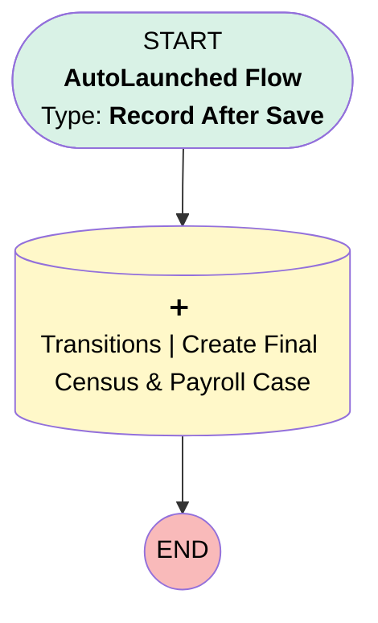

# Transitions | After Save | Final Census Payroll Case

## Flow Diagram [(_View History_)](Transitions_Final_5500_Termination_Process_1-history.md)

<!-- Flow description -->

## General Information

|<!-- -->|<!-- -->|
|:---|:---|
|Object|Transition__c|
|Process Type| Auto Launched Flow|
|Trigger Type| Record After Save|
|Record Trigger Type| Update|
|Label|Transitions | After Save | Final Census Payroll Case|
|Status|Active|
|Does Require Record Changed To Meet Criteria|✅|
|Description|Migrated from the Transitions | Final 5500 Termination Process process using Final Census & Last Payroll criteria.|
|Environments|Default|
|Interview Label|Transitions | After Save | Create Final Census Payroll Case {!$Flow.CurrentDateTime}|
| Builder Type (PM)|LightningFlowBuilder|
| Canvas Mode (PM)|AUTO_LAYOUT_CANVAS|
|Connector|[myRule_1_A1](#myrule_1_a1)|
|Next Node|[myRule_1_A1](#myrule_1_a1)|

#### Filters (logic: **(2 AND 4 AND 5 AND (1 OR 3)) AND (7 OR 8 OR 11 OR (6 AND 9 AND 10))**)

|Filter Id|Field|Operator|Value|
|:-- |:-- |:--:|:--: |
|1|Transition_Type__c| Equal To|Termination|
|2|Final_Census_Payroll_Submitted__c| Is Null|<!-- -->|
|3|Transition_Type__c| Equal To|Termination/Merger|
|4|RKO_Plan__c| Equal To|No|
|5|Final_Payroll_In_Terminated_Year__c| Equal To|Yes|
|6|Safe_Harbor_Plan__c| Equal To|Yes|
|7|Does_the_Plan_Have_Forfeitures__c| Equal To|Yes|
|8|Is_Plan_Vesting_100__c| Equal To|No|
|9|Safe_Harbor_Funded_In_Term_Year__c| Equal To|Yes|
|10|Safe_Harbor_Allocation_Frequency__c| Equal To|End of Plan Year|
|11|Safe_Harbor_Plan__c| Equal To|No|

## Flow Nodes Details

### myRule_1_A1

|<!-- -->|<!-- -->|
|:---|:---|
|Type|Record Create|
|Object|Case|
|Label|Transitions | Create Final Census & Payroll Case|
|Store Output Automatically|✅|

#### Input Assignments

|Field|Value|
|:-- |:--: |
|AccountId|$Record.Account__r.Id|
|BusinessHoursId|01m37000000L07P|
|Category__c|Transition|
|Department__c|Transitions|
|Description|Please create child case requesting the final testing and/or forfeiture allocation.|
|Origin|Internal|
|OwnerId|00500000006xUkf|
|Plan__c|$Record.Plan__r.Id|
|RecordTypeId|01237000000XwY4AAK|
|Status|New|
|Subject|Final Testing/ Forfeiture Allocation Needed|
|Transition__c|$Record.Id|

___

_Documentation generated from branch monitoring_myubiquity by [sfdx-hardis](https://sfdx-hardis.cloudity.com), featuring [salesforce-flow-visualiser](https://github.com/toddhalfpenny/salesforce-flow-visualiser)_