# Zoom Calls | Trigger After Insert | Populate Recording Link

## Flow Diagram [(_View History_)](Zoom_Calls_Trigger_After_Insert-history.md)

```mermaid
%% If you read this, your Markdown visualizer does not handle MermaidJS syntax.
%% - If you are in VS Code, install extension `Markdown Preview Mermaid Support` at https://marketplace.visualstudio.com/items?itemName=bierner.markdown-mermaid
%% - If you are using sfdx-hardis, try to define env variable `MERMAID_MODES=cli,docker` ,then run again the command to regenerate markdown with SVG images.
%% - If you are within mkdocs-material, define mermaid plugin in `mkdocs.yml` as described in https://squidfunk.github.io/mkdocs-material/extensions/mermaid/
%% - As a last resort, you can copy-paste this MermaidJS code into https://mermaid.live/ to see the flow diagram

flowchart TB
START(["START<br/><b>AutoLaunched Flow</b></br>Type: <b> Record After Save</b>"]):::startClass
click START "#general-information" "3635080508"

Has_Recording{"🔀 <em></em><br/>Has Recording?"}:::decisions
click Has_Recording "#has_recording" "1968494041"

Session_History_Found{"🔀 <em></em><br/>Session History Found?"}:::decisions
click Session_History_Found "#session_history_found" "768559630"

Get_Related_Session_History[("🔍 <em></em><br/>Get Related Session History")]:::recordLookups
click Get_Related_Session_History "#get_related_session_history" "1375735067"

Update_Recording_Link[("🛠️ <em></em><br/>Update Recording Link")]:::recordUpdates
click Update_Recording_Link "#update_recording_link" "3828497037"

Has_Recording --> |"Yes"| Get_Related_Session_History
Has_Recording --> |"Default Outcome"| END_Has_Recording
Session_History_Found --> |"Found"| Update_Recording_Link
Session_History_Found --> |"Default Outcome"| END_Session_History_Found
Get_Related_Session_History --> Session_History_Found
Update_Recording_Link --> END_Update_Recording_Link
START -->  Has_Recording
END_Has_Recording(( END )):::endClass
END_Session_History_Found(( END )):::endClass
END_Update_Recording_Link(( END )):::endClass


classDef actionCalls fill:#D4E4FC,color:black,text-decoration:none,max-height:100px
classDef assignments fill:#FBEED7,color:black,text-decoration:none,max-height:100px
classDef collectionProcessors fill:#F0E3FA,color:black,text-decoration:none,max-height:100px
classDef customErrors fill:#FFE9E9,color:black,text-decoration:none,max-height:100px
classDef decisions fill:#FDEAF6,color:black,text-decoration:none,max-height:100px
classDef loops fill:#FDEAF6,color:black,text-decoration:none,max-height:100px
classDef recordCreates fill:#FFF8C9,color:black,text-decoration:none,max-height:100px
classDef recordDeletes fill:#FFF8C9,color:black,text-decoration:none,max-height:100px
classDef recordLookups fill:#EDEAFF,color:black,text-decoration:none,max-height:100px
classDef recordUpdates fill:#FFF8C9,color:black,text-decoration:none,max-height:100px
classDef screens fill:#DFF6FF,color:black,text-decoration:none,max-height:100px
classDef subflows fill:#D4E4FC,color:black,text-decoration:none,max-height:100px
classDef startClass fill:#D9F2E6,color:black,text-decoration:none,max-height:100px
classDef endClass fill:#F9BABA,color:black,text-decoration:none,max-height:100px
classDef transforms fill:#FDEAF6,color:black,text-decoration:none,max-height:100px


```

<!-- Flow description -->

## General Information

|<!-- -->|<!-- -->|
|:---|:---|
|Object|Zoom_Phone_Calls_Info__c|
|Process Type| Auto Launched Flow|
|Trigger Type| Record After Save|
|Record Trigger Type| Create|
|Label|Zoom Calls | Trigger After Insert | Populate Recording Link|
|Status|Active|
|Description|This flow will populate recording link from the related Session History Object.|
|Environments|Default|
|Interview Label|Zoom Calls | Trigger After Insert {!$Flow.CurrentDateTime}|
| Builder Type (PM)|LightningFlowBuilder|
| Canvas Mode (PM)|AUTO_LAYOUT_CANVAS|
| Origin Builder Type (PM)|LightningFlowBuilder|
|Connector|[Has_Recording](#has_recording)|
|Next Node|[Has_Recording](#has_recording)|

#### Filters (logic: **and**)

|Filter Id|Field|Operator|Value|
|:-- |:-- |:--:|:--: |
|1|Call_Type__c| Equal To|Contact Center|

## Flow Nodes Details

### Has_Recording

|<!-- -->|<!-- -->|
|:---|:---|
|Type|Decision|
|Label|Has Recording?|
|Default Connector Label|Default Outcome|

#### Rule Yes (Yes)

|<!-- -->|<!-- -->|
|:---|:---|
|Connector|[Get_Related_Session_History](#get_related_session_history)|
|Condition Logic|and|

|Condition Id|Left Value Reference|Operator|Right Value|
|:-- |:-- |:--:|:--: |
|1|$Record.has_recording__c| Equal To|✅|
|2|$Record.Call_Id__c| Is Null|⬜|

### Session_History_Found

|<!-- -->|<!-- -->|
|:---|:---|
|Type|Decision|
|Label|Session History Found?|
|Default Connector Label|Default Outcome|

#### Rule Found (Found)

|<!-- -->|<!-- -->|
|:---|:---|
|Connector|[Update_Recording_Link](#update_recording_link)|
|Condition Logic|and|

|Condition Id|Left Value Reference|Operator|Right Value|
|:-- |:-- |:--:|:--: |
|1|Get_Related_Session_History.ZVC__Recording__c| Is Null|⬜|

### Get_Related_Session_History

|<!-- -->|<!-- -->|
|:---|:---|
|Type|Record Lookup|
|Object|ZVC__Session_History__c|
|Label|Get Related Session History|
|Assign Null Values If No Records Found|⬜|
|Get First Record Only|✅|
|Store Output Automatically|✅|
|Connector|[Session_History_Found](#session_history_found)|

#### Filters (logic: **and**)

|Filter Id|Field|Operator|Value|
|:-- |:-- |:--:|:--: |
|1|ZVC__Engagement_ID__c| Equal To|$Record.Call_Id__c|

### Update_Recording_Link

|<!-- -->|<!-- -->|
|:---|:---|
|Type|Record Update|
|Label|Update Recording Link|
|Input Reference|$Record|

#### Input Assignments

|Field|Value|
|:-- |:--: |
|Recording_link__c|Get_Related_Session_History.ZVC__Recording__c|

___

_Documentation generated from branch monitoring_myubiquity by [sfdx-hardis](https://sfdx-hardis.cloudity.com), featuring [salesforce-flow-visualiser](https://github.com/toddhalfpenny/salesforce-flow-visualiser)_