# sendBetterEmail Test - Create Test Templates if Needed

## Flow Diagram [(_View History_)](sendBetterEmail_Test_Create_Test_Templates_if_needed-history.md)

```mermaid
%% If you read this, your Markdown visualizer does not handle MermaidJS syntax.
%% - If you are in VS Code, install extension `Markdown Preview Mermaid Support` at https://marketplace.visualstudio.com/items?itemName=bierner.markdown-mermaid
%% - If you are using sfdx-hardis, try to define env variable `MERMAID_MODES=cli,docker` ,then run again the command to regenerate markdown with SVG images.
%% - If you are within mkdocs-material, define mermaid plugin in `mkdocs.yml` as described in https://squidfunk.github.io/mkdocs-material/extensions/mermaid/
%% - As a last resort, you can copy-paste this MermaidJS code into https://mermaid.live/ to see the flow diagram

flowchart TB
START(["START<br/><b>Screen Flow</b>"]):::startClass
click START "#general-information" "2109164704"

Create_en_US_Template[\"🟰 <em></em><br/>Create en_US Template"/]:::assignments
click Create_en_US_Template "#create_en_us_template" "35153652"

Create_es_MX_Template[\"🟰 <em></em><br/>Create es_MX Template"/]:::assignments
click Create_es_MX_Template "#create_es_mx_template" "1247412162"

Create_MassEmail_Template[\"🟰 <em></em><br/>Create MassEmail Template"/]:::assignments
click Create_MassEmail_Template "#create_massemail_template" "2912731382"

CreateCollection[\"🟰 <em></em><br/>CreateCollection"/]:::assignments
click CreateCollection "#createcollection" "3178942236"

Do_Nothing[\"🟰 <em></em><br/>Do Nothing"/]:::assignments
click Do_Nothing "#do_nothing" "853701837"

Error_Message[\"🟰 <em></em><br/>Error Message"/]:::assignments
click Error_Message "#error_message" "127929527"

Language_or_Mass_Email{"🔀 <em></em><br/>Language or Mass Email"}:::decisions
click Language_or_Mass_Email "#language_or_mass_email" "2238188390"

Template_Records_Found{{"🔁 <em></em><br/>Template Records Found"}}:::loops
click Template_Records_Found "#template_records_found" "3084985552"

Create_sendBetterEmail_Templates[("➕ <em></em><br/>Create sendBetterEmail Templates")]:::recordCreates
click Create_sendBetterEmail_Templates "#create_sendbetteremail_templates" "3750126148"

Create_sendBetterEmail_Templates_0[("➕ <em></em><br/>Create sendBetterEmail MassEmail Template")]:::recordCreates
click Create_sendBetterEmail_Templates_0 "#create_sendbetteremail_templates_0" "3486830912"

Test_Templates_Exist[("🔍 <em></em><br/>Test Templates Exist?")]:::recordLookups
click Test_Templates_Exist "#test_templates_exist" "3240094926"

Modify_Mass_Email_Template(["💻 <em></em><br/>Modify Mass Email Template"]):::screens
click Modify_Mass_Email_Template "#modify_mass_email_template" "2970285801"

Modify_Templates(["💻 <em></em><br/>Modify Language Templates"]):::screens
click Modify_Templates "#modify_templates" "10164991"

Create_en_US_Template --> Create_es_MX_Template
Create_es_MX_Template --> CreateCollection
Create_MassEmail_Template --> Create_sendBetterEmail_Templates_0
CreateCollection --> Create_sendBetterEmail_Templates
Do_Nothing --> END_Do_Nothing
Error_Message --> END_Error_Message
Language_or_Mass_Email --> |"Language Templates"| Modify_Templates
Language_or_Mass_Email --> |"MassEmailTemplates"| Modify_Mass_Email_Template
Language_or_Mass_Email --> |"Error Outcome"| Error_Message
Template_Records_Found --> |"For Each"|Do_Nothing
Template_Records_Found ---> |"After Last"|Language_or_Mass_Email
Create_sendBetterEmail_Templates --> END_Create_sendBetterEmail_Templates
Create_sendBetterEmail_Templates_0 --> END_Create_sendBetterEmail_Templates_0
Test_Templates_Exist --> Template_Records_Found
Modify_Mass_Email_Template --> Create_MassEmail_Template
Modify_Templates --> Create_en_US_Template
START -->  Test_Templates_Exist
END_Do_Nothing(( END )):::endClass
END_Error_Message(( END )):::endClass
END_Create_sendBetterEmail_Templates(( END )):::endClass
END_Create_sendBetterEmail_Templates_0(( END )):::endClass


classDef actionCalls fill:#D4E4FC,color:black,text-decoration:none,max-height:100px
classDef assignments fill:#FBEED7,color:black,text-decoration:none,max-height:100px
classDef collectionProcessors fill:#F0E3FA,color:black,text-decoration:none,max-height:100px
classDef customErrors fill:#FFE9E9,color:black,text-decoration:none,max-height:100px
classDef decisions fill:#FDEAF6,color:black,text-decoration:none,max-height:100px
classDef loops fill:#FDEAF6,color:black,text-decoration:none,max-height:100px
classDef recordCreates fill:#FFF8C9,color:black,text-decoration:none,max-height:100px
classDef recordDeletes fill:#FFF8C9,color:black,text-decoration:none,max-height:100px
classDef recordLookups fill:#EDEAFF,color:black,text-decoration:none,max-height:100px
classDef recordUpdates fill:#FFF8C9,color:black,text-decoration:none,max-height:100px
classDef screens fill:#DFF6FF,color:black,text-decoration:none,max-height:100px
classDef subflows fill:#D4E4FC,color:black,text-decoration:none,max-height:100px
classDef startClass fill:#D9F2E6,color:black,text-decoration:none,max-height:100px
classDef endClass fill:#F9BABA,color:black,text-decoration:none,max-height:100px
classDef transforms fill:#FDEAF6,color:black,text-decoration:none,max-height:100px


```

<!-- Flow description -->

## General Information

|<!-- -->|<!-- -->|
|:---|:---|
|Process Type| Flow|
|Label|sendBetterEmail Test - Create Test Templates if Needed|
|Status|⚠️ Draft|
|Description|Flow to test if the templates named sendBetterEmaiTest have been created, and if not, create them|
|Interview Label|sendBetterEmail Test - Create Test Templates if Necessary {!$Flow.CurrentDateTime}|
| Builder Type (PM)|LightningFlowBuilder|
| Canvas Mode (PM)|FREE_FORM_CANVAS|
| Origin Builder Type (PM)|LightningFlowBuilder|
|Connector|[Test_Templates_Exist](#test_templates_exist)|
|Next Node|[Test_Templates_Exist](#test_templates_exist)|

## Variables

|Name|Data Type|Is Collection|Is Input|Is Output|Object Type|Description|
|:-- |:--:|:--:|:--:|:--:|:--:|:--  |
|en_US_TemplateRecord|SObject|⬜|⬜|⬜|EmailTemplate|The EmailTemplate record for the en_US version|
|es_MX_TemplateRecord|SObject|⬜|⬜|⬜|EmailTemplate|The EmailTemplate record for the es_MX version|
|RelatedRecordType|String|⬜|✅|✅|<!-- -->|The type of related record (if any) to be used for the template merge field.  The value must be one of the following types: · Account · Asset · Campaign · Case · Contract · Opportunity · Order · Product · Solution · Custom|
|sendBetterEmailStatus|String|⬜|⬜|✅|<!-- -->|The action (or error) taken|
|sendBetterEmailTestName|String|⬜|✅|✅|<!-- -->|The name of the Templates to be used/or created|
|sendBetterEmailTestType|String|⬜|✅|✅|<!-- -->|Which type of templates do you want created|

## Formulas

|Name|Data Type|Expression|Description|
|:-- |:--:|:-- |:--  |
|DeveloperName_en_US|String|{!sendBetterEmailTestName}&"_en_US"|The calculated developer name for the template (en_US)|
|DeveloperName_es_MX|String|{!sendBetterEmailTestName}&"_es_MX"|The calculated developer name for the Español version|
|DeveloperName_Mass_Email|String|{!sendBetterEmailTestName}&"_Mass_Email"|Calculated developer name for Mass Email Template|
|InvalidTemplateType|String|"Error: Invalid Type Requested - " + {!sendBetterEmailTestType}|Returns an error with they invalid type requested|

## Constants

|Name|Data Type|Value|Description|
|:-- |:--:|:--:|:--  |
|sendBetterEmailDescription_en_US|String|Test email template for sendBetterEmailTest - Language="en_US"|en_US Description for sendBetterEmail Template|
|sendBetterEmailDescription_es_MX|String|Test email template for sendBetterEmailTest - Language="es_MX"|es_MX Description for sendBetterEmail Template|
|sendBetterEmailDescription_Mass_Email|String|Test email template for sendBetterEmailTest - Mass Email|Test email template for sendBetterEmailTest - Mass Email|
|sendBetterEmailSubject_en_US|String|This is a test email|en_US subject line for sendBetterEmail Template|
|sendBetterEmailSubject_es_MX|String|Este es un correo electrónico de prueba|en_MX subject line for sendBetterEmail Template|
|sendBetterEmailSubject_MassEmail|String|This is a test mass email message|<!-- -->|

## Text Templates

|Name|Text|Description|
|:-- |:-- |:--  |
|TemplateBodyHTML_en_US|<html style="overflow-y: hidden;"> <head> 	<title></title> </head> <body style="height: auto; min-height: auto;">Dear {{{Recipient.Name}}},    This is a test email about Account {{{Account.Name}}}  &nbsp;</body> </html>|The body of the en_US version of sendBetterEmailTest|
|TemplateBodyHTML_es_MX|<html style="overflow-y: hidden;"> <head> 	<title></title> </head> <body style="height: auto; min-height: auto;">Hola {{{Recipient.Name}}},    Este es un correo electr&oacute;nico de prueba sobre Cuenta {{{Account.Name}}}  &nbsp;</body> </html>|The body of the es_MX version of sendBetterEmailTest|
|TemplateBodyHTMLMassEmail|
This is from and automatically generated test template for the sendBetterEmail Flow
|A template for mass email creation|

## Flow Nodes Details

### Create_en_US_Template

|<!-- -->|<!-- -->|
|:---|:---|
|Type|Assignment|
|Label|Create en_US Template|
|Description|Create the en_US version of the template|
|Connector|[Create_es_MX_Template](#create_es_mx_template)|

#### Assignments

|Assign To Reference|Operator|Value|
|:-- |:--:|:--: |
|en_US_TemplateRecord.Name| Assign|sendBetterEmailTestName|
|en_US_TemplateRecord.Description| Assign|sendBetterEmailDescription_en_US|
|en_US_TemplateRecord.HtmlValue| Assign|en_US_Body_Template|
|en_US_TemplateRecord.Subject| Assign|en_US_Subject|
|en_US_TemplateRecord.RelatedEntityType| Assign|RelatedRecordType|
|en_US_TemplateRecord.DeveloperName| Assign|DeveloperName_en_US|
|en_US_TemplateRecord.TemplateType| Assign|custom|
|en_US_TemplateRecord.UiType| Assign|SFX|
|en_US_TemplateRecord.IsActive| Assign|✅|

### Create_es_MX_Template

|<!-- -->|<!-- -->|
|:---|:---|
|Type|Assignment|
|Label|Create es_MX Template|
|Description|Create the es_MS version of the template|
|Connector|[CreateCollection](#createcollection)|

#### Assignments

|Assign To Reference|Operator|Value|
|:-- |:--:|:--: |
|es_MX_TemplateRecord.Name| Assign|sendBetterEmailTestName|
|es_MX_TemplateRecord.Description| Assign|sendBetterEmailDescription_es_MX|
|es_MX_TemplateRecord.HtmlValue| Assign|es_MX_HTML_Body|
|es_MX_TemplateRecord.Subject| Assign|es_MX_Subject|
|es_MX_TemplateRecord.RelatedEntityType| Assign|RelatedRecordType|
|es_MX_TemplateRecord.DeveloperName| Assign|DeveloperName_es_MX|
|es_MX_TemplateRecord.TemplateType| Assign|custom|
|es_MX_TemplateRecord.UiType| Assign|SFX|
|es_MX_TemplateRecord.IsActive| Assign|✅|

### Create_MassEmail_Template

|<!-- -->|<!-- -->|
|:---|:---|
|Type|Assignment|
|Label|Create MassEmail Template|
|Description|Create the en_US version of the template|
|Connector|[Create_sendBetterEmail_Templates_0](#create_sendbetteremail_templates_0)|

#### Assignments

|Assign To Reference|Operator|Value|
|:-- |:--:|:--: |
|en_US_TemplateRecord.Name| Assign|sendBetterEmailTestName|
|en_US_TemplateRecord.Description| Assign|sendBetterEmailDescription_en_US|
|en_US_TemplateRecord.HtmlValue| Assign|Mass_Email_Template|
|en_US_TemplateRecord.Subject| Assign|Mass_Email_Subject|
|en_US_TemplateRecord.RelatedEntityType| Assign|RelatedRecordType|
|en_US_TemplateRecord.DeveloperName| Assign|DeveloperName_Mass_Email|
|en_US_TemplateRecord.TemplateType| Assign|custom|
|en_US_TemplateRecord.UiType| Assign|SFX|
|en_US_TemplateRecord.IsActive| Assign|✅|

### CreateCollection

|<!-- -->|<!-- -->|
|:---|:---|
|Type|Assignment|
|Label|[CreateCollection](#createcollection)|
|Description|Create a collection of EmailTemplates to be created|
|Connector|[Create_sendBetterEmail_Templates](#create_sendbetteremail_templates)|

#### Assignments

|Assign To Reference|Operator|Value|
|:-- |:--:|:--: |
|[Test_Templates_Exist](#test_templates_exist)| Add|en_US_TemplateRecord|
|[Test_Templates_Exist](#test_templates_exist)| Add|es_MX_TemplateRecord|

### Do_Nothing

|<!-- -->|<!-- -->|
|:---|:---|
|Type|Assignment|
|Label|Do Nothing|
|Description|An empty assignment to terminate record|

#### Assignments

|Assign To Reference|Operator|Value|
|:-- |:--:|:--: |
|sendBetterEmailStatus| Assign|Exists|

### Error_Message

|<!-- -->|<!-- -->|
|:---|:---|
|Type|Assignment|
|Label|Error Message|
|Description|Send an error message back|

#### Assignments

|Assign To Reference|Operator|Value|
|:-- |:--:|:--: |
|sendBetterEmailStatus| Assign|InvalidTemplateType|

### Language_or_Mass_Email

|<!-- -->|<!-- -->|
|:---|:---|
|Type|Decision|
|Label|Language or Mass Email|
|Default Connector|[Error_Message](#error_message)|
|Default Connector Label|Error Outcome|

#### Rule Language_Templates (Language Templates)

|<!-- -->|<!-- -->|
|:---|:---|
|Connector|[Modify_Templates](#modify_templates)|
|Condition Logic|or|

|Condition Id|Left Value Reference|Operator|Right Value|
|:-- |:-- |:--:|:--: |
|1|sendBetterEmailTestType| Equal To|Language|

#### Rule MassEmailTemplates (MassEmailTemplates)

|<!-- -->|<!-- -->|
|:---|:---|
|Connector|[Modify_Mass_Email_Template](#modify_mass_email_template)|
|Condition Logic|and|

|Condition Id|Left Value Reference|Operator|Right Value|
|:-- |:-- |:--:|:--: |
|1|sendBetterEmailTestType| Equal To|MassEmail|

### Template_Records_Found

|<!-- -->|<!-- -->|
|:---|:---|
|Type|Loop|
|Label|Template Records Found|
|Assign Next Value To Reference|en_US_TemplateRecord|
|Collection Reference|[Test_Templates_Exist](#test_templates_exist)|
|Iteration Order|Asc|
|Next Value Connector|[Do_Nothing](#do_nothing)|
|No More Values Connector|[Language_or_Mass_Email](#language_or_mass_email)|

### Create_sendBetterEmail_Templates

|<!-- -->|<!-- -->|
|:---|:---|
|Type|Record Create|
|Label|Create sendBetterEmail Templates|
|Input Reference|[Test_Templates_Exist](#test_templates_exist)|

### Create_sendBetterEmail_Templates_0

|<!-- -->|<!-- -->|
|:---|:---|
|Type|Record Create|
|Label|Create sendBetterEmail MassEmail Template|
|Input Reference|en_US_TemplateRecord|

### Test_Templates_Exist

|<!-- -->|<!-- -->|
|:---|:---|
|Type|Record Lookup|
|Object|EmailTemplate|
|Label|Test Templates Exist?|
|Description|Do the test templates exist?|
|Assign Null Values If No Records Found|⬜|
|Get First Record Only|⬜|
|Store Output Automatically|✅|
|Connector|[Template_Records_Found](#template_records_found)|

#### Filters (logic: **and**)

|Filter Id|Field|Operator|Value|
|:-- |:-- |:--:|:--: |
|1|Name| Equal To|sendBetterEmailTestName|

### Modify_Mass_Email_Template

|<!-- -->|<!-- -->|
|:---|:---|
|Type|Screen|
|Label|Modify Mass Email Template|
|Description|Modify the template|
|Allow Back|⬜|
|Allow Finish|✅|
|Allow Pause|✅|
|Show Footer|✅|
|Show Header|✅|
|Connector|[Create_MassEmail_Template](#create_massemail_template)|

#### Mass_Email_Subject

|<!-- -->|<!-- -->|
|:---|:---|
|Data Type|String|
|Default Value|sendBetterEmailSubject_MassEmail|
|Field Text|Mass Email  Subject|
|Field Type| Input Field|
|Is Required|✅|
|Style Properties|verticalAlignment: &nbsp;&nbsp;stringValue: top width: &nbsp;&nbsp;stringValue: 12 |

#### Mass_Email_Template

|<!-- -->|<!-- -->|
|:---|:---|
|Default Value|.{!TemplateBodyHTMLMassEmail}|
|Field Text|Mass Email Template|
|Field Type| Large Text Area|
|Is Required|✅|
|Style Properties|verticalAlignment: &nbsp;&nbsp;stringValue: top width: &nbsp;&nbsp;stringValue: 12 |

### Modify_Templates

|<!-- -->|<!-- -->|
|:---|:---|
|Type|Screen|
|Label|Modify Language Templates|
|Description|Modify the template|
|Allow Back|⬜|
|Allow Finish|✅|
|Allow Pause|✅|
|Show Footer|✅|
|Show Header|✅|
|Connector|[Create_en_US_Template](#create_en_us_template)|

#### en_US_Subject

|<!-- -->|<!-- -->|
|:---|:---|
|Data Type|String|
|Default Value|sendBetterEmailSubject_en_US|
|Field Text|en_US Subject|
|Field Type| Input Field|
|Is Required|✅|
|Style Properties|verticalAlignment: &nbsp;&nbsp;stringValue: top width: &nbsp;&nbsp;stringValue: 12 |

#### en_US_Description

|<!-- -->|<!-- -->|
|:---|:---|
|Data Type|String|
|Default Value|sendBetterEmailDescription_en_US|
|Field Text|en_US Description|
|Field Type| Input Field|
|Is Required|⬜|
|Style Properties|verticalAlignment: &nbsp;&nbsp;stringValue: top width: &nbsp;&nbsp;stringValue: 12 |

#### en_US_Body_Template

|<!-- -->|<!-- -->|
|:---|:---|
|Default Value|{!TemplateBodyHTML_en_US}|
|Field Text|en_US Body Template|
|Field Type| Large Text Area|
|Is Required|⬜|
|Style Properties|verticalAlignment: &nbsp;&nbsp;stringValue: top width: &nbsp;&nbsp;stringValue: 12 |

#### BlankLine

|<!-- -->|<!-- -->|
|:---|:---|
|Field Text|
 

 
|
|Field Type| Display Text|
|Style Properties|verticalAlignment: &nbsp;&nbsp;stringValue: top width: &nbsp;&nbsp;stringValue: 12 |

#### es_MX_Subject

|<!-- -->|<!-- -->|
|:---|:---|
|Data Type|String|
|Default Value|sendBetterEmailSubject_es_MX|
|Field Text|es_MX Subject|
|Field Type| Input Field|
|Is Required|✅|
|Style Properties|verticalAlignment: &nbsp;&nbsp;stringValue: top width: &nbsp;&nbsp;stringValue: 12 |

#### es_MX_Description

|<!-- -->|<!-- -->|
|:---|:---|
|Data Type|String|
|Default Value|sendBetterEmailDescription_es_MX|
|Field Text|es_MX Description|
|Field Type| Input Field|
|Is Required|⬜|
|Style Properties|verticalAlignment: &nbsp;&nbsp;stringValue: top width: &nbsp;&nbsp;stringValue: 12 |

#### es_MX_HTML_Body

|<!-- -->|<!-- -->|
|:---|:---|
|Default Value|{!TemplateBodyHTML_es_MX}|
|Field Text|es_MX HTML Body|
|Field Type| Large Text Area|
|Is Required|✅|
|Style Properties|verticalAlignment: &nbsp;&nbsp;stringValue: top width: &nbsp;&nbsp;stringValue: 12 |

___

_Documentation generated from branch monitoring_myubiquity by [sfdx-hardis](https://sfdx-hardis.cloudity.com), featuring [salesforce-flow-visualiser](https://github.com/toddhalfpenny/salesforce-flow-visualiser)_