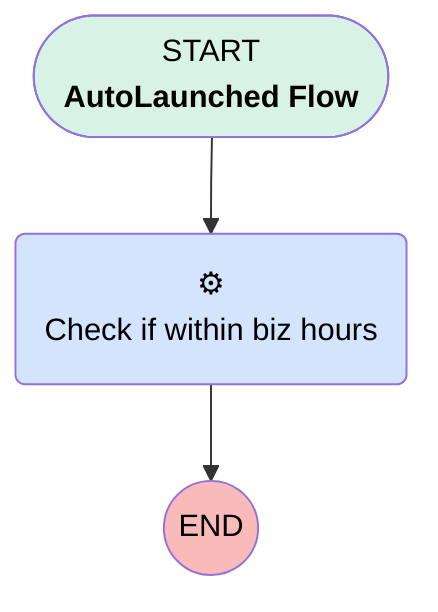

# testtest

## Flow Diagram [(_View History_)](testtest-history.md)

<!-- Flow description -->

## General Information

|<!-- -->|<!-- -->|
|:---|:---|
|Process Type| Auto Launched Flow|
|Label|testtest|
|Status|⚠️ Draft|
|Environments|Default|
|Interview Label|testtest {!$Flow.CurrentDateTime}|
| Builder Type (PM)|LightningFlowBuilder|
| Canvas Mode (PM)|AUTO_LAYOUT_CANVAS|
| Origin Builder Type (PM)|LightningFlowBuilder|
|Connector|[Check_if_within_biz_hours](#check_if_within_biz_hours)|
|Next Node|[Check_if_within_biz_hours](#check_if_within_biz_hours)|

## Variables

|Name|Data Type|Is Collection|Is Input|Is Output|Object Type|Description|
|:-- |:--:|:--:|:--:|:--:|:--:|:--  |
|areWeInBusinessHours|Boolean|⬜|⬜|⬜|<!-- -->|<!-- -->|

## Formulas

|Name|Data Type|Expression|Description|
|:-- |:--:|:-- |:--  |
|timeVar|DateTime|NOW()+(9/24)|<!-- -->|

## Flow Nodes Details

### Check_if_within_biz_hours

|<!-- -->|<!-- -->|
|:---|:---|
|Type|Action Call|
|Label|Check if within biz hours|
|Action Type|Apex|
|Action Name|[businessHoursDatetimeCheck](../apex/businessHoursDatetimeCheck.md)|
|Flow Transaction Model|CurrentTransaction|
|Name Segment|businessHoursDatetimeCheck|
|Output Parameters|assignToReference: areWeInBusinessHours name: isWithinBusinessHours |
|Business Hours Id (input)|01mHo000000L0H2|
|Datetime Value (input)|timeVar|

___

_Documentation generated from branch monitoring_myubiquity by [sfdx-hardis](https://sfdx-hardis.cloudity.com), featuring [salesforce-flow-visualiser](https://github.com/toddhalfpenny/salesforce-flow-visualiser)_